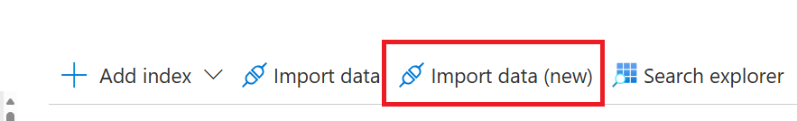
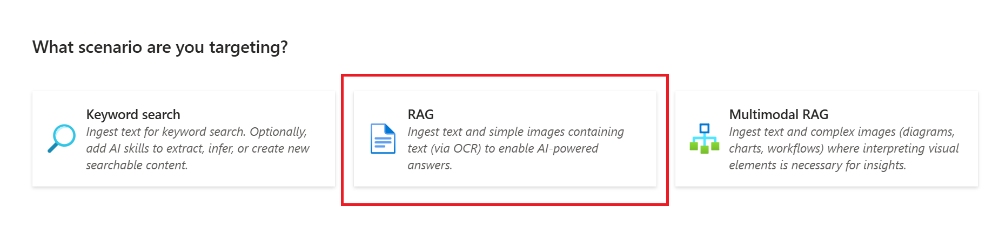
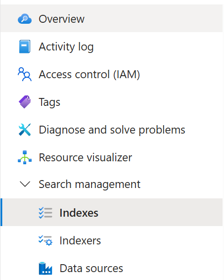
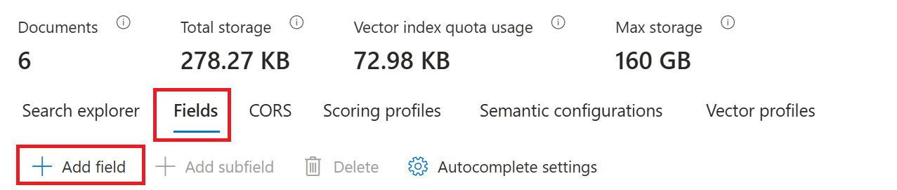
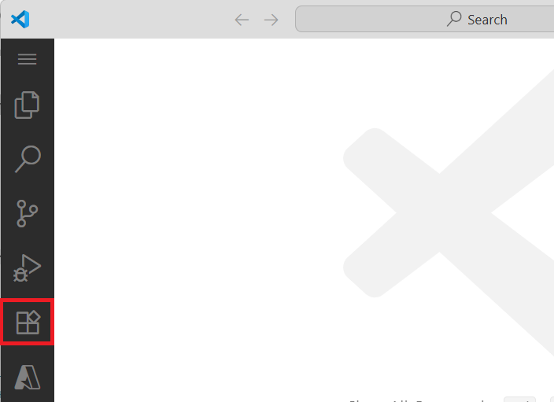
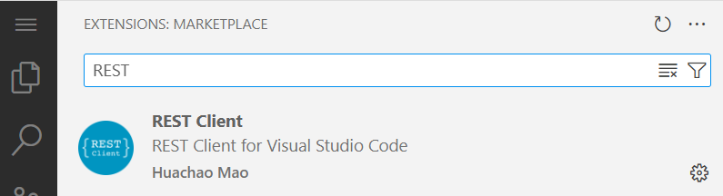
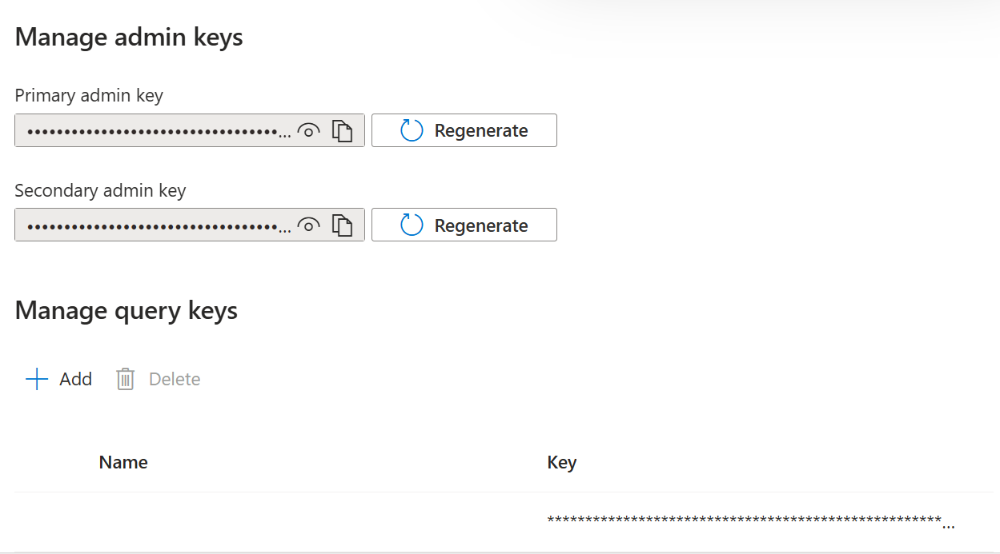
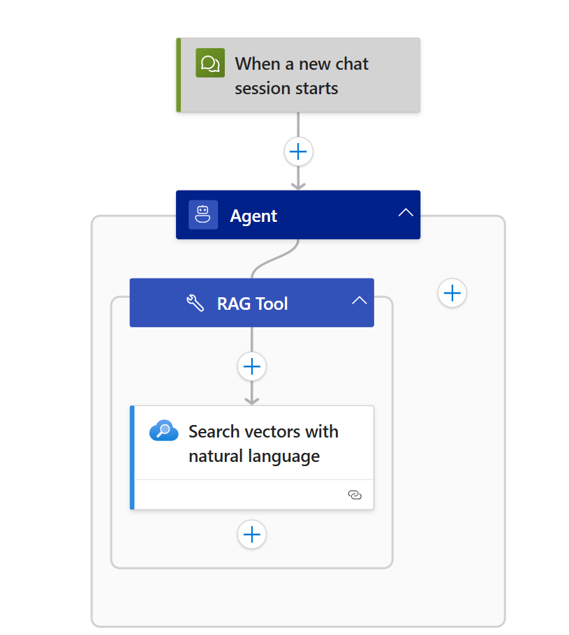
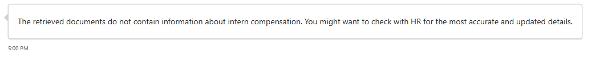

This module explains how to implement security filters to control knowledge access in your Azure Logic Apps agents, ensuring users only receive information they are authorized to view.

When finished with this module, you'll have gained the following knowledge:

- **Security Filter Pattern**: How to implement document-level authorization using user id filters in RAG-enabled Logic Apps

## The Importance of Security in Enterprise AI Applications

In enterprise AI applications, ensuring that users can only access information they are authorized to view is crucial for maintaining data privacy, regulatory compliance, and organizational security. Security trimming prevents unauthorized access to sensitive documents and ensures that AI responses are contextually appropriate based on user permissions.

## Security-Enhanced RAG Implementation

Implementing security filters in Azure Logic Apps RAG patterns requires a multi-layered approach that combines data indexing with security metadata and dynamic filtering during retrieval:

### Phase 1: Secure Data Ingestion and Indexing
In this phase, Azure AI Search will index and vectorize your data:
- **Parse and extract** text content 
- **Generate embeddings** for content
- **Index documents with security fields** in Azure AI Search, enabling efficient knowledge trimming during retrieval

### Phase 2: Filtered Retrieval and Response Generation
When users interact with your agent, Logic Apps applies security filters before generating responses:
- **Apply security filters** to ensure only authorized content is retrieved
- **Generate responses** based only on content that the user is authorized to access

## Phase 1 - Secure Data Ingestion and Indexing

> :::note
> Prerequisites for this phase are the following:
> - You have access to an Azure Storage Account resource. For steps on setting this resource up, follow the guide here [Create an Azure storage account](https://learn.microsoft.com/en-us/azure/storage/common/storage-account-create?tabs=azure-portal).
> - You have created a new container in your Azure Storage Account resource. For steps on creating a container, follow the guide here [Manage blob containers using the Azure portal](https://learn.microsoft.com/en-us/azure/storage/blobs/blob-containers-portal?source=recommendations)
> - You have uploaded interns and employees folder to the container in your Azure Storage Account resource. The folders used in this module can be downloaded here: [employees folder](media/07-add-security-filters-for-agent-knowledge-trimming/employees) and [interns folder](media/07-add-security-filters-for-agent-knowledge-trimming/interns) in the container in your Azure Storage Account resource.
> - You have access to an Azure OpenAI Service with a deployed text embeddings model. For more on creating this service, visit [Explore Azure OpenAI in Azure AI Foundry](https://learn.microsoft.com/en-us/azure/ai-foundry/openai/tutorials/embeddings?source=recommendations&tabs=command-line%2Cpython-new&pivots=programming-language-python).
> - You have access to an Azure AI Search service. For more on creating this resource visit here [Create an Azure AI Search service](https://learn.microsoft.com/en-us/azure/search/tutorial-optimize-indexing-push-api#create-an-azure-ai-search-service).
> - You have configured an Azure AI Search service connection to the Azure Storage account using a managed identity : [Connect to Azure Storage using a managed identity (Azure AI Search)](https://learn.microsoft.com/en-us/azure/search/search-howto-managed-identities-storage)

### Step 1 - Index and Vectorize Data

1. In the [Azure portal](https://portal.azure.com), open your Azure AI Search instance and click on Import Data (New).

1. Choose your data source and then select `RAG`.

1. On this page,
    1. Fill out the appropriate `Subscription`, `Storage account` and `Blob container`
    1. Leave `Blob folder` blank
    1. `Parsing mode` should be set to `Text`
    1. Check `Authenticate using Managed Identity`
    1. Select `System-assigned` or `User-assigned` based on how you configured the Azure AI Search service connection to the Azure Storage account
    1. Then click on `Next`
1. On the next page,
    1. Select `AI Foundry Hub catalog models (Preview)` for `Kind`
    1. Select the appropriate `Subscription` and `Azure AI Foundry/Hub Project`
    1. Select your embedding model under `Model deployment`
    1. Set `API key` as the Authentication type
    1. Check the acknowledgement
    1. Then click on `Next`
1. On the next page, keep all the default values and click on `Next`.
1. On the last page, rename your `Objects name prefix` to `hr-index`. Then press `Create`.

### Step 2 - Add empty UserIds Field

1. On the left navigation bar of your Azure AI Search instance, click on `Search management` and then click on `Indexes`.

1. Click on `hr-index`.
1. Click on `Fields` and then click `+ Add field`.

1. On the pop-up on the right-hand, fill in the following information:  
   - Field Name: `UserIds`
   - Type: `Collection(Edm.String)`
   - Check `Filterable`  
   - Press `Save`


### Step 3 - Obtain document chunk ids

1. Start Visual Studio Code and select the `Extensions` tile.

1. Search for the Rest Client and Select `Install`.

1. Create a new file named `get-documents.rest`.
1. Paste in the following code in your file.

```text
@endpoint = PUT-YOUR-SEARCH-SERVICE-ENDPOINT-HERE
@index = hr-index
@queryApiKey = PUT-YOUR-SEARCH-SERVICE-QUERY-API-KEY-HERE

POST https://{{endpoint}}/indexes/{{index}}/docs/search?api-version=2025-09-01
api-key: {{queryApiKey}}
Content-Type: application/json
    
{
   "search": "*",
   "select": "chunk_id,title",
   "top": 6,
   "skip": 0
}
```
You will need to replace the `endpoint` with your own. To do this,
1. On Azure Portal, open your Azure AI Search instance. Copy the link next to `Url` and paste it in `get-documents.rest`. The `Url` will look something like this: `https://name-of-azure-search-service.search.windows.net`.

You will need to replace the `queryApiKey` with your own. To do this,
1. On Azure Portal, open your Azure AI Search instance. On the left navigation bar, click on `Settings` and then click on `Keys`.
1. Under `Manage query keys`, copy the key and paste it in `get-documents.rest`.
    
    
Now press `Send Request`. You should have gotten a `value` array with the `@search.score`, `chunk_id` and `title`.

### Step 4 - Populate User Ids for each document

> :::note
> This step demonstrates how to manually update documents with security metadata for testing purposes. In a production environment, you would typically incorporate this security metadata assignment into your automated data ingestion pipeline to ensure all documents are properly tagged with appropriate user access permissions during the indexing process.

1. Create a new file in Visual Studio Code named `update-documents.rest`
1. Paste in the following code in your file.

```text
@endpoint = PUT-YOUR-SEARCH-SERVICE-ENDPOINT-HERE
@index = hr-index
@adminApiKey = PUT-YOUR-SEARCH-SERVICE-ADMIN-API-KEY-HERE

POST https://{{endpoint}}/indexes/{{index}}/docs/index?api-version=2025-09-01
api-key: {{adminApiKey}}
Content-Type: application/json

{
    "value": [
        {
            "@search.action": "mergeOrUpload",
            "chunk_id": "f9f29713558d_aHR0cHM6Ly93YXdzZHN0ZXN0c2E1MS5ibG9iLmNvcmUud2luZG93cy5uZXQvcmFnLXRlbXAtdGVzdC9pbnRlcm5zL2ludGVybl9qb2JfcmVzcG9uc2liaWxpdGllcy50eHQ1_pages_0",
            "title": "intern_job_responsibilities.txt",
            "UserIds": ["249f5761-6f30-4e27-a1db-df2399e13b3d"]
        },
        {
            "@search.action": "mergeOrUpload",
            "chunk_id": "f9f29713558d_aHR0cHM6Ly93YXdzZHN0ZXN0c2E1MS5ibG9iLmNvcmUud2luZG93cy5uZXQvcmFnLXRlbXAtdGVzdC9pbnRlcm5zL2ludGVybl9wZXJrcy50eHQ1_pages_0",
            "title": "intern_perks.txt",
            "UserIds": ["249f5761-6f30-4e27-a1db-df2399e13b3d"]
        },
        {
            "@search.action": "mergeOrUpload",
            "chunk_id": "f9f29713558d_aHR0cHM6Ly93YXdzZHN0ZXN0c2E1MS5ibG9iLmNvcmUud2luZG93cy5uZXQvcmFnLXRlbXAtdGVzdC9pbnRlcm5zL2ludGVybl9jb21wZW5zYXRpb24udHh00_pages_0",
            "title": "intern_compensation.txt",
            "UserIds": ["249f5761-6f30-4e27-a1db-df2399e13b3d"]
        },
        {
            "@search.action": "mergeOrUpload",
            "chunk_id": "f9f29713558d_aHR0cHM6Ly93YXdzZHN0ZXN0c2E1MS5ibG9iLmNvcmUud2luZG93cy5uZXQvcmFnLXRlbXAtdGVzdC9lbXBsb3llZXMvZW1wbG95ZWVfcGVya3MudHh00_pages_0",
            "title": "employee_perks.txt",
            "UserIds": ["cfb80024-5aab-49cb-af64-cc1df63aff24"]
        },
        {
            "@search.action": "mergeOrUpload",
            "chunk_id": "f9f29713558d_aHR0cHM6Ly93YXdzZHN0ZXN0c2E1MS5ibG9iLmNvcmUud2luZG93cy5uZXQvcmFnLXRlbXAtdGVzdC9lbXBsb3llZXMvZW1wbG95ZWVfam9iX3Jlc3BvbnNpYmlsaXRpZXMudHh00_pages_0",
            "title": "employee_job_responsibilities.txt",
            "UserIds": ["cfb80024-5aab-49cb-af64-cc1df63aff24"]
        },
        {
            "@search.action": "mergeOrUpload",
            "chunk_id": "f9f29713558d_aHR0cHM6Ly93YXdzZHN0ZXN0c2E1MS5ibG9iLmNvcmUud2luZG93cy5uZXQvcmFnLXRlbXAtdGVzdC9lbXBsb3llZXMvZW1wbG95ZWVfY29tcGVuc2F0aW9uLnR4dA2_pages_0",
            "title": "employee_compensation.txt",
            "UserIds": ["cfb80024-5aab-49cb-af64-cc1df63aff24"]
        }
    ]
}
```
Make sure to replace the `endpoint` with your own.

Update each `chunk_id` value in the `value` array with the actual `chunk_id` you obtained in Step 3. Make sure each `chunk_id` is being mapped to the correct document `title`.

Next, `UserIds` values must be updated with the actual Microsoft Entra object identifiers (GUIDs) of the users who should have access to view these documents. In this example:
   - The first three documents (intern-related) use `249f5761-6f30-4e27-a1db-df2399e13b3d`, which could represent the user id of a particular intern.
   - The last three documents (employee-related) use `cfb80024-5aab-49cb-af64-cc1df63aff24`, which could represent the user id of a particular full-time employee.

   You can assign multiple User Ids to each document by adding more GUIDs to the array if you want to grant access to multiple interns or full-time employees.

   > **For testing purposes**: You can use your own user Object ID for the employee documents (so you can access them) and use another user's Object ID for the intern documents (to test access restrictions).
   >
   > **To find your Object ID:**
   > 1. In the Azure Portal search box, search for your name
   > 1. Your profile will appear under "Microsoft Entra ID"
   > 1. Click on your profile and copy the "Object ID" value from the details page

Finally, you will need to replace the `@adminApiKey` with your own. To do this:
1. On Azure Portal, open your Azure AI Search instance. On the left navigation bar, click on `Settings` and then click on `Keys`.
1. Under `Manage admin keys`, copy the `Primary admin key` and paste it in `update-documents.rest`.

1. Now press `Send Request`.

## Phase 2: Filtered Retrieval and Response Generation
> :::note
> Prerequisites for this module are the following:
> - You have Easy Auth configured. For steps on setting up EasyAuth, follow the guide here [Setting up Easy Auth](../02_build_conversational_agents/04-add-user-context-to-tools.md).

### Step 1 - Create the Logic Apps Workflow

1. In the Azure portal, open your Standard logic app resource. Add a new conversational agent workflow in the designer and name it `Secure-Document-Retrieval`.

1. Configure the agent with the following settings:

- **Name**: HR Agent
- **System Instructions**:  
   ```
    You are an HR assistant that answers questions about job responsibilities, compensation and perks. Use the Document Search Tool to do a vector search of the user's question. Use only information outputted from this tool to answer the user's question. No other data or information should be used to answer the question.
   ```
    1. Click “Add an action” inside the agent loop.
    1. Select the Azure AI Search > Search vectors with natural language.
    1. Rename the tool: `Document Search Tool`
    1. Tool description: `Query the knowledge base.`
    1. Create an agent parameter:
        - Name: `query`
        - Type: String
    1. Add a new connection for the `Search vectors with natural language` action by setting the Azure AI Search Endpoint and Admin Key.
    1. Set the following:
        - Index Name: `hr-index`
        - Search Text: Insert the agent parameter `query`
        - Number of nearest neighbors to return: `2`
    1. Press `Show All` under `Advanced Parameters` and set the following:
        - Filter Condition: `UserIds/any(u: u eq '@{currentRequest()['headers']['X-MS-CLIENT-PRINCIPAL-ID']}')`
        - The Vector Fields To Search: `"text_vector"`
        - Fields To Select: `"chunk"`

### Step 2 - Test the Workflow
On the designer toolbar, select **Chat** to open the chat client in the Azure portal. Select the chat client URL, which opens the chat client integrated with your logic app.

In the chat client interface, ask the following question: **What are the perks?**


Since you only have access to employee documents, the response is based on the employee documents.

In a new chat session, ask the following question: **What is the intern compensation?**



Since you only have access to employee documents, the agent is unable to provide a response.

## Security Best Practices for RAG-Enabled Logic Apps
- **Principle of Least Privilege**: Grant users access only to the minimum information required for their role
- **Document-Level Access Control**: Use the `UserIds` field to specify exactly which users can access each document
- **Role-Based Filtering**: Implement different UserIds arrays for different organizational roles
