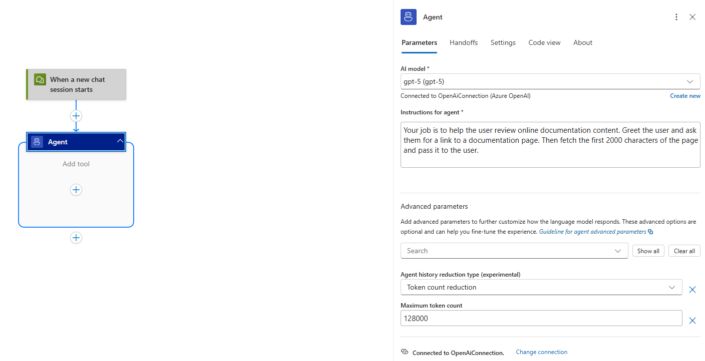
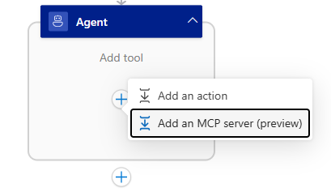
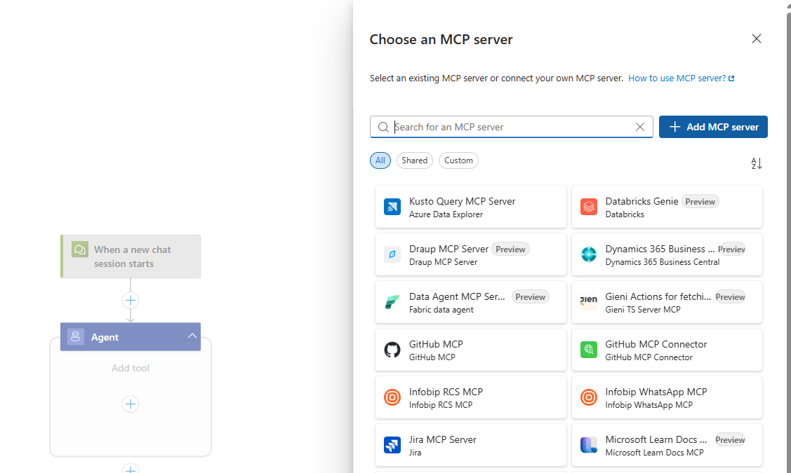
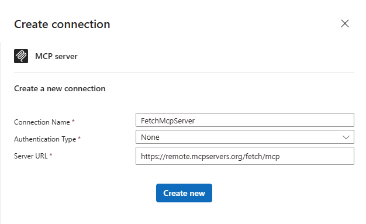
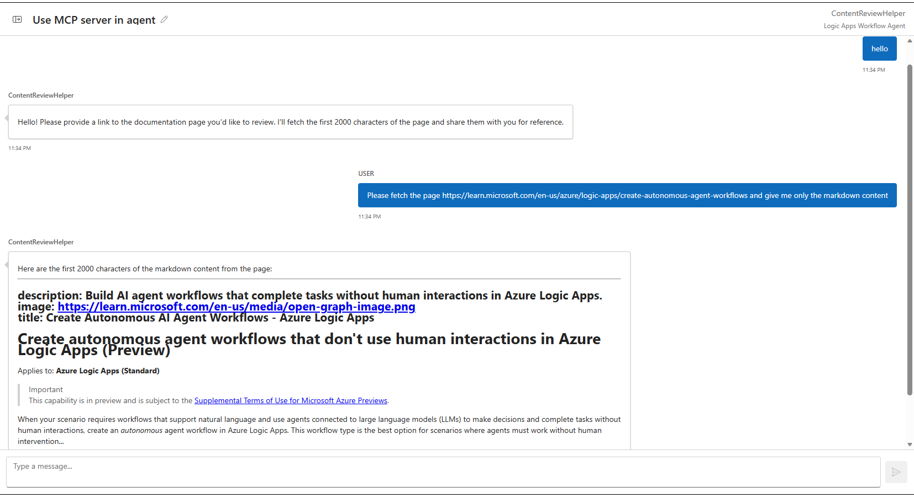
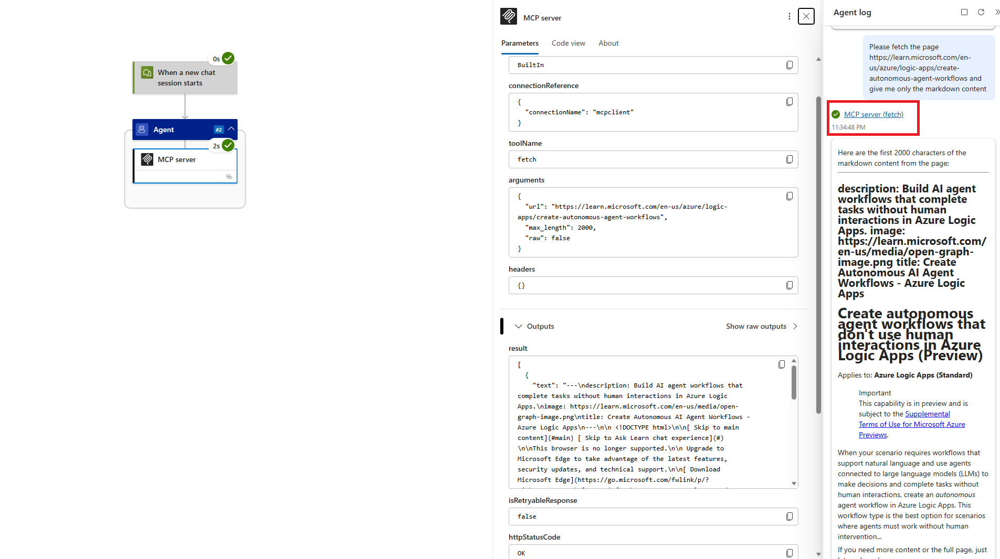

import Tabs from '@theme/Tabs';
import TabItem from '@theme/TabItem';

## Prerequisites 

- An Azure account and subscription. If you don't have a subscription, [sign up for a free Azure account](https://azure.microsoft.com/free/?WT.mc_id=A261C142F).
- Existing Logic Apps Standard workflow app (or create one): [Create a single-tenant workflow app](https://learn.microsoft.com/azure/logic-apps/create-single-tenant-workflows-azure-portal).
- Deployed Azure OpenAI model (for example a GPT -family chat/completions model): [Azure OpenAI models](https://learn.microsoft.com/azure/ai-services/openai/concepts/models).

## Overview
If you want to consume an MCP server that is hosted externally, you can use the BYO MCP connector feature in your agent workflows. This can be used in both autonomous and conversational workflows and the configuration steps are the same.

In this lesson we will begin to explore the agent's capabilities to configure MCP server tools. This is a powerful feature that lets your agent connect to existing MCP servers and use the tools they provide.
We will create a conversational flow and then use a bring your own (BYO) MCP server so that the agent can fetch online content as markdown. We will configure the workflow, interact with the agent, and then go through the monitoring view to inspect the agent and tool execution.

## Create a conversational flow
Create a new conversational workflow in a new or existing Azure Logic App. This will be the workflow we use for this and the following lessons. The steps to create this workflow are the same ones that can be found in the [Build your first conversational agent](../02_build_conversational_agents/01-create-first-conversational-agent.mdx) lesson.

### Step 1 - Configure agent connection and system prompt
Configure the AI model your agent will use and pass the following as the system prompt:

```
Your job is to help the user review online documentation content. Greet the user and ask them for a link to a documentation page. Then fetch the first 2000 characters of the page and pass it to the user.
```



### Step 2 - Add BYO MCP tool to your agent
1. Click on the "+" icon and add an MCP tool. The MCP server pane will show up on the right side of your screen.

1. Select "Add MCP Server" to bring your own MCP server to the agent.

1. Name the connection something that represents this MCP server connection like "FetchMcpServer", select "None" for the authentication option and set the MCP server URL, "https://remote.mcpservers.org/fetch/mcp" and click create new.


### Step 3 - Use MCP server in agent
You have successfully added your first MCP server to your agent! Start a chat session with the agent to test out this new capabilities, you can use the following prompt as an example: 

```
> [User]: Hello
> [Agent]: [Greeting]
> [User]: Please fetch the page https://learn.microsoft.com/en-us/azure/logic-apps/create-autonomous-agent-workflows and give me only the markdown content
```

The agent might take a few seconds to reply as it fetches the content from the page. This is the reason for the character limit in the system prompt as well.
Once the agent comes back with the content, we can check the run history to see the execution of the MCP tool.



### Step 4 - Monitor & Debug
1. Navigate to the workflow's run history and select the latest run. This will load the run of the chat session you just had.

1. If you followed the same script as above, you should navigate to the agent's second task. This will be where the agent uses the MCP tool. You can also use the Agent log on the right hand side and click on the tool execution which should be called "MCP server (fetch)" or more generally, "[MCP Server Tool name] ([MCP Tool executed])".

1. You can now inspect the inputs of the MCP tool execution which includes the tool from the MCP server that the agent decided to use and the arguments that the agent passed into the tool.
    - The outputs of the tool are the ones returned by the MCP tool itself and should include the content from the documentation page above.



## Run History & Monitoring for MCP Tools
| Pane Element | Description |
|--------------|-------------|
| Agent Log | Shows assistant messages and tool call directives. |
| Tool call detail | Contains raw LLM completion that requested the MCP tool; review for argument fidelity. |
| Action result | Underlying connector/custom action output; expand only necessary fields. |
| Error propagation | Non-2xx responses surfaced; model can self-correct if prompted (“If tool fails, summarize error and ask clarifying question”). |

### Common Troubleshooting
| Issue | Resolution |
|-------|------------|
| Tool not invoked | Refine description; ensure no overlapping semantics with other tools; check Allowed tools filter. |
| Wrong parameters | Add agent parameters with clearer names & descriptions; show expected examples in system instructions. |
| Auth failure (401/403) | Recreate per-user connection; verify scopes; confirm Easy Auth or developer key for chat client. |
| Throttling (429) | Add retry (built-in), instruct model to narrow request, or consolidate batch operations. |

## Best Practices Recap
- Use the "Allowed Tools" parameter on the MCP tool for times where you want to limit the tools that the agent can use on that MCP server.
- Monitor early runs to validate system prompt and the accuracy of MCP server tool names and descriptions.

## Clean Up Resources
- Do not preform any clean up yet if you plan to continue the module and go to the next lesson.
- Remove unused per-user connections; rotate app secrets (custom connector) per policy.
- Decommission experimental BYO MCP endpoints if no longer required.
- Archive run history exports if used for prompt tuning and then purge per retention standards.

## Related content
- [Connect tools to external services (conversational)](../02_build_conversational_agents/03-connect-tools-external-services.md)
- [Connect tools to external services (autonomous)](../03_build_autonomous_agents/03-connect-tools-external-services.md)
- [Add parameters to your tools](../04_agent_functionality/01-add-parameters-to-tools.md)
- [Extend your tool functionality with patterns](../04_agent_functionality/02-extend-tools-with-patterns.md)
- [Add user context to tools](../02_build_conversational_agents/04-add-user-context-to-tools.mdx)

## Next steps
Proceed to the next lesson to add a managed MCP server to your workflow.