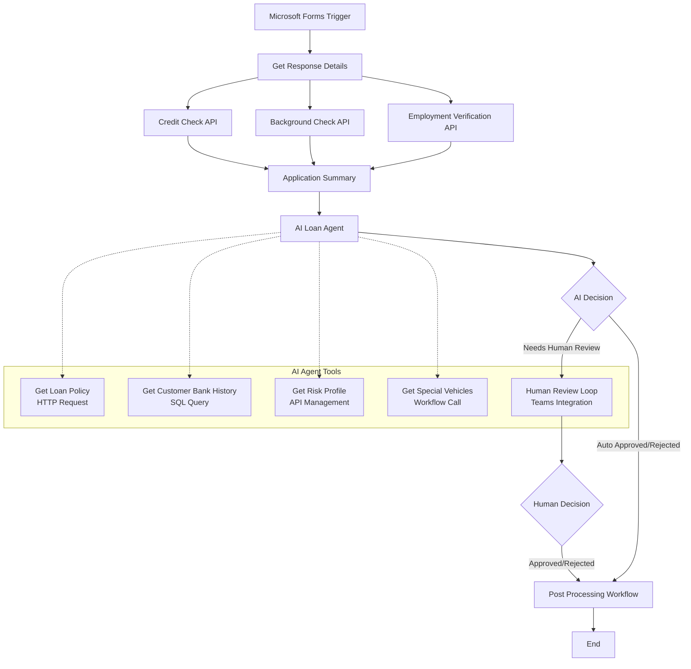
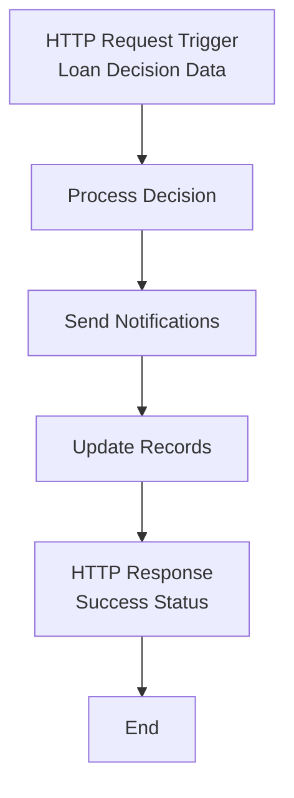
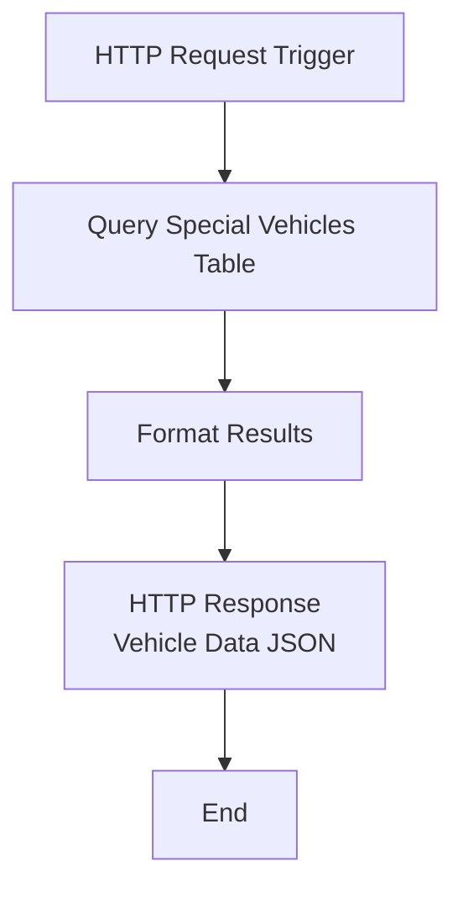

# AI Loan Agent

This project is an AI-powered loan approval system that automates the evaluation of vehicle loan applications using Azure Logic Apps Standard and Azure OpenAI. The system intelligently processes loan applications from Microsoft Forms, performs comprehensive risk assessments, and routes decisions through AI agents with human escalation when needed.

## Prerequisites

The following Azure services are required for this project:

- **Azure Logic Apps Standard** - Workflow orchestration platform
- **Azure OpenAI Service** - AI agent for loan decision making with GPT-4 deployment
- **Azure SQL Database** - Customer history and special vehicle data storage
- **Azure API Management** - Risk assessment, credit check, employment verification, and demographic APIs
- **Microsoft Forms** - Loan application submission interface
- **Microsoft Teams** - Human agent notification and approval workflow
- **Microsoft Outlook** - Email notifications and communications
- **Azure Storage Account** - Workflow runtime storage
- **Azure Blob Storage** - Policy document storage

## 🚀 Complete Step-by-Step Deployment Guide

### **Phase 1: Prerequisites Setup**

#### **1.1 Required Tools**
```bash
✅ Azure CLI (version 2.0 or later)
✅ PowerShell 5.1 or PowerShell Core 7+
✅ VS Code with Azure Logic Apps extension
✅ Azure subscription with Contributor permissions
✅ Microsoft Entra ID permissions (Global Admin or Privileged Role Admin)
```

#### **1.2 Authentication Setup**
```powershell
# Login to Azure CLI
az login

# Verify subscription access
az account show

# Set correct subscription if needed
az account set --subscription "your-subscription-id"
```

### **Phase 2: Azure Infrastructure Deployment**

#### **2.1 Deploy Azure Resources**
```powershell
# Navigate to the deployment folder
cd Deployment

# Deploy all Azure infrastructure (30-45 minutes)
.\deploy.ps1
```

**✅ What gets created:**
- Azure Logic Apps Standard (with managed identity enabled)
- Azure OpenAI Service with GPT-4 deployment  
- Azure SQL Server and Database (with Entra ID authentication)
- Azure API Management with 4 mock APIs
- Azure Storage Account and Blob Storage
- Policy document uploaded to blob storage
- Network security and firewall configurations

#### **2.2 Database Schema Setup**
```sql
-- Execute in Azure Portal Query Editor
-- 1. Navigate to: Azure Portal → Resource Groups → [your-resource-group] → [SQL Server] → [Database]
-- 2. Click "Query Editor (preview)" 
-- 3. Authenticate with "Microsoft Entra ID"
-- 4. Copy and paste the entire contents of 'database-setup.sql'
-- 5. Click "Run"
```

**✅ What gets created:**
- CustomersBankHistory table (8 sample customer records)
- AutoLoanSpecialVehicles table (27 vehicle records: 5 Custom, 9 Limited, 13 Luxury)
- Required test data for AI agent workflows

#### **2.3 Grant SQL Database Access to Logic App**
```sql
-- Execute in Azure Portal Query Editor (same as above)
-- Copy and paste the entire contents of 'create-managed-identity-user.sql'
-- This grants the Logic App's managed identity access to the database
```

### **Phase 3: Security & Authentication Setup**

#### **3.1 Grant Microsoft Graph Permissions**
```powershell
# Get Logic App Principal ID
# Azure Portal → Logic App → Identity → System assigned → Copy "Object (principal) ID"

# Run permissions script
.\grant-graph-permissions.ps1 -ManagedIdentityPrincipalId "YOUR-LOGIC-APP-PRINCIPAL-ID"
```

**✅ Grants permissions for:**
- Microsoft Teams (Group.ReadWrite.All, Channel.ReadBasic.All)
- Microsoft Outlook (Mail.Send, Mail.ReadWrite)  
- Microsoft Forms (Forms.Read)

#### **3.2 Authorize Microsoft 365 API Connections**
```
1. Azure Portal → Resource Groups → [your-resource-group]
2. Click on each connection and authorize:
   - microsoftforms-2 → Edit API Connection → Authorize
   - teams-1 → Edit API Connection → Authorize
   - office365 → Edit API Connection → Authorize
3. Sign in with your Microsoft 365 account when prompted
```

### **Phase 4: Logic Apps Configuration**

#### **4.1 Fix Configuration Settings**
```powershell
# Navigate to helpers folder
cd Deployment\helpers

# Run configuration fix script
.\update-local-settings.ps1
```

**✅ What gets configured:**
- SQL connection string with managed identity authentication
- Policy document URL mapping for workflows
- Teams and email notification settings
- Azure app settings synchronization

#### **4.2 Verify Connection Configuration**
The connections.json file should be configured with:
- Service provider SQL connection using managed identity
- Proper connection string parameter format
- Clean naming conventions (no random GUIDs)

### **Phase 5: Microsoft 365 Setup**

#### **5.1 Create Microsoft Forms**
**Required form fields:**
```
Customer Information:
- Full Name (Text)
- Date of Birth (Date)
- Social Security Number (Text)  
- Email Address (Text)

Employment Details:
- Employer Name (Text)
- Annual Salary (Number)
- Years in Current Role (Number)

Loan Information:
- Requested Loan Amount (Number)
- Vehicle Make (Text)
- Vehicle Model (Text)
```

#### **5.2 Configure Microsoft Teams**
```
1. Create a Teams workspace for loan approvals
2. Create a channel for notifications
3. Get the Team Group ID and Channel ID:
   - Team Settings → More options → Get link to team
   - Extract Group ID from URL
   - Channel settings → Get link to channel  
   - Extract Channel ID from URL
```

#### **5.3 Setup Email Configuration**
```
1. Ensure Outlook connection is authorized
2. Configure demo email address for notifications
3. Test email delivery from Logic Apps
```

### **Phase 6: Logic Apps Deployment**

#### **6.1 Deploy Workflows to Azure**
```
1. Open VS Code
2. Open folder: [repository-path]\LogicApps
3. Install Azure Logic Apps extension if not already installed
4. Sign in to Azure from VS Code
5. Right-click on the LogicApps folder
6. Select "Deploy to Logic App in Azure"
7. Choose your Logic App ([your-logic-app-name])
8. Confirm deployment
```

**✅ Workflows deployed:**
- LoanApprovalAgent (main AI workflow)
- SpecialVehicles (child workflow for vehicle lookup)
- LoanPostProcessing (post-approval notifications)

### **Phase 7: Testing & Validation**

#### **7.1 Test Individual Workflow**
```
1. Azure Portal → Logic Apps → [your-logic-app-name] → Workflows
2. Click on "SpecialVehicles" workflow
3. Click "Run Trigger" → "manual"
4. Send test HTTP request to verify SQL connection
5. Verify workflow completes without errors
```

#### **7.2 Test End-to-End Flow**
```
1. Submit loan application via Microsoft Forms
2. Monitor LoanApprovalAgent workflow execution
3. Verify AI agent uses all tools:
   - SQL query for customer history
   - API calls for risk assessment
   - Special vehicles lookup via child workflow
4. Check Teams notifications for human review cases
5. Verify email notifications are sent
```

### **Phase 8: Troubleshooting Common Issues**

#### **8.1 SQL Connection Issues**
```
❌ Error: "Login failed for user"
✅ Solution: Verify managed identity user created in database
✅ Check: connections.json uses connectionString parameter format
✅ Verify: Connection string includes Authentication=Active Directory Managed Identity
```

#### **8.2 Microsoft 365 Connection Issues**
```  
❌ Error: "Unauthorized" for Forms/Teams/Outlook
✅ Solution: Re-authorize connections in Azure Portal
✅ Check: Microsoft Graph permissions granted to Logic App
✅ Verify: User has appropriate Microsoft 365 permissions
```

#### **8.3 Workflow Deployment Issues**
```
❌ Error: "BadGateway" in child workflows
✅ Solution: Ensure parent and child workflows use same connection configuration
✅ Check: Connection inheritance properly configured
✅ Verify: All workflows deployed successfully
```

## 📚 Additional Documentation

- **[Deployment Guide](Deployment/README.md)** - Detailed infrastructure deployment
- **[Connection Setup](Deployment/SETUPCONNECTIONS.md)** - Microsoft 365 connection configuration
- **[Form Template](Deployment/FORM-FIELDS-TEMPLATE.md)** - Microsoft Forms field requirements
- **[Teams Setup](Deployment/GET-TEAMS-IDS-BROWSER.md)** - Teams ID extraction guide

## 🔧 Configuration Scripts

Located in the `Deployment/` folder:

- **`deploy.ps1`** - Main Azure infrastructure deployment
- **`database-setup.sql`** - Database schema and sample data
- **`create-managed-identity-user.sql`** - Grant database access to Logic App
- **`grant-graph-permissions.ps1`** - Grant Microsoft Graph permissions
- **`helpers/update-local-settings.ps1`** - Fix configuration settings
- **`helpers/get-connection-details.ps1`** - Extract connection details

## 🔐 Security Considerations

- **Managed Identity**: Used for SQL authentication (no connection strings with passwords)
- **Microsoft Graph Permissions**: Minimal required permissions for Microsoft 365 integration
- **API Keys**: Stored securely in Azure app settings
- **Network Security**: SQL firewall configured for Azure services only
- **Data Protection**: No sensitive customer data in sample records

## 💰 Cost Considerations

**Estimated monthly costs (USD, may vary by region):**
- Azure Logic Apps Standard: $200-300 (depends on usage)
- Azure OpenAI Service: $50-200 (depends on token usage)
- Azure SQL Database: $50-100 (Basic/Standard tier)
- Azure API Management: $50-100 (Developer tier)
- Azure Storage: $5-20 (minimal usage)
- **Total estimated: $355-720/month**

**Cost optimization tips:**
- Use Basic tier for SQL Database in dev/test
- Choose appropriate OpenAI model (GPT-3.5 vs GPT-4)
- Scale down Logic Apps when not in active use
- Clean up resources when testing is complete

## 🧹 Cleanup

To remove all deployed resources:

```powershell
# Delete entire resource group and all resources
az group delete --name "[your-resource-group]" --yes --no-wait
```

## 🎯 Success Criteria

**✅ Deployment Complete:**
- All Azure resources created and running
- Database tables created with sample data
- Logic App has database access via managed identity
- Microsoft 365 connections authorized
- Workflows deployed successfully

**✅ Testing Complete:**
- SpecialVehicles workflow executes without errors
- SQL connection inheritance works between workflows
- AI agent can access all tools (SQL, APIs, child workflows)
- End-to-end loan processing flow works
- Microsoft Teams and email notifications delivered

## ❓ Getting Help

**Common Resources:**
- Review Azure portal for resource deployment status
- Check Logic Apps run history for detailed error information
- Verify Azure CLI authentication and permissions
- Review deployment script output for configuration values

**Documentation:**
- [Azure Logic Apps Documentation](https://docs.microsoft.com/azure/logic-apps/)
- [Azure OpenAI Service Documentation](https://docs.microsoft.com/azure/cognitive-services/openai/)
- [Microsoft Graph Permissions Reference](https://docs.microsoft.com/graph/permissions-reference)

## Workflows

### LoanApprovalAgent

The main workflow that orchestrates the complete loan approval process using AI agents to evaluate applications against company policies, with integrated tools for data retrieval and human escalation.

#### Process Flow



#### Required Connections

|Connection Name|Connector Name|Connector Type|
|---|---|---|
|microsoftforms-2|Microsoft Forms|Azure|
|agent|Azure OpenAI|Agent|
|sql|SQL Server|Service Provider|
|apiManagementOperation|Risk Assessment API|API Management|
|apiManagementOperation-1|Employment Validation API|API Management|
|apiManagementOperation-2|Credit Check API|API Management|
|apiManagementOperation-3|Demographic Verification API|API Management|
|teams-1|Microsoft Teams|Azure|
|office365|Office 365 Outlook|Azure|

### LoanPostProcessing

A supporting workflow that handles post-approval processing steps and notifications after loan decisions are made.

#### Process Flow



#### Required Connections

|Connection Name|Connector Name|Connector Type|
|---|---|---|
|None|HTTP Request/Response|Built-in|

### SpecialVehicles

A utility workflow that retrieves special vehicle information from the database to support loan policy decisions and pricing calculations.

#### Process Flow



#### Required Connections

|Connection Name|Connector Name|Connector Type|
|---|---|---|
|sql|SQL Server|Service Provider|
