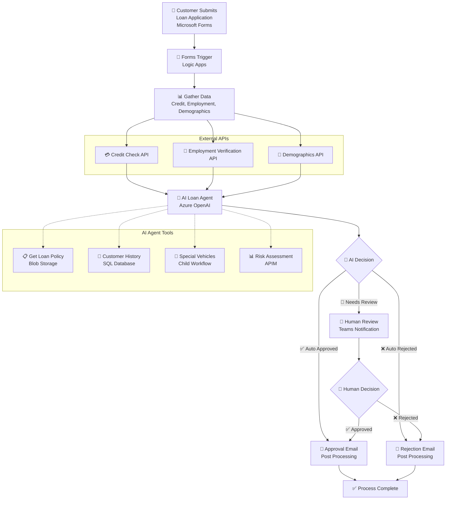
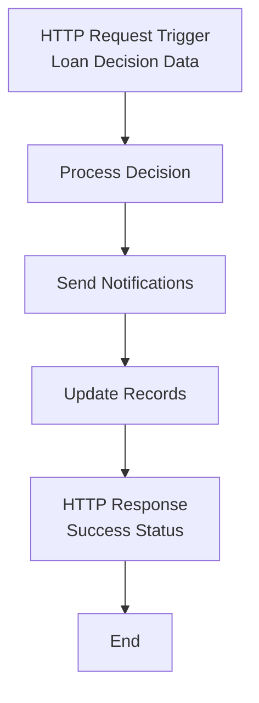
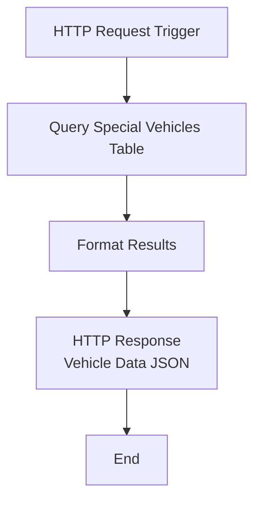

# AI Loan Agent

[](https://azure.microsoft.com/services/logic-apps/)
[](https://azure.microsoft.com/products/cognitive-services/openai-service/)

An AI-powered loan approval system that automates vehicle loan application evaluation using Azure Logic Apps Standard and Azure OpenAI. The system processes applications from Microsoft Forms, performs comprehensive risk assessments, and routes decisions through AI agents with human escalation when needed.

> **🚀 AI Loan Agent Sample**: End to end deployment with 6 validation scenarios included

## 🎥 Demo & Resources

- **📺 [Watch the Demo Video](https://youtu.be/rR1QjQTfCCg)** - Complete walkthrough of the AI Loan Agent in action
- **📖 [Read the Blog Post](https://techcommunity.microsoft.com/blog/integrationsonazureblog/%F0%9F%A4%96-agent-loop-demos-%F0%9F%A4%96/4414770)** - Deep dive into Agent Loop demos and architecture

## Prerequisites

### Required Tools

Before running the deployment script, ensure you have:

- **Azure CLI** (version 2.0 or later)
- **PowerShell 5.1** or **PowerShell Core 7+**
- **VS Code** with Azure Logic Apps extension
- **Azure subscription** with Contributor permissions
- **Microsoft Entra ID permissions** (Global Admin or Privileged Role Admin)

### Authentication Setup

```powershell
# Login to Azure CLI
az login

# Verify subscription access
az account show

# Set correct subscription if needed
az account set --subscription "your-subscription-id"
```

**Note**: The deployment script requires active Azure CLI authentication and will exit with clear instructions if you're not logged in.

### Azure Services Created by deploy.ps1

The deployment script automatically provisions these Azure services:

- **Azure Logic Apps Standard** - Workflow orchestration platform
- **Azure OpenAI Service** - AI agent for loan decision making with GPT-4.1 deployment
- **Azure SQL Database** - Customer history and special vehicle data storage
- **Azure API Management** - Risk assessment, credit check, employment verification, and demographic APIs
- **Azure Storage Account** - Workflow runtime storage
- **Azure Blob Storage** - Policy document storage with auto-generated SAS URLs
- **Managed Identity & RBAC** - Secure authentication between services
- **Network & Firewall Rules** - Proper access control and security configuration
- **Microsoft 365 V2 API Connections** - Forms, Teams, and Outlook with automatic access policies
- **Complete Configuration** - Auto-generated `local.settings.json` for development

### Microsoft 365 Prerequisites

For Microsoft 365 integrations, you'll need:

- **Microsoft 365 Business/Enterprise License** - Required for Forms, Teams, and Outlook
- **Microsoft Forms** - Permission to create forms in your organization
- **Microsoft Teams** - Access to create workspaces and channels
- **Microsoft Outlook/Exchange Online** - For email notifications
- **Microsoft 365 Admin Permissions** - To authorize API connections

## Deployment Instructions

### Step 1: Deploy Azure Infrastructure

```powershell
cd Deployment
.\deploy.ps1
```

**Enhanced Deployment Features:**
- ✅ **Idempotent**: Safe to run multiple times - existing resources are detected and skipped
- 🔄 **Unique Naming**: Automatically generates unique resource names to avoid conflicts
- 🛠️ **Error Recovery**: Improved error handling with detailed troubleshooting guidance
- 📝 **Auto-Configuration**: Generates `local.settings.json` with deployed resource values
- � **Troubleshooting**: See `TROUBLESHOOTING.md` for common issues and solutions

**Deployment Time:**
- *Typical Duration: 45-60 minutes (API Management creation takes 30-45 minutes)*
- *⏰ Use this time to complete Step 2 (Microsoft 365 configuration)*
- *The script will show progress and can be safely interrupted and resumed*

**Customization Options:**
```powershell
# Custom resource group and project name
.\deploy.ps1 -ResourceGroup "contoso-loan-rg" -ProjectName "contoso-loan"

# Different Azure region
.\deploy.ps1 -Location "westus"

# Use existing API Management (faster deployment)
.\deploy.ps1 -APIMServiceName "existing-apim-service"
```

### Step 2: Configure Microsoft 365 (During Deployment)

*⏰ Complete this step WHILE Step 1 is running to maximize efficiency*

#### 2.1 Create Microsoft Forms

**🔗 Workflow Dependency**: *Form triggers the AI Loan Agent workflow* - The workflow starts immediately reviewing the loan application once someone submits this form.

1. **Visit Microsoft Forms**: Go to [https://forms.microsoft.com/Pages/DesignPagev2.aspx](https://forms.microsoft.com/Pages/DesignPagev2.aspx)

2. **Import the Form**:
   
   **If you have existing forms** (Quick Import option available):
   - Click "Quick import" at the top of the page
   - Select the `Vehicle-Loan-Application-Form-Import.docx` file (located in the `ai-loan-agent-sample` folder)
   - Confirm the form type when prompted
   
   **If this is your first time using Microsoft Forms** (no Quick Import option):
   - Click "New Form" to create a blank form
   - You'll need to manually create the form fields using the template in `FORM-FIELDS-TEMPLATE.md` as a guide
   - Alternatively, try uploading the `Vehicle-Loan-Application-Form-Import.docx` file through "Upload from file" if available

3. **Review Form**: Once the form is created/imported, review all fields and make any necessary adjustments (change field types as needed)
4. **Get Form URL**: 
   - Click "Collect responses" 
   - Select "Copy link" to obtain the form URL
   - The URL will include the Form ID that you'll need for the workflow configuration
5. **Save Form ID**: Extract the ID from the URL format: `https://forms.microsoft.com/Pages/ResponsePage.aspx?id=[FORM_ID]`
6. **Configure Workflow Trigger**: You'll need to update the Logic App workflow trigger with this Form ID
   - **Location**: `LogicApps/LoanApprovalAgent/workflow.json`
   - **What to update**: Replace the placeholder Form ID in the Microsoft Forms trigger
   - **When**: Before deploying the workflow (Step 7)

**⚠️ Important**: The workflow trigger is currently configured with a placeholder Form ID. You must update it with your actual Form ID before deployment, or the workflow won't receive form submissions.

**⚠️ Note**: After import/creation, you may need to adjust field types (Date, Number, Choice) and add dropdown options for Vehicle Make as described in `FORM-FIELDS-TEMPLATE.md`.

#### 2.2 Connect Workflow to Teams Channel

**🔗 Workflow Dependency**: *Only needed for complex loan assessments* - The AI Loan Agent workflow sends notifications to a Microsoft Teams channel for human review of complex loan applications. You need to configure which Teams channel to use.

**Choose Your Teams Channel**:

- **Use Existing Channel**: If you have a suitable Teams channel (e.g., in your finance or operations team), you can use it directly
- **Create New Channel**: Add a dedicated channel to an existing team ([see Microsoft's channel guide](https://support.microsoft.com/en-us/office/create-a-standard-private-or-shared-channel-in-microsoft-teams-fda0b75e-5b90-4fb8-8857-7e102b014525))
- **Create New Team**: Set up a dedicated team for loan processing workflows ([see Microsoft's team guide](https://support.microsoft.com/en-us/office/create-a-team-from-scratch-in-microsoft-teams-174adf5f-846b-4780-b765-de1a0a737e2b))

**Get Channel Configuration Details**:

1. **Navigate to Your Chosen Channel**:
   - Open Microsoft Teams and go to the channel you want to use for loan approval notifications

2. **Get Channel Link**:
   - Right-click on the channel name in the left sidebar
   - Select **Copy link**
   - **Alternative method**: Click the **⋯** (More options) next to the channel name and select **Copy link**

3. **Extract Required Configuration IDs**:
   - The channel URL contains the IDs needed for workflow configuration:
     ```
     https://teams.microsoft.com/l/channel/19%3A[encoded-channel-id]%40thread.tacv2/[channel-name]?groupId=[group-id]&tenantId=[tenant-id]
     ```
   - **Extract Group ID**: Copy the value after `groupId=` (before any `&` character)
   - **Extract Channel ID**: Copy the encoded part between `/channel/` and the channel name, then URL decode it
     - Example: `19%3A...%40thread.tacv2` becomes `19:...@thread.tacv2`
   - **Save these IDs**: You'll need them for workflow configuration in Step 6

---

## Post-Deployment Configuration

*⚠️ Complete Steps 3-5 AFTER Step 1 (deployment) finishes*

### Step 3: Setup Database Schema

**🔗 Workflow Dependency**: *AI agent queries this data* - The agent looks up customer loan history and special vehicle info to gather context that informs a loan application decision.

1. **Open Azure Portal** → Your Resource Group → Your SQL Database
2. **Click "Query editor (preview)"** in the left sidebar
3. **Sign in with "Entra ID authentication"** (uses your Microsoft Entra ID credentials)**
4. **Update the script**:
   - Open `Deployment/complete-database-setup.sql`
   - Replace `your-logic-app-name` with your actual Logic App name
   - Copy the updated script
5. **Paste into Query Editor and click "Run"**

This creates sample customer data, special vehicle tables, and grants your Logic App's managed identity database access.

**Troubleshooting**: If you get "Access Denied", ensure you have Microsoft Entra ID admin permissions on the SQL Server.

### Step 4: Authorize API Connections & Configure Runtime URLs

**🔗 Workflow Dependency**: *Authenticates workflow to access your Microsoft 365* - These V2 connections with access policies let the Logic App use managed identity authentication while still requiring OAuth authorization.

#### 4.1 Authorize Microsoft 365 V2 Connections

**✨ Enhanced**: The deployment now creates V2 connections with automatic access policies!

1. **Navigate to Azure Portal** → Resource Groups → `[your-resource-group]`
2. **For each V2 connection** (`formsConnection`, `teamsConnection`, `outlookConnection`):
   - Click on the connection resource
   - Verify it shows **Kind: V2** in the overview
   - Click "Edit API Connection"
   - Click "Authorize" → Sign in with Microsoft 365 account
   - Grant requested permissions
   - Click "Save"
3. **Verify Status**: All connections should show "Connected" status

**📧 Email Sender**: The workflow will send a loan application decision email from the Microsoft 365 account used to authorize `outlookConnection`.

#### 4.2 Generate Runtime URLs for Connections```powershell
cd Deployment/helpers
.\generate-runtime-urls.ps1 -SubscriptionId "your-subscription-id" -ResourceGroup "your-resource-group"
```

This generates the runtime URLs needed for your `local.settings.json` file.

### Step 5: Finalize Local Development Configuration

**🔗 Workflow Dependency**: *Tells workflow where to find your resources* - The workflow needs your specific Form ID, Teams channel IDs, and connection URLs. Wrong values cause "resource not found" errors.

✨ The `deploy.ps1` script automatically generates your `local.settings.json` file. Most values are populated to reflect the deployed Azure resources.

**Auto-Generated Configuration:**
- ✅ All Azure resource connection strings and keys
- ✅ API Management subscription keys  
- ✅ OpenAI endpoint and keys
- ✅ Policy document URLs
- ✅ SQL connection strings

**Manual Updates Required:**
1. **Teams Configuration**: Update `TeamsGroupId` and `TeamsChannelId` from Step 2.2
2. **Email Address**: Update `DemoUserEmail` with your actual email address
   - *This demo uses a hardcoded applicant email address because SAMPLE-DATA.md has placeholder addresses. Production workflows would extract the applicant's email from form data.*
3. **Project Path**: Update `ProjectDirectoryPath` with your local LogicApps folder path
4. **Runtime URLs**: Add the Microsoft 365 connection runtime URLs from Step 4.2
5. **Form ID**: Update the workflow trigger in `LogicApps/LoanApprovalAgent/workflow.json` (detailed in Step 7.1)

**Example manual updates needed in `local.settings.json`:**
```json
{
  "TeamsGroupId": "f6c2f8c4-169d-45f0-984f-5ddf92745896",
  "TeamsChannelId": "19:qphIGD96Fek2nrKbl-diAx7d6iNZ8aJq6dtVHtZVwNI1@thread.tacv2",
  "DemoUserEmail": "your-email@company.com",
  "ProjectDirectoryPath": "c:\\\\path\\\\to\\\\your\\\\LogicApps"
}
```

### Step 6: Configure API Management Policies (If Needed)

**🔗 Workflow Dependency**: *Optional - provides realistic test data* - These mock APIs return sample credit scores and employment data. The workflow runs without them, but AI decisions may be unrealistic during testing.

The deployment script automatically creates mock API policies, but you may need to update them manually if deployment issues occurred.

#### Option A: Automatic (Default)
The `deploy.ps1` script automatically calls `create-apim-policies.ps1` to configure all mock API policies.

#### Option B: Manual Configuration in Azure Portal

If you need to manually configure or update the API policies:

1. **Navigate to API Management**: Azure Portal → Your Resource Group → Your API Management service
2. **For each API** (Credit Check, Employment Validation, Demographics, Risk Assessment):
   - Go to "APIs" → Select the API → "All operations" → "Policies"
   - Click "Add policy" → "Code editor"
   - Copy the corresponding policy XML from the `Deployment/policies/` folder:
     - `policy-cronus-credit.xml` → Credit Check API
     - `policy-litware-employment-validation.xml` → Employment Validation API  
     - `policy-northwind-demographic-verification.xml` → Demographics API
     - `policy-olympia-risk-assessment.xml` → Risk Assessment API
   - Paste the XML content and click "Save"

3. **Verify Policies**: Test each API endpoint to ensure mock responses work correctly

**Policy Structure Notes:**
- All policies use `<return-response>` in the `<backend>` section
- Mock data is based on input patterns (SSN endings, employer names)
- Each policy includes proper error handling with try/catch blocks

### Step 7: Deploy Logic Apps

**🔗 Workflow Dependency**: *Uploads the workflow code to Azure* - This copies your workflow definitions to the cloud. Until deployed, the workflows exist only locally and can't process real applications.

*Complete this step AFTER configuring local.settings.json (Step 5):*

#### 7.1 Update Form ID in Workflow Trigger

**⚠️ Critical**: Before deploying, you must update the Microsoft Forms trigger with your actual Form ID:

1. **Open the workflow file**: `LogicApps/LoanApprovalAgent/workflow.json`

2. **Find and update TWO locations with your Form ID**:

   **Location 1 - Trigger:**
   ```json
   "triggers": {
       "When_a_new_response_is_submitted": {
           "type": "ApiConnectionWebhook",
           "inputs": {
               "path": "/formapi/api/forms/@{encodeURIComponent('PUT_YOUR_FORM_ID_HERE')}/webhooks"
   ```

   **Location 2 - Get Response Action:**
   ```json
   "Get_response_details": {
       "type": "ApiConnection",
       "inputs": {
           "path": "/formapi/api/forms('@{encodeURIComponent('PUT_YOUR_FORM_ID_HERE')}')/responses",
   ```

3. **Replace `PUT_YOUR_FORM_ID_HERE`** with your actual Form ID from Step 2.1
   - Extract from your form URL: `https://forms.microsoft.com/Pages/ResponsePage.aspx?id=YOUR_FORM_ID`
   - Example: If your Form ID is `v4j5cvGGr0GRqy180BHbRzvuYcO0V-9Bq3SxP9NbF71UOFlOTFYyMEdPWEhFSVQ3VVRHVTZXREFYTy4u`, replace both instances

4. **Save the file**

**⚠️ Important**: Both locations MUST use the exact same Form ID, or the workflow won't trigger when forms are submitted.

#### 7.2 Deploy with VS Code

**Deploy workflows with VS Code**: See instructions in `LogicApps/README.md` → "Next Steps: Deploy to Azure"

 
### Step 8: End-to-End Testing

**🔗 Workflow Dependency**: *Validates everything works together* - Tests the complete flow: form submission → AI processing → Teams notification. Confirms all previous steps were configured correctly.

1. Submit loan application via Microsoft Forms with entry from `SAMPLE-DATA.md`
2. Monitor workflow execution in Azure Portal
3. Verify AI agent tools and Teams notifications match `SAMPLE-DATA.md` expected outcome

## Troubleshooting

### Deployment Issues

**Quick Solutions for Common Problems**:

**Script fails or times out**: 
- Re-run the script - it's idempotent and will resume where it left off
- Most common cause: API Management creation takes 30-45 minutes (normal)

**Resource naming conflicts**: 
- Script auto-generates unique names based on subscription + resource group hash
- If conflicts occur, delete the resource group and re-run with a different name

**Permission denied errors**:
- Ensure you have Contributor role on the subscription
- For Microsoft Entra ID operations, ensure you have Global Admin or Privileged Role Admin permissions

**OpenAI or APIM deployment fails**:
- Check service availability in your selected region
- Verify you have sufficient quota for these services
- Manual creation instructions are provided in the simplified deployment output

### Post-Deployment Issues

**Database Connection Errors**:
- Verify your Microsoft Entra ID user is set as SQL admin (done automatically by script)
- Use "Entra ID authentication" in Query Editor, not SQL authentication
- Managed identity authentication is configured automatically - no passwords needed

**Microsoft 365 Connection Issues**:
- All connections initially show "Unauthenticated" - this is normal
- Follow Step 5 to authorize each connection through Azure Portal
- Ensure you're using a Microsoft 365 account with proper licenses

**Workflow Deployment Fails**:
- Verify `local.settings.json` contains correct values from deployment
- Ensure all connections are authorized before deploying workflows
- Check VS Code Azure Logic Apps extension is properly connected

**Form or Teams Integration Issues**:
- **Form not triggering workflow**: Verify Form ID is correctly updated in `workflow.json` (Step 7.1)
- Double-check Form ID and Teams Group/Channel IDs in `local.settings.json`
- Test individual connections in Azure Portal before full workflow testing
- Ensure Microsoft Forms connection is authorized and shows "Connected" status

### Getting Help

**Step-by-step resolution**:
1. **Check deployment output**: Script provides specific error messages with solutions
2. **Review logs**: Deployment script shows detailed progress and error information
3. **Re-run deployment**: Safe to run multiple times - existing resources are preserved
4. **Clean start**: Delete resource group and run script again for fresh deployment
5. **Consult guides**: Check `TROUBLESHOOTING.md` for detailed problem-specific solutions

**Clean slate deployment**:
```powershell
# Remove everything and start fresh
az group delete --name "your-resource-group" --yes --no-wait
# Wait for deletion to complete, then re-run deploy.ps1
```

## Configuration Notes

### ✅ Fully Automated (98% of setup)
- **Azure Infrastructure**: All services provisioned and configured with managed identity
- **Database Authentication**: Automatic Microsoft Entra ID admin setup and managed identity configuration
- **Connection Strings**: Database, Storage, API Management keys auto-generated
- **Mock APIs**: Credit check, employment verification, demographics with realistic responses
- **Sample Data**: Database tables with comprehensive test scenarios
- **local.settings.json**: Auto-generated with all deployment values and resource references
- **Security Configuration**: Firewall rules, access policies, and permissions set automatically
- **V2 API Connections**: Automatic creation with access policies for Logic App managed identity

### 🔧 Manual Configuration Required (2% of setup)
Why these specific steps require manual intervention:
- **Microsoft Forms**: No programmatic API available for form creation or import
- **Form ID Configuration**: Must be manually updated in workflow trigger definition
- **Teams Workspace**: Interactive setup required for proper organizational permissions
- **OAuth Connections**: Security requirement mandates explicit user consent for Microsoft 365 access (even with V2 connections)
- **Personal Identifiers**: Teams Group/Channel IDs and demo email require user-specific values

### 🧪 Test Data Design
- **Safe Test Values**: Uses 555-XXX-XXXX SSNs and @example.com emails for compliance
- **Realistic Scenarios**: 6 comprehensive test cases covering all decision paths and edge cases
- **Deterministic Mock Responses**: APIs return consistent, predictable data based on input patterns for reliable testing

## Security & Cost

**Security Features**:
- **Managed Identity Authentication**: No passwords stored or managed - Azure handles secure authentication
- **Microsoft Entra ID Integration**: SQL Server uses Microsoft Entra ID authentication with automatic admin setup
- **OAuth Connection Authentication**: Microsoft 365 connections use secure OAuth flows
- **Secure Key Storage**: API keys automatically stored in Azure Key Vault references
- **Network Security**: Proper firewall rules and access controls configured automatically

**Estimated Cost**: $355-720/month (varies by region and usage)
**Cleanup**: `az group delete --name "ai-loan-agent-rg" --yes --no-wait`

## Workflows

### LoanApprovalAgent

The main workflow that orchestrates the complete loan approval process using AI agents to evaluate applications against company policies, with integrated tools for data retrieval and human escalation.

#### Process Flow



#### Required Connections

|Connection Name|Connector Name|Connector Type|
|---|---|---|
|formsConnection|Microsoft Forms|Azure|
|agent|Azure OpenAI|Agent|
|sql|SQL Server|Service Provider|
|riskAssessmentAPI|Risk Assessment API|API Management|
|employmentValidationAPI|Employment Validation API|API Management|
|creditCheckAPI|Credit Check API|API Management|
|demographicVerificationAPI|Demographic Verification API|API Management|
|teamsConnection|Microsoft Teams|Azure|
|outlookConnection|Office 365 Outlook|Azure|

### LoanPostProcessing

A supporting workflow that handles post-approval processing steps and notifications after loan decisions are made.

#### Process Flow



#### Required Connections

|Connection Name|Connector Name|Connector Type|
|---|---|---|
|None|HTTP Request/Response|Built-in|

### SpecialVehicles

A utility workflow that retrieves special vehicle information from the database to support loan policy decisions and pricing calculations.

#### Process Flow



#### Required Connections

|Connection Name|Connector Name|Connector Type|
|---|---|---|
|sql|SQL Server|Service Provider|

## Deployment Folder Reference

### Main Deployment Script
- **`deploy.ps1`** - Enhanced main deployment script with improved error handling, unique naming, and idempotent behavior
  - **Features**: Automatic conflict resolution, detailed logging, safe re-runs, auto-generated configurations
  - **Documentation**: See `TROUBLESHOOTING.md` for comprehensive guidance

### Automated Scripts (Called by deploy.ps1)
- **`create-apim-policies.ps1`** - Automatically called by deploy.ps1 to configure APIM mock APIs

### Manual Scripts (Require User Execution)
- **`database-setup.sql`** - Creates tables and sample data (run in Azure Portal after deploy.ps1)
- **`create-managed-identity-user.sql`** - Grants Logic App database access (run after database-setup.sql)
- **`complete-database-setup.sql`** - Alternative single script combining database-setup.sql + managed identity setup

### Documentation & Support
- **`TROUBLESHOOTING.md`** - 🆕 Comprehensive troubleshooting guide for deployment issues

### Helper Scripts (Optional/Troubleshooting)
- **`helpers/generate-runtime-urls.ps1`** - Generates connection runtime URLs for manual configuration
  - Usage: `.\generate-runtime-urls.ps1 -SubscriptionId "your-sub-id" -ResourceGroup "your-rg"`
- **`helpers/get-connection-details.ps1`** - Extracts Microsoft 365 connection details for troubleshooting
  - Usage: `.\get-connection-details.ps1 -SubscriptionId "your-sub-id" -ResourceGroup "your-rg"`
- **`helpers/update-local-settings.ps1`** - Updates local.settings.json for configuration fixes
  - Usage: `.\update-local-settings.ps1 -DemoUserEmail "user@company.com"`

### Configuration Files
- **`policies/`** - Contains XML policy templates for APIM mock responses
  - `policy-cronus-credit.xml` - Credit check API mock responses
  - `policy-litware-employment-validation.xml` - Employment verification mock responses
  - `policy-northwind-demographic-verification.xml` - Demographics API mock responses
  - `policy-olympia-risk-assessment.xml` - Risk assessment API mock responses
