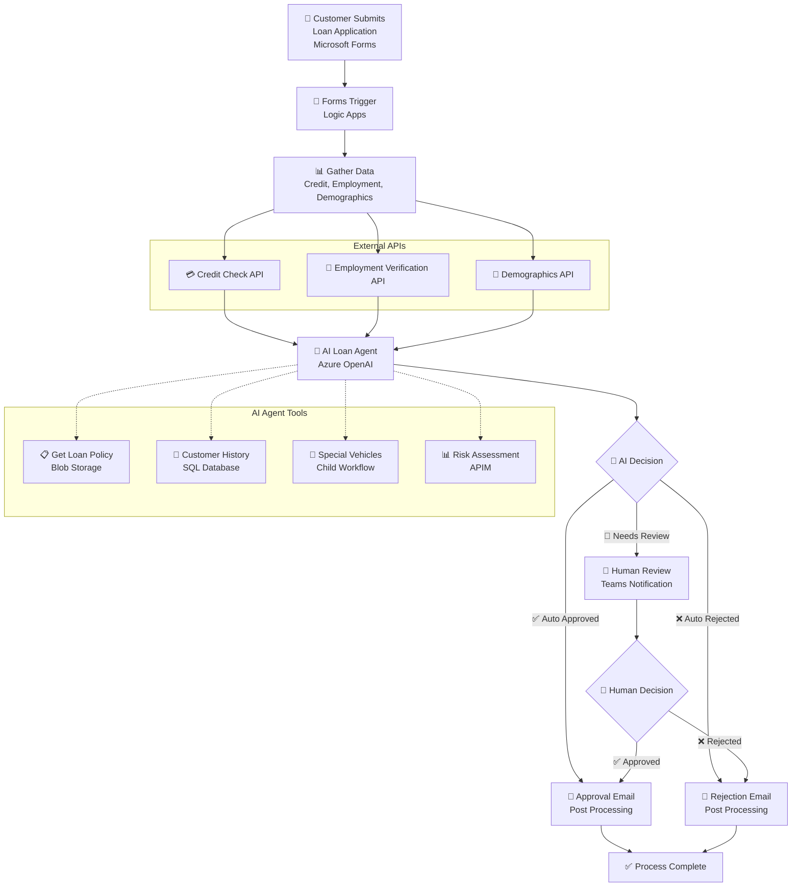
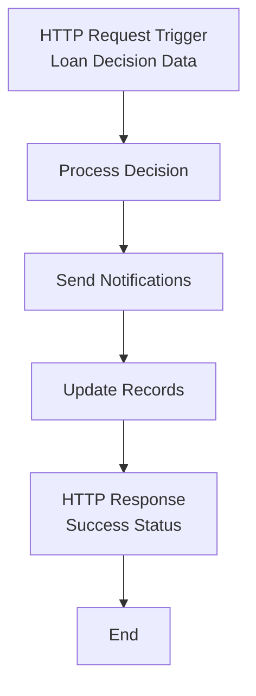
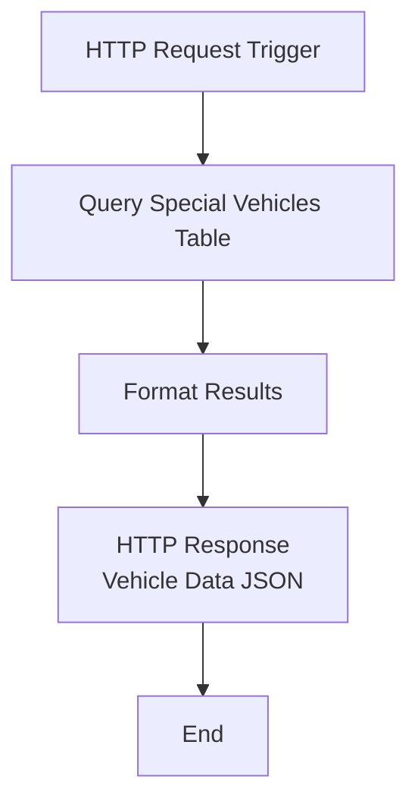

# AI Loan Agent

[](https://azure.microsoft.com/services/logic-apps/)
[](https://azure.microsoft.com/products/cognitive-services/openai-service/)

An AI-powered loan approval system that automates vehicle loan application evaluation using Azure Logic Apps Standard and Azure OpenAI. The system processes applications from Microsoft Forms, performs comprehensive risk assessments, and routes decisions through AI agents with human escalation when needed.

> **🚀 AI Loan Agent Sample**: End to end deployment with 6 validation scenarios included

## 🎥 Demo & Resources

- **📺 [Watch the Demo Video](https://youtu.be/rR1QjQTfCCg)** - Complete walkthrough of the AI Loan Agent in action
- **📖 [Read the Blog Post](https://techcommunity.microsoft.com/blog/integrationsonazureblog/%F0%9F%A4%96-agent-loop-demos-%F0%9F%A4%96/4414770)** - Deep dive into Agent Loop demos and architecture

## Prerequisites

### Required Tools

Before running the deployment script, ensure you have:

- **Azure CLI** (version 2.0 or later)
- **PowerShell 5.1** or **PowerShell Core 7+**
- **VS Code** with Azure Logic Apps extension
- **Azure subscription** with Contributor permissions
- **Microsoft Entra ID permissions** (Global Admin or Privileged Role Admin)

### Authentication Setup

```powershell
# Login to Azure CLI
az login

# Verify subscription access
az account show

# Set correct subscription if needed
az account set --subscription "your-subscription-id"
```

### Azure Services Created by deploy.ps1

The deployment script automatically provisions these Azure services:

- **Azure Logic Apps Standard** - Workflow orchestration platform
- **Azure OpenAI Service** - AI agent for loan decision making with GPT-4.1 deployment
- **Azure SQL Database** - Customer history and special vehicle data storage
- **Azure API Management** - Risk assessment, credit check, employment verification, and demographic APIs
- **Azure Storage Account** - Workflow runtime storage
- **Azure Blob Storage** - Policy document storage
- **Managed Identity** - Secure authentication between services

### Microsoft 365 Prerequisites

For Microsoft 365 integrations, you'll need:

- **Microsoft 365 Business/Enterprise License** - Required for Forms, Teams, and Outlook
- **Microsoft Forms** - Permission to create forms in your organization
- **Microsoft Teams** - Access to create workspaces and channels
- **Microsoft Outlook/Exchange Online** - For email notifications
- **Microsoft 365 Admin Permissions** - To authorize API connections

## Deployment Instructions

### Step 1: Deploy Azure Infrastructure

```powershell
cd Deployment
.\deploy.ps1
```

**What this script creates:**
- Azure Logic Apps Standard with managed identity
- Azure OpenAI Service with GPT-4.1 deployment
- Azure SQL Server and Database with Entra ID authentication
- Azure API Management with 4 mock APIs for testing
- Azure Storage Account and Blob containers
- Policy document uploaded to blob storage
- Network security and firewall configurations
- Microsoft 365 API connections (require manual authorization)

*Note: Deployment could take 30-45 minutes - use this time to complete Step 2 (Microsoft 365 configuration).*

### Step 2: Configure Microsoft 365

#### 2.1 Create Microsoft Forms

1. **Navigate to Microsoft Forms**: Go to [forms.microsoft.com](https://forms.microsoft.com)
2. **Create New Form**: Click "New Form" → "Blank Form"
3. **Set Form Title**: "Vehicle Loan Application"
4. **Add Required Fields**: Follow the exact template in `FORM-FIELDS-TEMPLATE.md`
5. **Configure Settings**:
   - ✅ Require sign-in
   - ✅ One response per person
   - ✅ Record name
6. **Publish Form**: Click "Share" → Copy the Form ID from URL
   - URL format: `https://forms.microsoft.com/r/[FORM_ID]`
   - Save the Form ID for later configuration

#### 2.2 Setup Microsoft Teams

1. **Create Teams Workspace**:
   - Open Microsoft Teams
   - Click "Teams" → "Create team" → "From scratch"
   - Name: "Loan Processing" (or your preference)
   - Type: "Private"
2. **Create Channel**:
   - In your team, click "+" → "Add channel"
   - Name: "Loan Approvals" (or your preference)
   - Privacy: "Standard"
3. **Extract IDs**:
   - Open the channel in web browser
   - Copy the URL
   - Extract Group ID and Channel ID from URL path
   - Format: `/l/team/[GROUP_ID]/conversations/[CHANNEL_ID]`
   - Save both IDs for configuration

#### 2.3 Authorize API Connections

1. **Navigate to Azure Portal** → Resource Groups → `[your-resource-group]`
2. **For each connection** (`formsConnection`, `teamsConnection`, `outlookConnection`):
   - Click on the connection resource
   - Click "Edit API Connection"
   - Click "Authorize" → Sign in with Microsoft 365 account
   - Grant requested permissions
   - Click "Save"
3. **Verify Status**: All connections should show "Connected" status

> 🔧 **Troubleshooting**: If authorization fails, ensure you have Microsoft 365 admin permissions and the required licenses.

### Step 3: Setup Database Schema

1. Navigate to Azure Portal → SQL Database → Query Editor
2. Authenticate with Microsoft Entra ID
3. Run `database-setup.sql` (creates tables and sample data)
4. Run `create-managed-identity-user.sql` (grants Logic App access)

### Step 4: Configure Local Development

*Complete this step AFTER Steps 1-3 are finished:*

1. Navigate to `LogicApps` folder
2. Follow setup instructions in `LogicApps/README.md`
3. Create and configure `local.settings.json` with values from deployed resources

### Step 5: Deploy Logic Apps

*Complete this step AFTER configuring local.settings.json (Step 4):*

**Deploy workflows with VS Code**: See instructions in `LogicApps/README.md` → "Next Steps: Deploy to Azure"

 
### Step 6: End-to-End Testing

1. Submit loan application via Microsoft Forms with entry from `SAMPLE-DATA.md`
2. Monitor workflow execution in Azure Portal
3. Verify AI agent tools and Teams notifications match `SAMPLE-DATA.md` expected outcome

## Troubleshooting

**SQL Connection Issues**: Verify managed identity user created in database
**Microsoft 365 Unauthorized**: Re-authorize connections in Azure Portal  
**Workflow Deployment Errors**: Ensure all connections use consistent configuration

## Configuration Notes

### ✅ Fully Automated (90% of setup)
- **Azure Infrastructure**: All services provisioned and configured
- **Connection Strings**: Database, Storage, API Management keys
- **Mock APIs**: Credit check, employment verification, demographics
- **Sample Data**: Database tables with realistic test scenarios
- **local.settings.json**: Auto-generated with deployment values

### 🔧 Manual Configuration Required (10% of setup)
Why these steps require manual intervention:
- **Microsoft Forms**: No programmatic API for form creation
- **Teams Workspace**: Interactive setup required for proper permissions
- **OAuth Connections**: Security requirement for user consent
- **IDs & Emails**: Teams Group/Channel IDs, Forms ID, Demo Email

### 🧪 Test Data Design
- **Safe Values**: Uses 555-XXX-XXXX SSNs, @example.com emails
- **Realistic Scenarios**: 6 test cases covering all decision paths
- **Mock Responses**: APIs return consistent data based on input patterns

## Security & Cost

**Security**: Uses managed identity for SQL, minimal Graph permissions, secure key storage
**Estimated Cost**: $355-720/month (varies by region and usage)
**Cleanup**: `az group delete --name "ai-loan-agent-rg" --yes --no-wait`

## Workflows

### LoanApprovalAgent

The main workflow that orchestrates the complete loan approval process using AI agents to evaluate applications against company policies, with integrated tools for data retrieval and human escalation.

#### Process Flow



#### Required Connections

|Connection Name|Connector Name|Connector Type|
|---|---|---|
|formsConnection|Microsoft Forms|Azure|
|agent|Azure OpenAI|Agent|
|sql|SQL Server|Service Provider|
|riskAssessmentAPI|Risk Assessment API|API Management|
|employmentValidationAPI|Employment Validation API|API Management|
|creditCheckAPI|Credit Check API|API Management|
|demographicVerificationAPI|Demographic Verification API|API Management|
|teamsConnection|Microsoft Teams|Azure|
|outlookConnection|Office 365 Outlook|Azure|

### LoanPostProcessing

A supporting workflow that handles post-approval processing steps and notifications after loan decisions are made.

#### Process Flow



#### Required Connections

|Connection Name|Connector Name|Connector Type|
|---|---|---|
|None|HTTP Request/Response|Built-in|

### SpecialVehicles

A utility workflow that retrieves special vehicle information from the database to support loan policy decisions and pricing calculations.

#### Process Flow



#### Required Connections

|Connection Name|Connector Name|Connector Type|
|---|---|---|
|sql|SQL Server|Service Provider|

## Deployment Folder Reference

### Automated Scripts (Called by deploy.ps1)
- **`deploy.ps1`** - Main deployment script that provisions all Azure resources
- **`create-apim-policies.ps1`** - Automatically called by deploy.ps1 to configure APIM mock APIs

### Manual Scripts (Require User Execution)
- **`database-setup.sql`** - Creates tables and sample data (run in Azure Portal after deploy.ps1)
- **`create-managed-identity-user.sql`** - Grants Logic App database access (run after database-setup.sql)
- **`complete-database-setup.sql`** - Alternative single script combining database-setup.sql + managed identity setup
- **`grant-graph-permissions.ps1`** - Grants Microsoft Graph permissions to Logic App managed identity

### Helper Scripts (Optional/Troubleshooting)
- **`helpers/generate-runtime-urls.ps1`** - Generates connection runtime URLs for manual configuration
  - Usage: `.\generate-runtime-urls.ps1 -SubscriptionId "your-sub-id" -ResourceGroup "your-rg"`
- **`helpers/get-connection-details.ps1`** - Extracts Microsoft 365 connection details for troubleshooting
  - Usage: `.\get-connection-details.ps1 -SubscriptionId "your-sub-id" -ResourceGroup "your-rg"`
- **`helpers/update-local-settings.ps1`** - Updates local.settings.json for configuration fixes
  - Usage: `.\update-local-settings.ps1 -DemoUserEmail "user@company.com"`

### Configuration Files
- **`policies/`** - Contains XML policy templates for APIM mock responses
  - `policy-cronus-credit.xml` - Credit check API mock responses
  - `policy-litware-employment-validation.xml` - Employment verification mock responses
  - `policy-northwind-demographic-verification.xml` - Demographics API mock responses
  - `policy-olympia-risk-assessment.xml` - Risk assessment API mock responses
