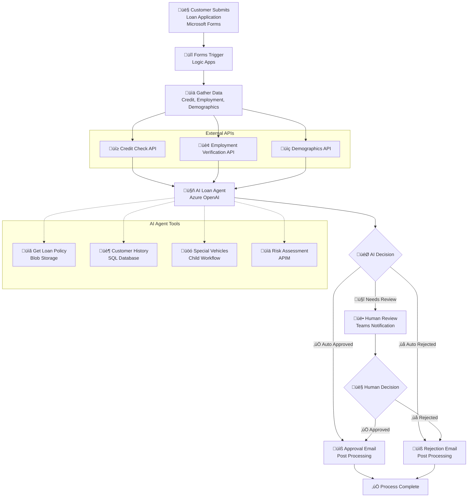

# AI Loan Agent

[](https://azure.microsoft.com/services/logic-apps/)
[](https://azure.microsoft.com/products/cognitive-services/openai-service/)

An AI-powered loan approval system that automates vehicle loan application evaluation using Azure Logic Apps Standard and Azure OpenAI. The system processes applications from Microsoft Forms, performs comprehensive risk assessments, and routes decisions through AI agents with human escalation when needed.

> **🚀 AI Loan Agent Sample**: End to end deployment with 6 validation scenarios included

## 🎥 Demo & Resources

- **📺 [Watch the Demo Video](https://youtu.be/rR1QjQTfCCg)** - Complete walkthrough of the AI Loan Agent in action
- **📖 [Read the Blog Post](https://techcommunity.microsoft.com/blog/integrationsonazureblog/%F0%9F%A4%96-agent-loop-demos-%F0%9F%A4%96/4414770)** - Deep dive into Agent Loop demos and architecture

## Prerequisites

### Required Tools

Before running the deployment script, ensure you have:

- **Azure CLI** (version 2.0 or later)
- **PowerShell 5.1** or **PowerShell Core 7+**
- **VS Code** with Azure Logic Apps extension
- **Azure subscription** with Contributor permissions
- **Microsoft Entra ID permissions** (Global Admin or Privileged Role Admin)

### Authentication Setup

```powershell
# Login to Azure CLI
az login

# Verify subscription access
az account show

# Set correct subscription if needed
az account set --subscription "your-subscription-id"
```

### Azure Services Created by deploy.ps1

The deployment script automatically provisions these Azure services:

- **Azure Logic Apps Standard** - Workflow orchestration platform
- **Azure OpenAI Service** - AI agent for loan decision making with GPT-4.1 deployment
- **Azure SQL Database** - Customer history and special vehicle data storage
- **Azure API Management** - Risk assessment, credit check, employment verification, and demographic APIs
- **Azure Storage Account** - Workflow runtime storage
- **Azure Blob Storage** - Policy document storage with auto-generated SAS URLs
- **Managed Identity & RBAC** - Secure authentication between services
- **Network & Firewall Rules** - Proper access control and security configuration
- **Microsoft 365 API Connections** - Forms, Teams, and Outlook integrations (require manual authorization)
- **Complete Configuration** - Auto-generated `local.settings.json` for development

### Microsoft 365 Prerequisites

For Microsoft 365 integrations, you'll need:

- **Microsoft 365 Business/Enterprise License** - Required for Forms, Teams, and Outlook
- **Microsoft Forms** - Permission to create forms in your organization
- **Microsoft Teams** - Access to create workspaces and channels
- **Microsoft Outlook/Exchange Online** - For email notifications
- **Microsoft 365 Admin Permissions** - To authorize API connections

## Deployment Instructions

### Step 1: Deploy Azure Infrastructure

```powershell
cd Deployment
.\deploy.ps1
```

**Enhanced Deployment Features:**
- ✅ **Idempotent**: Safe to run multiple times - existing resources are detected and skipped
- 🔄 **Unique Naming**: Automatically generates unique resource names to avoid conflicts
- 🛠️ **Error Recovery**: Improved error handling with detailed troubleshooting guidance
- 📝 **Auto-Configuration**: Generates `local.settings.json` with deployed resource values
- 🔧 **Troubleshooting**: See `TROUBLESHOOTING.md` for common issues and solutions

**Deployment Time:**
- *Typical Duration: 45-60 minutes (API Management creation takes 30-45 minutes)*
- *⏰ Use this time to complete Step 2 (Microsoft 365 configuration)*
- *The script will show progress and can be safely interrupted and resumed*

**Customization Options:**
```powershell
# Custom resource group and project name
.\deploy.ps1 -ResourceGroup "contoso-loan-rg" -ProjectName "contoso-loan"

# Different Azure region
.\deploy.ps1 -Location "westus"

# Use existing API Management (faster deployment)
.\deploy.ps1 -APIMServiceName "existing-apim-service"

# Skip login if already authenticated
.\deploy.ps1 -SkipLogin
```

### Step 2: Configure Microsoft 365 (During Deployment)

*⏰ Complete this step WHILE Step 1 is running to maximize efficiency*

#### 2.1 Create Microsoft Forms

1. **Visit Microsoft Forms**: Go to [https://forms.microsoft.com/Pages/DesignPagev2.aspx](https://forms.microsoft.com/Pages/DesignPagev2.aspx)
2. **Select Quick Import**: Click "Quick import" at the top of the page
3. **Choose Document**: Select the `Vehicle-Loan-Application-Form-Import.docx` file (included in this folder)
4. **Confirm Form Type**: Review and confirm the form type when prompted
5. **Review Form**: Once the form is imported, review all fields and make any necessary adjustments (change field types as needed)
6. **Get Form URL**: 
   - Click "Collect responses" 
   - Select "Copy link" to obtain the form URL
   - The URL will include the Form ID that you'll need for the workflow configuration
7. **Save Form ID**: Extract the ID from the URL format: `https://forms.microsoft.com/Pages/ResponsePage.aspx?id=[FORM_ID]`
8. **Save for Later**: Keep the Form ID - you'll add it to `local.settings.json` in Step 4

**⚠️ Note**: After import, you may need to adjust field types (Date, Number, Choice) and add dropdown options for Vehicle Make as described in `FORM-FIELDS-TEMPLATE.md`.

#### 2.2 Setup Microsoft Teams

1. **Create Teams Workspace**:
   - Open Microsoft Teams
   - Click "Teams" → "Create team" → "From scratch"
   - Name: "Loan Processing" (or your preference)
   - Type: "Private"
2. **Create Channel**:
   - In your team, click "+" → "Add channel"
   - Name: "Loan Approvals" (or your preference)
   - Privacy: "Standard"
3. **Extract IDs**:
   - Open the channel in web browser
   - Copy the URL which will look like: `https://teams.microsoft.com/l/channel/19%3A[encoded-channel-id]%40thread.tacv2/[channel-name]?groupId=[group-id]&tenantId=[tenant-id]`
   - Extract Group ID from `groupId=` parameter
   - Extract Channel ID from the encoded part (URL decode the `19%3A...%40thread.tacv2` section)
   - Save both IDs for configuration in Step 4

---

## Post-Deployment Configuration

*⚠️ Complete Steps 3-6 AFTER Step 1 (deployment) finishes*

### Step 3: Setup Database Schema

1. **Open Azure Portal** → Your Resource Group → Your SQL Database
2. **Click "Query editor (preview)"** in the left sidebar
3. **Sign in with "Active Directory authentication"**
4. **Update the script**:
   - Open `Deployment/complete-database-setup.sql`
   - Replace `your-logic-app-name` with your actual Logic App name
   - Copy the updated script
5. **Paste into Query Editor and click "Run"**

This creates sample customer data, special vehicle tables, and grants your Logic App database access.

**Troubleshooting**: If you get "Access Denied", ensure you have Azure AD admin permissions on the SQL Server.

### Step 4: Grant Microsoft Graph Permissions

```powershell
cd Deployment
.\grant-graph-permissions.ps1 -ResourceGroup "your-resource-group" -LogicAppName "your-logic-app-name"
```

This grants the Logic App managed identity permissions to read Microsoft 365 data.

### Step 5: Authorize API Connections & Configure Runtime URLs

#### 5.1 Authorize Microsoft 365 Connections

1. **Navigate to Azure Portal** → Resource Groups → `[your-resource-group]`
2. **For each connection** (`formsConnection`, `teamsConnection`, `outlookConnection`):
   - Click on the connection resource
   - Click "Edit API Connection"
   - Click "Authorize" → Sign in with Microsoft 365 account
   - Grant requested permissions
   - Click "Save"
3. **Verify Status**: All connections should show "Connected" status

#### 5.2 Generate Runtime URLs for Connections

```powershell
cd Deployment/helpers
.\generate-runtime-urls.ps1 -SubscriptionId "your-subscription-id" -ResourceGroup "your-resource-group"
```

This generates the runtime URLs needed for your `local.settings.json` file.

### Step 6: Finalize Local Development Configuration

✨ **Good News**: The enhanced `deploy.ps1` script automatically generates your `local.settings.json` file with most values populated!

**Auto-Generated Configuration:**
- ✅ All Azure resource connection strings and keys
- ✅ API Management subscription keys  
- ✅ OpenAI endpoint and keys
- ✅ Policy document URLs
- ✅ SQL connection strings

**Manual Updates Required:**
1. **Form ID**: Add your Microsoft Forms Form ID from Step 2.1
2. **Teams Configuration**: Update `TeamsGroupId` and `TeamsChannelId` from Step 2.2
3. **Email Address**: Update `DemoUserEmail` with your actual email address
4. **Project Path**: Update `ProjectDirectoryPath` with your local LogicApps folder path
5. **Runtime URLs**: Add the Microsoft 365 connection runtime URLs from Step 5.2

**Example manual updates needed in `local.settings.json`:**
```json
{
  "FormsFormId": "your-actual-form-id-from-step-2",
  "TeamsGroupId": "f6c2f8c4-169d-45f0-984f-5ddf92745896",
  "TeamsChannelId": "19:qphIGD96Fek2nrKbl-diAx7d6iNZ8aJq6dtVHtZVwNI1@thread.tacv2",
  "DemoUserEmail": "your-email@company.com",
  "ProjectDirectoryPath": "c:\\\\path\\\\to\\\\your\\\\LogicApps"
}
```

### Step 7: Configure API Management Policies (If Needed)

The deployment script automatically creates mock API policies, but you may need to update them manually if deployment issues occurred.

#### Option A: Automatic (Default)
The `deploy.ps1` script automatically calls `create-apim-policies.ps1` to configure all mock API policies.

#### Option B: Manual Configuration in Azure Portal

If you need to manually configure or update the API policies:

1. **Navigate to API Management**: Azure Portal → Your Resource Group → Your API Management service
2. **For each API** (Credit Check, Employment Validation, Demographics, Risk Assessment):
   - Go to "APIs" → Select the API → "All operations" → "Policies"
   - Click "Add policy" → "Code editor"
   - Copy the corresponding policy XML from the `Deployment/policies/` folder:
     - `policy-cronus-credit.xml` → Credit Check API
     - `policy-litware-employment-validation.xml` → Employment Validation API  
     - `policy-northwind-demographic-verification.xml` → Demographics API
     - `policy-olympia-risk-assessment.xml` → Risk Assessment API
   - Paste the XML content and click "Save"

3. **Verify Policies**: Test each API endpoint to ensure mock responses work correctly

**Policy Structure Notes:**
- All policies use `<return-response>` in the `<backend>` section
- Mock data is based on input patterns (SSN endings, employer names)
- Each policy includes proper error handling with try/catch blocks

### Step 8: Deploy Logic Apps

*Complete this step AFTER configuring local.settings.json (Step 6):*

**Deploy workflows with VS Code**: See instructions in `LogicApps/README.md` → "Next Steps: Deploy to Azure"

 
### Step 9: End-to-End Testing

1. Submit loan application via Microsoft Forms with entry from `SAMPLE-DATA.md`
2. Monitor workflow execution in Azure Portal
3. Verify AI agent tools and Teams notifications match `SAMPLE-DATA.md` expected outcome

## Troubleshooting

### Deployment Issues

**For deployment script problems**, see the comprehensive troubleshooting guide:
- 📖 **`Deployment/TROUBLESHOOTING.md`** - Complete troubleshooting guide with solutions

**Common deployment solutions:**
- **Script fails**: Re-run the script - it's idempotent and will resume where it left off
- **SQL Server naming conflicts**: Script auto-generates unique names to avoid conflicts  
- **Resource already exists**: Script detects and reuses existing resources safely
- **API Management timeout**: Normal behavior - APIM creation takes 30-45 minutes
- **Storage account conflicts**: Script automatically generates new unique names

### Runtime Issues

**SQL Connection Issues**: Verify managed identity user created in database
**Microsoft 365 Unauthorized**: Re-authorize connections in Azure Portal  
**Workflow Deployment Errors**: Ensure all connections use consistent configuration

### Getting Help

1. **Check logs**: Deployment script provides detailed error messages with solutions
2. **Re-run deployment**: Script is safe to run multiple times
3. **Clean start**: Delete resource group and run script again
4. **Review guides**: Check `TROUBLESHOOTING.md` for step-by-step solutions

## Configuration Notes

### ✅ Fully Automated (90% of setup)
- **Azure Infrastructure**: All services provisioned and configured
- **Connection Strings**: Database, Storage, API Management keys
- **Mock APIs**: Credit check, employment verification, demographics
- **Sample Data**: Database tables with realistic test scenarios
- **local.settings.json**: Auto-generated with deployment values

### 🔧 Manual Configuration Required (10% of setup)
Why these steps require manual intervention:
- **Microsoft Forms**: No programmatic API for form creation
- **Teams Workspace**: Interactive setup required for proper permissions
- **OAuth Connections**: Security requirement for user consent
- **IDs & Emails**: Teams Group/Channel IDs, Forms ID, Demo Email

### 🧪 Test Data Design
- **Safe Values**: Uses 555-XXX-XXXX SSNs, @example.com emails
- **Realistic Scenarios**: 6 test cases covering all decision paths
- **Mock Responses**: APIs return consistent data based on input patterns

## Security & Cost

**Security**: Uses managed identity for SQL, minimal Graph permissions, secure key storage
**Estimated Cost**: $355-720/month (varies by region and usage)
**Cleanup**: `az group delete --name "ai-loan-agent-rg" --yes --no-wait`

## Workflows

### LoanApprovalAgent

The main workflow that orchestrates the complete loan approval process using AI agents to evaluate applications against company policies, with integrated tools for data retrieval and human escalation.

#### Process Flow



#### Required Connections

|Connection Name|Connector Name|Connector Type|
|---|---|---|
|formsConnection|Microsoft Forms|Azure|
|agent|Azure OpenAI|Agent|
|sql|SQL Server|Service Provider|
|riskAssessmentAPI|Risk Assessment API|API Management|
|employmentValidationAPI|Employment Validation API|API Management|
|creditCheckAPI|Credit Check API|API Management|
|demographicVerificationAPI|Demographic Verification API|API Management|
|teamsConnection|Microsoft Teams|Azure|
|outlookConnection|Office 365 Outlook|Azure|

### LoanPostProcessing

A supporting workflow that handles post-approval processing steps and notifications after loan decisions are made.

#### Process Flow


#### Required Connections

|Connection Name|Connector Name|Connector Type|
|---|---|---|
|None|HTTP Request/Response|Built-in|

### SpecialVehicles

A utility workflow that retrieves special vehicle information from the database to support loan policy decisions and pricing calculations.

#### Process Flow


#### Required Connections

|Connection Name|Connector Name|Connector Type|
|---|---|---|
|sql|SQL Server|Service Provider|

## Deployment Folder Reference

### Main Deployment Script
- **`deploy.ps1`** - Enhanced main deployment script with improved error handling, unique naming, and idempotent behavior
  - **Features**: Automatic conflict resolution, detailed logging, safe re-runs, auto-generated configurations
  - **Documentation**: See `TROUBLESHOOTING.md` for comprehensive guidance

### Automated Scripts (Called by deploy.ps1)
- **`create-apim-policies.ps1`** - Automatically called by deploy.ps1 to configure APIM mock APIs

### Manual Scripts (Require User Execution)
- **`database-setup.sql`** - Creates tables and sample data (run in Azure Portal after deploy.ps1)
- **`create-managed-identity-user.sql`** - Grants Logic App database access (run after database-setup.sql)
- **`complete-database-setup.sql`** - Alternative single script combining database-setup.sql + managed identity setup
- **`grant-graph-permissions.ps1`** - Grants Microsoft Graph permissions to Logic App managed identity

### Documentation & Support
- **`TROUBLESHOOTING.md`** - 🆕 Comprehensive troubleshooting guide for deployment issues

### Helper Scripts (Optional/Troubleshooting)
- **`helpers/generate-runtime-urls.ps1`** - Generates connection runtime URLs for manual configuration
  - Usage: `.\generate-runtime-urls.ps1 -SubscriptionId "your-sub-id" -ResourceGroup "your-rg"`
- **`helpers/get-connection-details.ps1`** - Extracts Microsoft 365 connection details for troubleshooting
  - Usage: `.\get-connection-details.ps1 -SubscriptionId "your-sub-id" -ResourceGroup "your-rg"`
- **`helpers/update-local-settings.ps1`** - Updates local.settings.json for configuration fixes
  - Usage: `.\update-local-settings.ps1 -DemoUserEmail "user@company.com"`

### Configuration Files
- **`policies/`** - Contains XML policy templates for APIM mock responses
  - `policy-cronus-credit.xml` - Credit check API mock responses
  - `policy-litware-employment-validation.xml` - Employment verification mock responses
  - `policy-northwind-demographic-verification.xml` - Demographics API mock responses
  - `policy-olympia-risk-assessment.xml` - Risk assessment API mock responses
