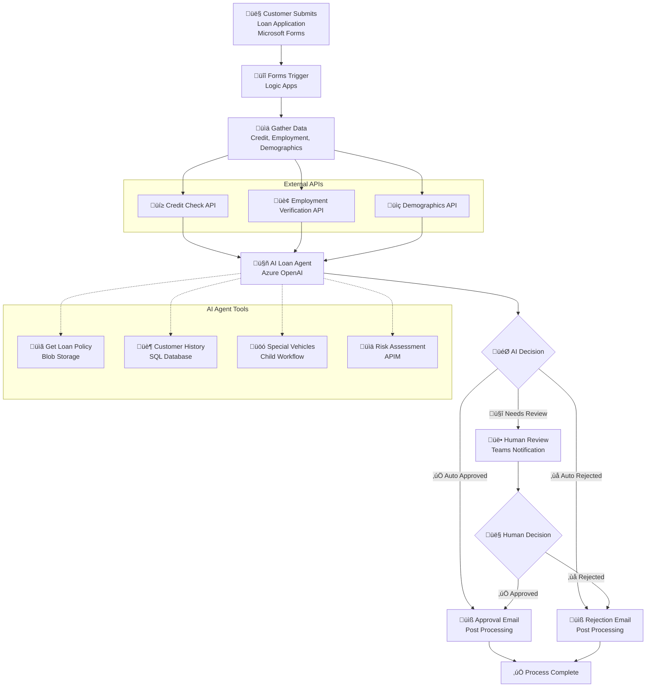

# AI Loan Agent

[](https://azure.microsoft.com/services/logic-apps/)
[](https://azure.microsoft.com/products/cognitive-services/openai-service/)

An AI-powered loan approval system that automates vehicle loan application evaluation using Azure Logic Apps Standard and Azure OpenAI. The system processes applications from Microsoft Forms, performs comprehensive risk assessments, and routes decisions through AI agents with human escalation when needed.

> **🚀 AI Loan Agent Sample**: End to end deployment with 6 validation scenarios included

## 📋 Quick Overview

This sample demonstrates a complete AI agent workflow for loan processing with automated deployment:

**What You'll Build:**
- 🤖 **AI Loan Agent** - GPT-4 powered decision engine with company policy awareness
- 🔧 **AI Agent Tools** - Credit checks, employment verification, customer history, risk assessment
- 📝 **Microsoft Forms Integration** - Web-based loan application submission
- 👥 **Teams Notifications** - Human review escalation for complex cases
- 🗄️ **SQL Database** - Customer history and special vehicle data
- 🌐 **Mock APIs** - Realistic external service simulation via API Management

**Deployment Overview:**
1. **Run Bicep Deployment** (`deploy-bicep.ps1`) - PowerShell script deploys Bicep templates to provision Azure infrastructure (~45-60 minutes)
2. **Create Microsoft Form** - Build loan application form with 14 required fields (during deployment, ~10 minutes)
3. **Configure Teams Channel** - Set up notification destination (during deployment, ~5 minutes)
4. **Deploy Workflows to Azure** - Push workflows from VS Code with placeholder connections (~5 minutes)
5. **Authorize M365 Connections** - Use Azure Portal to authorize Forms, Teams, Outlook with On-Behalf-Of (OBO) agent connections (~10 minutes)
6. **Submit Test Form** - Submit ONE test application to trigger workflow and capture field IDs (~2 minutes)
7. **Map Form Field IDs** - Run PowerShell script to auto-detect and update field mappings (~5 minutes)
8. **Test End-to-End** - Submit remaining test applications and verify AI decisions (~15 minutes)

**Total Setup Time**: ~100 minutes (infrastructure provisioning is longest step)

**Key Features:**
- ✅ **99% Automated** - Bicep templates (Infrastructure as Code) handle all Azure resource creation and configuration
- ✅ **Secure by Default** - Managed Identity, Entra ID authentication, app settings stores connection strings and keys for Logic App runtime
- ✅ **Idempotent Deployment** - Safe to re-run if anything fails
- ✅ **Comprehensive Testing** - 6 pre-built test scenarios covering all decision paths

## 🎥 Demo & Resources

- **📺 [Watch the Demo Video](https://youtu.be/rR1QjQTfCCg)** - Complete walkthrough of the AI Loan Agent in action
- **📖 [Read the Blog Post](https://techcommunity.microsoft.com/blog/integrationsonazureblog/%F0%9F%A4%96-agent-loop-demos-%F0%9F%A4%96/4414770)** - Deep dive into Agent Loop demos and architecture

## Prerequisites

### Required Tools

Before running the deployment script, ensure you have:

- **Azure PowerShell Modules** - Automatically installed by script if missing:
  - `Az.Accounts` - Authentication and context management
  - `Az.Resources` - Bicep deployment and resource group operations
  - `Az.ApiManagement` - APIM API and policy management  
  - `Az.Storage` - Blob storage operations
  - `Az.Sql` - SQL Server firewall rules
  - `SqlServer` - Database setup (optional, script falls back if unavailable)
- **PowerShell 5.1** or **PowerShell Core 7+**
- **VS Code** with Azure Logic Apps extension
- **Azure subscription** with Contributor permissions
- **Microsoft Entra ID permissions** (Global Admin or Privileged Role Admin)

**Note**: The deployment script uses ** Azure PowerShell**

### Authentication Setup

```powershell
# Login to Azure PowerShell
Connect-AzAccount

# Verify subscription access
Get-AzContext

# Set correct subscription if needed
Set-AzContext -Subscription "your-subscription-id"
```

**Note**: The deployment script requires active Azure PowerShell authentication. All Azure operations use the PowerShell Az modules for consistency and reliability.

### Azure Services Created by Bicep Deployment

The Bicep deployment (`deploy-bicep.ps1`) automatically provisions these Azure services:

- **Azure Logic Apps Standard** - Workflow orchestration platform
- **Azure OpenAI Service** - AI agent for loan decision making with GPT-4.1 deployment
- **Azure SQL Database** - Customer history and special vehicle data storage
- **Azure API Management** - Risk assessment, credit check, employment verification, and demographic APIs
- **Azure Storage Account** - Workflow runtime storage
- **Azure Blob Storage** - Policy document storage with auto-generated SAS URLs
- **Managed Identity & RBAC** - Secure authentication between services
- **Network & Firewall Rules** - Proper access control and security configuration
- **Microsoft 365 V2 API Connections** - Forms, Teams, and Outlook with automatic access policies
- **Complete Configuration** - Auto-generated `local.settings.json` for development

### Microsoft 365 Prerequisites

For Microsoft 365 integrations, you'll need:

- **Microsoft 365 Business/Enterprise License** - Required for Forms, Teams, and Outlook
- **Microsoft Forms** - Permission to create forms in your organization
- **Microsoft Teams** - Access to create workspaces and channels
- **Microsoft Outlook/Exchange Online** - For email notifications

**Permissions for M365 Connection Authorization:**

When you authorize Microsoft 365 connections in VS Code (Step 4), you'll need:

- **User Permissions** - Standard user account with access to:
  - **Forms**: Ability to read form responses in your organization
  - **Teams**: Permission to post messages to channels in teams you're a member of
  - **Outlook**: Send email on your behalf

- **Consent Flow** - During authorization, you'll be prompted to grant these delegated permissions:
  - `Forms.Read.All` - Read forms and responses
  - `ChannelMessage.Send` - Post messages to Teams channels
  - `Mail.Send` - Send emails via Outlook
  
- **No Admin Consent Required** - These are delegated permissions (user-level), not application permissions
- **Organization Policy** - Ensure your organization allows users to consent to apps accessing company data
  - If user consent is disabled by your tenant admin, you'll need admin approval for the connections

## Deployment Instructions

### Step 1: Deploy Azure Infrastructure

```powershell
cd Deployment
.\deploy-bicep.ps1
```

**Bicep Deployment Features:**
- 🏗️ **Infrastructure as Code**: Uses Azure Bicep templates for declarative infrastructure
- ✅ **Idempotent**: Safe to run multiple times - existing resources are detected and skipped
- 🔄 **Deterministic Naming**: Uses `uniqueString()` for conflict-free resource naming
- 🛠️ **Comprehensive Error Handling**: PowerShell Az module deployment with detailed error messages
- 📝 **Auto-Configuration**: Generates `local.settings.json` with all deployed resource values
- 🗄️ **Automated Database Setup**: Uses Azure CLI access token for passwordless SQL configuration
- 🔐 **Security Best Practices**: Entra ID authentication, Managed Identity, encrypted connections
- � **Modular Architecture**: Separate Bicep modules for each resource type

**Deployment Time:**
- *Typical Duration: 45-60 minutes (API Management creation takes 30-45 minutes)*
- *⏰ Use this time to complete Step 2 (Microsoft 365 configuration)*
- *The script will show progress and can be safely interrupted and resumed*

**Configuration Options:**

Edit `bicep/main.bicepparam` before deployment:
```bicep
param projectName = 'my-loan-agent'        // Your unique project name
param location = 'eastus2'                  // OpenAI-supported region
param sqlAdminObjectId = '<YOUR_OBJECT_ID>' // Get from: az ad signed-in-user show --query id
param sqlAdminUsername = '<YOUR_EMAIL>'     // Your Azure AD email
param existingApimName = ''                 // Optional: reuse existing APIM
```

**Supported OpenAI Regions:** eastus2, swedencentral, australiaeast, westus, northeurope

### Step 2: Create Microsoft Form (During Deployment)

*⏰ Complete this step WHILE Step 1 is running to maximize efficiency*

**🔗 Workflow Dependency**: The AI Loan Agent workflow is triggered when a loan application is submitted through a Microsoft Form. In this step, you will create the form and save its `Form ID` for use in a later step after the core infrastructure has been deployed.

1. **Visit Microsoft Forms**: Go to [https://forms.microsoft.com/Pages/DesignPagev2.aspx](https://forms.microsoft.com/Pages/DesignPagev2.aspx)

2.  **Import or Create the Form**:
   
    **Option A: Import from File (Recommended)**
    - If you see a "Quick import" option, click it.
    - Select the `Vehicle-Loan-Application-Form-Import.docx` file from the `ai-loan-agent-sample` folder.
    - This will automatically create the form with the required fields.

    **Option B: Create Manually**
    - If you don't have the "Quick import" option, click "New Form".
    - Manually add the fields as specified in `FORM-FIELDS-TEMPLATE.md`.

3.  **Review and Validate the Form**:
    - **This is a critical step.** The imported or created form must contain **14 specific fields** for the `LoanApprovalAgent` workflow to function correctly.
    - The form should have:
        - **12 Text input fields** for applicant and loan details.
        - **1 Multiple-choice question** for loan purpose.
        - **1 Closing statement** (informational text).
    - Carefully compare your form against the structure outlined in `FORM-FIELDS-TEMPLATE.md`. Ensure all fields are present and that their types (e.g., Text, Choice) are correct. The data from these fields is expected by the Logic App workflow you will deploy later.

4.  **Get and Save the Form ID**: 
    - Click **Collect responses** at the top of your form.
    - Copy the sharing link. The URL will have a format like: `https://forms.microsoft.com/Pages/ResponsePage.aspx?id=[YOUR_FORM_ID]`
    - **Save the `Form ID` part of the URL.** You will need this ID in a post-deployment step to connect your Logic App to this form.

#### 2.2 Connect Workflow to Teams Channel

**🔗 Workflow Dependency**: *Only needed for complex loan assessments* - The AI Loan Agent workflow sends notifications to a Microsoft Teams channel for human review of complex loan applications. You need to configure which Teams channel to use.

**Choose Your Teams Channel**:

- **Use Existing Channel**: If you have a suitable Teams channel (e.g., in your finance or operations team), you can use it directly
- **Create New Channel**: Add a dedicated channel to an existing team ([see Microsoft's channel guide](https://support.microsoft.com/en-us/office/create-a-standard-private-or-shared-channel-in-microsoft-teams-fda0b75e-5b90-4fb8-8857-7e102b014525))
- **Create New Team**: Set up a dedicated team for loan processing workflows ([see Microsoft's team guide](https://support.microsoft.com/en-us/office/create-a-team-from-scratch-in-microsoft-teams-174adf5f-846b-4780-b765-de1a0a737e2b))

**Get Channel Configuration Details**:

1. **Navigate to Your Chosen Channel**:
   - Open Microsoft Teams and go to the channel you want to use for loan approval notifications

2. **Get Channel Link**:
   - Right-click on the channel name in the left sidebar
   - Select **Copy link**
   - **Alternative method**: Click the **⋯** (More options) next to the channel name and select **Copy link**

3. **Extract Required Configuration IDs**:
   - The channel URL contains the IDs needed for workflow configuration:
     ```
     https://teams.microsoft.com/l/channel/19%3A[encoded-channel-id]%40thread.tacv2/[channel-name]?groupId=[group-id]&tenantId=[tenant-id]
     ```
   - **Extract Group ID**: Copy the value after `groupId=` (before any `&` character)
   - **Extract Channel ID**: Copy the encoded part between `/channel/` and the channel name, then URL decode it
     - Example: `19%3A...%40thread.tacv2` becomes `19:...@thread.tacv2`
   - **Save these IDs**: You'll need them for workflow configuration in Step 6

---

## Post-Deployment Configuration

*⚠️ Complete these steps AFTER Step 1 (deployment) finishes*

### Step 3: Database Setup (Automated)

**🔗 Workflow Dependency**: The AI agent queries the SQL database for customer history and special vehicle information. The deployment script now handles this automatically.

**✅ Automated Setup** (No Action Required):
The `deploy-bicep.ps1` script automatically:
1. **Uses Azure CLI Access Token**: Leverages your existing `az login` session (no password needed)
2. **Installs SqlServer Module**: Auto-installs PowerShell SqlServer module if not present
3. **Executes SQL Script**: Runs `complete-database-setup.sql` with token authentication
4. **Creates Database Schema**: Sets up `Applicants` and `SpecialVehicles` tables
5. **Populates Sample Data**: Loads test data from `SAMPLE-DATA.md`
6. **Configures Managed Identity**: Grants Logic App database access automatically

**Authentication Method**:
- ✅ **Passwordless Authentication**: Uses Azure CLI token (no MFA prompts)
- ✅ **Entra ID Only**: SQL Server configured for Azure AD authentication only
- ✅ **Managed Identity**: Logic App uses system-assigned identity for database access

**📋 Manual Setup** (Fallback if automated setup fails):

If the deployment script cannot complete database setup automatically, it will:
1. Try `sqlcmd` with Entra ID authentication (may prompt for MFA)
2. Display the full SQL script for manual execution
3. Provide portal instructions

**Manual Steps**:
1. **Navigate to SQL Database** in Azure Portal → Your Resource Group → SQL Database
2. **Open Query Editor (preview)** from left navigation
3. **Add Firewall Rule** if prompted: Click "Allowlist IP" link
4. **Connect with Entra ID**: Use Microsoft Entra ID authentication
5. **Execute Script**: Copy content from `Deployment/complete-database-setup.sql` and run

**Note**: The script automatically replaces `your-logic-app-name` placeholder with your actual Logic App name.

### Step 4: Finalize Local Development Configuration

**🔗 Workflow Dependency**: *Tells workflow where to find your resources* - The workflow needs your specific Form ID, Teams channel IDs, and connection URLs. Wrong values cause "resource not found" errors.

✨ The `deploy-bicep.ps1` script automatically generates your `local.settings.json` file. Most values are populated to reflect the deployed Azure resources.

**Auto-Generated Configuration:**
- ✅ All Azure resource connection strings and keys
- ✅ API Management subscription keys  
- ✅ OpenAI endpoint and keys
- ✅ Policy document URLs
- ✅ SQL connection strings

**Manual Updates Required:**
1. **Teams Configuration**: Update `TeamsGroupId` and `TeamsChannelId` obtained from Step 2.2
   - You must create or identify a Teams channel and extract the Group ID and Channel ID from the channel link
   - These IDs configure where the workflow sends loan approval notifications
2. **Email Address**: Update `DemoUserEmail` with your actual email address
   - *This demo uses a hardcoded applicant email address because SAMPLE-DATA.md has placeholder addresses. Production workflows would extract the applicant's email from form data.*
3. **Project Path**: Update `ProjectDirectoryPath` with your local LogicApps folder path
4. **Form ID**: Update the workflow trigger in `LogicApps/LoanApprovalAgent/workflow.json` (detailed in Step 6.1)

**Connection Authorization**: The Microsoft 365 connections (Forms, Teams, Outlook) will be authorized automatically when you open the workflow in VS Code designer and deploy. No manual portal configuration is required.

**💡 Tip**: You can edit `local.settings.json` directly or use the deployment helper scripts to update specific values.

**Example manual updates needed in `local.settings.json`:**
```json
{
  "TeamsGroupId": "f6c2f8c4-169d-45f0-984f-5ddf92745896",
  "TeamsChannelId": "19:qphIGD96Fek2nrKbl-diAx7d6iNZ8aJq6dtVHtZVwNI1@thread.tacv2",
  "DemoUserEmail": "your-email@company.com",
  "ProjectDirectoryPath": "c:\\\\path\\\\to\\\\your\\\\LogicApps"
}
```

### Step 5: Configure API Management Policies (If Needed)

**🔗 Workflow Dependency**: *Optional - provides realistic test data* - These mock APIs return sample credit scores and employment data. The workflow runs without them, but AI decisions may be unrealistic during testing.

The deployment script automatically creates mock API policies, but you may need to update them manually if deployment issues occurred.

#### Option A: Automatic (Default)
The `deploy-bicep.ps1` script automatically calls `create-apim-policies.ps1` to configure all mock API policies.

#### Option B: Manual Configuration in Azure Portal

If you need to manually configure or update the API policies:

1. **Navigate to API Management**: Azure Portal → Your Resource Group → Your API Management service
2. **For each API** (Credit Check, Employment Validation, Demographics, Risk Assessment):
   - Go to "APIs" → Select the API → "All operations" → "Policies"
   - Click "Add policy" → "Code editor"
   - Copy the corresponding policy XML from the `Deployment/policies/` folder:
     - `policy-cronus-credit.xml` → Credit Check API
     - `policy-litware-employment-validation.xml` → Employment Validation API  
     - `policy-northwind-demographic-verification.xml` → Demographics API
     - `policy-olympia-risk-assessment.xml` → Risk Assessment API
   - Paste the XML content and click "Save"

3. **Verify Policies**: Test each API endpoint to ensure mock responses work correctly

**Policy Structure Notes:**
- All policies use `<return-response>` in the `<backend>` section
- Mock data is based on input patterns (SSN endings, employer names)
- Each policy includes proper error handling with try/catch blocks

### Step 6: Deploy Logic Apps

**🔗 Workflow Dependency**: *Uploads the workflow code to Azure* - This copies your workflow definitions to the cloud. Until deployed, the workflows exist only locally and can't process real applications.

*Complete this step AFTER configuring local.settings.json (Step 4):*

#### 6.1 Update Form ID in Workflow Trigger

**⚠️ Critical**: Before deploying, you must update the Microsoft Forms trigger with your actual Form ID:

1. **Open the workflow file**: `LogicApps/LoanApprovalAgent/workflow.json`

2. **Find and update TWO locations with your Form ID**:

   **Location 1 - Trigger:**
   ```json
   "triggers": {
       "When_a_new_response_is_submitted": {
           "type": "ApiConnectionWebhook",
           "inputs": {
               "path": "/formapi/api/forms/@{encodeURIComponent('PUT_YOUR_FORM_ID_HERE')}/webhooks"
   ```

   **Location 2 - Get Response Action:**
   ```json
   "Get_response_details": {
       "type": "ApiConnection",
       "inputs": {
           "path": "/formapi/api/forms('@{encodeURIComponent('PUT_YOUR_FORM_ID_HERE')}')/responses",
   ```

3. **Replace `PUT_YOUR_FORM_ID_HERE`** with your actual Form ID from Step 2.
   - Extract from your form URL: `https://forms.microsoft.com/Pages/ResponsePage.aspx?id=YOUR_FORM_ID`
   - Example: If your Form ID is `v4j5cvGGr0GRqy180BHbRzvuYcO0V-9Bq3SxP9NbF71UOFlOTFYyMEdPWEhFSVQ3VVRHVTZXREFYTy4u`, replace both instances

4. **Save the file**

**⚠️ Important**: Both locations MUST use the exact same Form ID, or the workflow won't trigger when forms are submitted.

#### 6.2 Map Form Field IDs to Workflow

**⚠️ Critical**: Microsoft Forms assigns unique IDs to each form field. Your form's field IDs are different from the sample's hardcoded IDs in workflow.json.

**Automated Solution**: Use the provided PowerShell script to automatically detect and map your form field IDs:

```powershell
cd Deployment/helpers
.\update-form-field-mappings.ps1 `
    -LogicAppName "your-logic-app-name" `
    -ResourceGroup "your-resource-group"
```

**Prerequisites**:
1. Submit at least **one test form response** first (the script needs a workflow run to extract field IDs)
2. Ensure Azure CLI is authenticated (`az login`)

**What the script does**:
1. Fetches your latest workflow run
2. Extracts actual form field IDs from `Get_response_details` action output
3. Auto-detects field types using pattern matching:
   - **SSN**: Format `XXX-XX-XXXX` or 9 digits
   - **Salary**: Large numeric values (> $100,000)
   - **Loan Amount**: Moderate numeric values ($10k-$100k)
   - **Date of Birth**: Date format
   - **Vehicle Make**: Text matching car brands (Toyota, Honda, Ford, BMW, etc.)
   - **Name/Employer**: Remaining text fields
4. Updates all field references in `workflow.json` with correct IDs
5. Offers to redeploy automatically

**Interactive Mode** (manual field selection if auto-detection fails):
```powershell
.\update-form-field-mappings.ps1 `
    -LogicAppName "your-logic-app-name" `
    -ResourceGroup "your-resource-group" `
    -Interactive
```

**Required Form Fields**: Your Microsoft Form must include these fields for the workflow to work:

| Field Name | Description | Example Value |
|------------|-------------|---------------|
| **Name** | Applicant's full name | John Smith |
| **SSN** | Social Security Number | 555-12-3456 |
| **Date of Birth** | Date of birth | 01/15/1985 |
| **Employer** | Current employer name | Contoso Inc. |
| **Years Worked** | Years at current job | 5 |
| **Salary** | Annual salary | 75000 |
| **Loan Amount** | Requested loan amount | 35000 |
| **Vehicle Make** | Vehicle make/model | Toyota Camry |

#### 6.3 Deploy with VS Code

1. **Open the Logic Apps workspace** in VS Code: `File` → `Open Folder` → Select `LogicApps` folder
2. **Deploy workflows**: See detailed instructions in `LogicApps/README.md` → "Next Steps: Deploy to Azure"
   - Workflows will deploy with placeholder M365 connections (showing 'Invalid connection' initially)
   - Connection authorization happens in the next step via Azure Portal

#### 6.4 Authorize M365 Connections in Azure Portal

**⚠️ Important**: The sample deploys with placeholder connections using user-assigned managed identity and On-Behalf-Of (OBO) agent connections. You must authorize these in the Azure Portal.

**Steps to Authorize**:

1. **Open Azure Portal** → Navigate to your Logic App resource
2. **Open LoanApprovalAgent Workflow** → Click on the workflow in the left navigation
3. **Identify Invalid Connections** → Actions with M365 connectors (Forms, Teams, Outlook) will show 'Invalid connection' messages
4. **Authorize Each Connection**:
   - Click on each action showing 'Invalid connection'
   - At the bottom of the action blade, click **'Change connection'**
   - Click **'Sign in'**
   - Select the connection from the list
   - For agent connections (Teams, Outlook), you'll see:
     - **On-Behalf-Of (OBO) option** with 'Create as per-user connection' toggle
     - Enable this OBO capability for agent connections
   - Complete the OAuth consent flow to grant permissions
5. **Repeat for All M365 Actions**:
   - **Forms**: `When_a_new_response_is_submitted`, `Get_response_details`
   - **Teams**: `Post_message_in_a_chat_or_channel`
   - **Outlook**: Email actions
6. **Save Workflow Changes** → Click 'Save' at the top to persist the authorized connections

**What OBO Connections Enable**:
- Agent connections act on behalf of the authenticated user
- Managed Identity handles the Logic App's identity
- User consent grants delegated permissions (Forms.Read.All, ChannelMessage.Send, Mail.Send)
- No stored credentials - uses secure OAuth tokens

**Verification**: After saving, the 'Invalid connection' messages will resolve, and the workflow is ready to run.

 
### Step 7: Submit Test Form and Map Field IDs

**🔗 Workflow Dependency**: *Captures form field IDs from actual workflow run* - After deploying and authorizing connections, submit one test form to trigger the workflow and extract field IDs.

1. **Submit ONE test form** via Microsoft Forms with entry from `SAMPLE-DATA.md`
2. **Run field mapping script** (see Step 6.2 for details):
   ```powershell
   cd Deployment/helpers
   .\update-form-field-mappings.ps1 -LogicAppName "your-logic-app-name" -ResourceGroup "your-resource-group"
   ```
3. **Verify field mappings** were updated in workflow and app settings

### Step 8: End-to-End Testing

**🔗 Workflow Dependency**: *Validates everything works together* - Tests the complete flow: form submission → AI processing → Teams notification. Confirms all previous steps were configured correctly.

1. Submit loan application via Microsoft Forms with entry from `SAMPLE-DATA.md`
2. Monitor workflow execution in Azure Portal
3. Verify AI agent tools and Teams notifications match `SAMPLE-DATA.md` expected outcome

## Troubleshooting

### Deployment Issues

**Quick Solutions for Common Problems**:

**Script fails or times out**: 
- Re-run the script - it's idempotent and will resume where it left off
- Most common cause: API Management creation takes 30-45 minutes (normal)

**Resource naming conflicts**: 
- Script auto-generates unique names based on subscription + resource group hash
- If conflicts occur, delete the resource group and re-run with a different name

**Permission denied errors**:
- Ensure you have Contributor role on the subscription
- For Microsoft Entra ID operations, ensure you have Global Admin or Privileged Role Admin permissions

**OpenAI or APIM deployment fails**:
- Check service availability in your selected region
- Verify you have sufficient quota for these services
- Manual creation instructions are provided in the simplified deployment output

### Post-Deployment Issues

**Database Connection Errors**:
- Verify your Microsoft Entra ID user is set as SQL admin (done automatically by script)
- Use "Entra ID authentication" in Query Editor, not SQL authentication
- Managed identity authentication is configured automatically - no passwords needed

**Microsoft 365 Connection Issues**:
- **'Invalid connection' errors**: Follow Step 6.4 to authorize connections in Azure Portal
- **OBO authorization required**: Agent connections (Teams, Outlook) must use On-Behalf-Of with 'Create as per-user connection' enabled
- **Consent not appearing**: Ensure your organization allows user consent for apps (check tenant admin settings)
- **Connection still invalid after authorization**: Save the workflow after changing connections
- **Permissions denied**: Verify your M365 account has licenses for Forms, Teams, and Outlook
- **User not found in Teams**: Add Logic App's managed identity as a member of the Teams team

**Workflow Deployment Fails**:
- Verify `local.settings.json` contains correct values from deployment
- Ensure connections are authorized in VS Code designer before deployment
- Check VS Code Azure Logic Apps extension is properly connected to Azure
- Verify you have appropriate permissions in the Azure subscription

**Workflow Parameter Not Found Errors**:
- **Symptom**: "The workflow parameter 'FormFieldId_XXX' is not found" errors at runtime
- **Root Cause**: Logic Apps Standard requires parameters in THREE places:
  1. `workflow.json` - Defines parameters with types and defaults
  2. `parameters.json` - Maps parameters to app settings using `@appsetting('ParameterName')`
  3. Azure app settings - Contains actual values
- **Solution**: Run `update-form-field-mappings.ps1` which updates all three locations automatically
- **Manual fix**: Add missing parameters to `parameters.json` following the pattern:
  ```json
  "FormFieldId_XXX": {
    "type": "String",
    "value": "@appsetting('FormFieldId_XXX')"
  }
  ```

**Form or Teams Integration Issues**:
- **Webhook trigger not working**: 
  - Verify connections are authorized in VS Code designer before deploying
  - Check connections.json uses `"type": "ManagedServiceIdentity"` authentication
  - Submit a new form to trigger webhook re-registration
- **Teams "UnauthorizedSenderForChannelNotification" error**:
  - **Root cause**: Logic App's managed identity is not a member of the Teams team
  - **Solution**: Go to Teams → Your Team → ⋯ → Manage team → Members → Add your Logic App's managed identity
  - **Verification**: Check that your Logic App appears in the team's member list
- **Form not triggering workflow**: 
  - Verify Form ID is correctly updated in `workflow.json` (Step 6.1)
  - Ensure the Forms connection is properly authorized during deployment
- **Application_Summary shows empty values**:
  - This means form field IDs don't match your form
  - Run `update-form-field-mappings.ps1` to automatically fix field mappings (Step 6.2)
- Double-check Form ID and Teams Group/Channel IDs in `local.settings.json`
- Ensure Microsoft Forms connection is authorized and deployed successfully

### Getting Help

**Step-by-step resolution**:
1. **Check deployment output**: Script provides specific error messages with solutions
2. **Review logs**: Deployment script shows detailed progress and error information
3. **Re-run deployment**: Safe to run multiple times - existing resources are preserved
4. **Clean start**: Delete resource group and run script again for fresh deployment
5. **Consult guides**: Check `TROUBLESHOOTING.md` for detailed problem-specific solutions

**Clean slate deployment**:
```powershell
# Remove everything and start fresh
az group delete --name "your-resource-group" --yes --no-wait
# Wait for deletion to complete, then re-run deploy-bicep.ps1
```

## Configuration Notes

### 📋 Workflow Parameter Resolution Architecture

Logic Apps Standard uses a **three-layer parameter resolution system**:

1. **workflow.json** - Defines parameters with types and default values
   - Example: `"FormFieldId_SSN": { "type": "string", "defaultValue": "rXXXXXXX..." }`
   - Default values are fallbacks if other layers fail

2. **parameters.json** - Maps workflow parameters to app settings
   - Example: `"FormFieldId_SSN": { "type": "String", "value": "@appsetting('FormFieldId_SSN')" }`
   - Uses `@appsetting()` expression to pull from app settings at runtime

3. **Azure App Settings** - Contains actual runtime values
   - Example: `FormFieldId_SSN = "r329d190d32cb4d5d887528004be87b85"`
   - Values synced via Azure CLI or Azure Portal

**All three layers must be configured** for parameters to resolve correctly. The `update-form-field-mappings.ps1` script handles all three automatically.

### ✅ Fully Automated (99% of setup)
- **Azure Infrastructure**: All services provisioned and configured with managed identity
- **Database Authentication**: Automatic Microsoft Entra ID admin setup and managed identity configuration
- **Database Schema & Data**: Automatic table creation and sample data population (if `sqlcmd` available)
- **Connection Strings**: Database, Storage, API Management keys auto-generated
- **Mock APIs**: Credit check, employment verification, demographics with realistic responses
- **Sample Data**: Database tables with comprehensive test scenarios
- **local.settings.json**: Auto-generated with all deployment values and resource references
- **Security Configuration**: Firewall rules, access policies, and permissions set automatically
- **V2 API Connections**: Automatic creation with access policies for Logic App managed identity

### 🔧 Manual Configuration Required (1% of setup)
Why these specific steps require manual intervention:
- **Microsoft Forms**: No programmatic API available for form creation or import
- **Form ID Configuration**: Must be manually updated in workflow trigger definition (Step 6.1)
- **Form Field Mapping**: Each form has unique field IDs that must be mapped using `update-form-field-mappings.ps1` (Step 6.2)
  - Script updates all three parameter resolution layers: local.settings.json, parameters.json, and Azure app settings
  - Automatically restarts Logic App to load new settings
- **Teams Channel Setup**: Must create or identify a Teams channel and extract Group ID and Channel ID from channel link (Step 2.2)
  - These IDs are required in local.settings.json to configure where workflow sends notifications
  - No API available to programmatically discover user's Teams channels
- **Teams Team Membership**: Logic App's managed identity must be added as a member of your Teams team for posting messages
- **Connection Authorization**: Microsoft 365 connections (Forms, Teams, Outlook) are authorized during VS Code deployment
- **Personal Identifiers**: Demo email address requires user-specific value

### 🧪 Test Data Design
- **Safe Test Values**: Uses 555-XXX-XXXX SSNs and @example.com emails for compliance
- **Realistic Scenarios**: 6 comprehensive test cases covering all decision paths and edge cases
- **Deterministic Mock Responses**: APIs return consistent, predictable data based on input patterns for reliable testing

## Security & Cost

**Security Features**:
- **Managed Identity Authentication**: No passwords stored or managed - Azure handles secure authentication
- **Microsoft Entra ID Integration**: SQL Server uses Microsoft Entra ID authentication with automatic admin setup
- **OAuth Connection Authentication**: Microsoft 365 connections use secure OAuth flows
- **Secure Key Storage**: API keys automatically stored in Azure Key Vault references
- **Network Security**: Proper firewall rules and access controls configured automatically

**Cleanup**: `az group delete --name "ai-loan-agent-rg" --yes --no-wait`

## Workflows

### LoanApprovalAgent

The main workflow that orchestrates the complete loan approval process using AI agents to evaluate applications against company policies, with integrated tools for data retrieval and human escalation.

#### Process Flow



#### Required Connections

|Connection Name|Connector Name|Connector Type|
|---|---|---|
|formsConnection|Microsoft Forms|Azure|
|agent|Azure OpenAI|Agent|
|sql|SQL Server|Service Provider|
|riskAssessmentAPI|Risk Assessment API|API Management|
|employmentValidationAPI|Employment Validation API|API Management|
|creditCheckAPI|Credit Check API|API Management|
|demographicVerificationAPI|Demographic Verification API|API Management|
|teamsConnection|Microsoft Teams|Azure|
|outlookConnection|Office 365 Outlook|Azure|

### LoanPostProcessing

A supporting workflow that handles post-approval processing steps and notifications after loan decisions are made.

#### Process Flow


#### Required Connections

|Connection Name|Connector Name|Connector Type|
|---|---|---|
|None|HTTP Request/Response|Built-in|

### SpecialVehicles

A utility workflow that retrieves special vehicle information from the database to support loan policy decisions and pricing calculations.

#### Process Flow


#### Required Connections

|Connection Name|Connector Name|Connector Type|
|---|---|---|
|sql|SQL Server|Service Provider|

## Deployment Folder Reference

### Main Deployment Script
- **`deploy-bicep.ps1`** - Bicep-based deployment script using Infrastructure as Code
  - **Technology**: Uses Azure Bicep templates with PowerShell Az module deployment
  - **Features**: Declarative infrastructure, deterministic naming, automated SQL setup with access tokens
  - **Authentication**: Passwordless database setup using Azure CLI authentication
  - **Security**: Entra ID only authentication, Managed Identity, proper RBAC configuration

### Bicep Infrastructure Templates
- **`bicep/main.bicep`** - Main orchestration template that deploys all modules
- **`bicep/main.bicepparam`** - Parameter file (configure before deployment)
- **`bicep/modules/`** - Modular resource definitions:
  - `logicapp.bicep` - Logic App + App Service Plan
  - `openai.bicep` - Azure OpenAI + GPT-4 deployment  
  - `sql.bicep` - SQL Server + Database with Entra ID admin
  - `apim.bicep` - API Management service
  - `apim-apis.bicep` - APIM APIs + subscriptions
  - `storage.bicep` - Storage for Logic App runtime
  - `blobstorage.bicep` - Blob storage for policy docs
  - `connections.bicep` - (Optional) Pre-create V2 API connections

### Automated Scripts (Called by deploy-bicep.ps1)
- **`create-apim-policies.ps1`** - Configures APIM mock API policies
- **`complete-database-setup.sql`** - Automated SQL setup (tables + sample data + managed identity)

### Manual Scripts (Fallback if Automation Fails)
- **`database-setup.sql`** - Creates tables and sample data (manual fallback)
- **`create-managed-identity-user.sql`** - Grants Logic App database access (manual fallback)

### Documentation & Support
- **`TROUBLESHOOTING.md`** - 🆕 Comprehensive troubleshooting guide for deployment issues

### Helper Scripts
- **`helpers/update-form-field-mappings.ps1`** - 🆕 Automatically maps Microsoft Forms field IDs to workflow
  - **When to use**: After creating your form and submitting one test response (Step 7)
  - **Usage**: `.\update-form-field-mappings.ps1 -LogicAppName "your-logic-app-name" -ResourceGroup "your-resource-group"`
  - **Features**: Auto-detection with pattern matching, updates local.settings.json AND parameters.json, pushes to Azure app settings, automatic Logic App restart, optional auto-redeploy

### Configuration Files
- **`policies/`** - Contains XML policy templates for APIM mock responses
  - `policy-cronus-credit.xml` - Credit check API mock responses
  - `policy-litware-employment-validation.xml` - Employment verification mock responses
  - `policy-northwind-demographic-verification.xml` - Demographics API mock responses
  - `policy-olympia-risk-assessment.xml` - Risk assessment API mock responses
