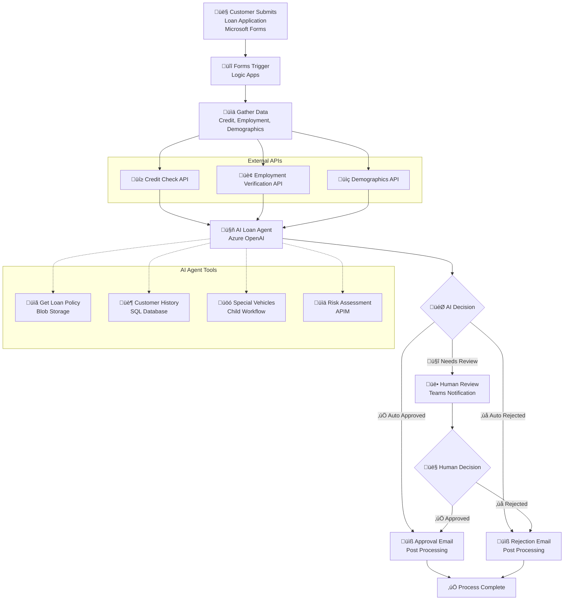

# AI Loan Agent

[](https://azure.microsoft.com/services/logic-apps/)
[](https://azure.microsoft.com/products/cognitive-services/openai-service/)

An AI-powered loan approval system that automates vehicle loan application evaluation using Azure Logic Apps Standard and Azure OpenAI. The system processes applications from Microsoft Forms, performs comprehensive risk assessments, and routes decisions through AI agents with human escalation when needed.

> **🚀 AI Loan Agent Sample**: End to end deployment with 6 validation scenarios included

## 🎥 Demo & Resources

- **📺 [Watch the Demo Video](https://youtu.be/rR1QjQTfCCg)** - Complete walkthrough of the AI Loan Agent in action
- **📖 [Read the Blog Post](https://techcommunity.microsoft.com/blog/integrationsonazureblog/%F0%9F%A4%96-agent-loop-demos-%F0%9F%A4%96/4414770)** - Deep dive into Agent Loop demos and architecture

## Prerequisites

### Required Tools

Before running the deployment script, ensure you have:

- **Azure CLI** (version 2.0 or later)
- **PowerShell 5.1** or **PowerShell Core 7+**
- **VS Code** with Azure Logic Apps extension
- **Azure subscription** with Contributor permissions
- **Microsoft Entra ID permissions** (Global Admin or Privileged Role Admin)

### Authentication Setup

```powershell
# Login to Azure CLI
az login

# Verify subscription access
az account show

# Set correct subscription if needed
az account set --subscription "your-subscription-id"
```

**Note**: The deployment script requires active Azure CLI authentication and will exit with clear instructions if you're not logged in.

### Azure Services Created by deploy.ps1

The deployment script automatically provisions these Azure services:

- **Azure Logic Apps Standard** - Workflow orchestration platform
- **Azure OpenAI Service** - AI agent for loan decision making with GPT-4.1 deployment
- **Azure SQL Database** - Customer history and special vehicle data storage
- **Azure API Management** - Risk assessment, credit check, employment verification, and demographic APIs
- **Azure Storage Account** - Workflow runtime storage
- **Azure Blob Storage** - Policy document storage with auto-generated SAS URLs
- **Managed Identity & RBAC** - Secure authentication between services
- **Network & Firewall Rules** - Proper access control and security configuration
- **Microsoft 365 V2 API Connections** - Forms, Teams, and Outlook with automatic access policies
- **Complete Configuration** - Auto-generated `local.settings.json` for development

### Microsoft 365 Prerequisites

For Microsoft 365 integrations, you'll need:

- **Microsoft 365 Business/Enterprise License** - Required for Forms, Teams, and Outlook
- **Microsoft Forms** - Permission to create forms in your organization
- **Microsoft Teams** - Access to create workspaces and channels
- **Microsoft Outlook/Exchange Online** - For email notifications
- **Microsoft 365 Admin Permissions** - To authorize API connections

## Deployment Instructions

### Step 1: Deploy Azure Infrastructure

```powershell
cd Deployment
.\deploy.ps1
```

**Enhanced Deployment Features:**
- ✅ **Idempotent**: Safe to run multiple times - existing resources are detected and skipped
- 🔄 **Unique Naming**: Automatically generates unique resource names to avoid conflicts
- 🛠️ **Error Recovery**: Improved error handling with detailed troubleshooting guidance
- 📝 **Auto-Configuration**: Generates `local.settings.json` with deployed resource values
- 🗄️ **Automated Database Setup**: Automatically configures SQL database if `sqlcmd` is available
- 🔧 **Troubleshooting**: See `TROUBLESHOOTING.md` for common issues and solutions

**Deployment Time:**
- *Typical Duration: 45-60 minutes (API Management creation takes 30-45 minutes)*
- *⏰ Use this time to complete Step 2 (Microsoft 365 configuration)*
- *The script will show progress and can be safely interrupted and resumed*

**Customization Options:**
```powershell
# Custom resource group and project name
.\deploy.ps1 -ResourceGroup "contoso-loan-rg" -ProjectName "contoso-loan"

# Different Azure region
.\deploy.ps1 -Location "westus"

# Use existing API Management (faster deployment)
.\deploy.ps1 -APIMServiceName "existing-apim-service"
```

### Step 2: Create Microsoft Form (During Deployment)

*⏰ Complete this step WHILE Step 1 is running to maximize efficiency*

**🔗 Workflow Dependency**: The AI Loan Agent workflow is triggered when a loan application is submitted through a Microsoft Form. In this step, you will create the form and save its `Form ID` for use in a later step after the core infrastructure has been deployed.

1. **Visit Microsoft Forms**: Go to [https://forms.microsoft.com/Pages/DesignPagev2.aspx](https://forms.microsoft.com/Pages/DesignPagev2.aspx)

2.  **Import or Create the Form**:
   
    **Option A: Import from File (Recommended)**
    - If you see a "Quick import" option, click it.
    - Select the `Vehicle-Loan-Application-Form-Import.docx` file from the `ai-loan-agent-sample` folder.
    - This will automatically create the form with the required fields.

    **Option B: Create Manually**
    - If you don't have the "Quick import" option, click "New Form".
    - Manually add the fields as specified in `FORM-FIELDS-TEMPLATE.md`.

3.  **Review and Validate the Form**:
    - **This is a critical step.** The imported or created form must contain **14 specific fields** for the `LoanApprovalAgent` workflow to function correctly.
    - The form should have:
        - **12 Text input fields** for applicant and loan details.
        - **1 Multiple-choice question** for loan purpose.
        - **1 Closing statement** (informational text).
    - Carefully compare your form against the structure outlined in `FORM-FIELDS-TEMPLATE.md`. Ensure all fields are present and that their types (e.g., Text, Choice) are correct. The data from these fields is expected by the Logic App workflow you will deploy later.

4.  **Get and Save the Form ID**: 
    - Click **Collect responses** at the top of your form.
    - Copy the sharing link. The URL will have a format like: `https://forms.microsoft.com/Pages/ResponsePage.aspx?id=[YOUR_FORM_ID]`
    - **Save the `Form ID` part of the URL.** You will need this ID in a post-deployment step to connect your Logic App to this form.

#### 2.2 Connect Workflow to Teams Channel

**🔗 Workflow Dependency**: *Only needed for complex loan assessments* - The AI Loan Agent workflow sends notifications to a Microsoft Teams channel for human review of complex loan applications. You need to configure which Teams channel to use.

**Choose Your Teams Channel**:

- **Use Existing Channel**: If you have a suitable Teams channel (e.g., in your finance or operations team), you can use it directly
- **Create New Channel**: Add a dedicated channel to an existing team ([see Microsoft's channel guide](https://support.microsoft.com/en-us/office/create-a-standard-private-or-shared-channel-in-microsoft-teams-fda0b75e-5b90-4fb8-8857-7e102b014525))
- **Create New Team**: Set up a dedicated team for loan processing workflows ([see Microsoft's team guide](https://support.microsoft.com/en-us/office/create-a-team-from-scratch-in-microsoft-teams-174adf5f-846b-4780-b765-de1a0a737e2b))

**Get Channel Configuration Details**:

1. **Navigate to Your Chosen Channel**:
   - Open Microsoft Teams and go to the channel you want to use for loan approval notifications

2. **Get Channel Link**:
   - Right-click on the channel name in the left sidebar
   - Select **Copy link**
   - **Alternative method**: Click the **⋯** (More options) next to the channel name and select **Copy link**

3. **Extract Required Configuration IDs**:
   - The channel URL contains the IDs needed for workflow configuration:
     ```
     https://teams.microsoft.com/l/channel/19%3A[encoded-channel-id]%40thread.tacv2/[channel-name]?groupId=[group-id]&tenantId=[tenant-id]
     ```
   - **Extract Group ID**: Copy the value after `groupId=` (before any `&` character)
   - **Extract Channel ID**: Copy the encoded part between `/channel/` and the channel name, then URL decode it
     - Example: `19%3A...%40thread.tacv2` becomes `19:...@thread.tacv2`
   - **Save these IDs**: You'll need them for workflow configuration in Step 6

---

## Post-Deployment Configuration

*⚠️ Complete these steps AFTER Step 1 (deployment) finishes*

### Step 3: Database Setup (Automated)

**🔗 Workflow Dependency**: The AI agent queries the SQL database for customer history and special vehicle information. The deployment script now handles this automatically.

**✅ Automated Setup**: If you have `sqlcmd` installed (common on Windows), the deployment script automatically:
- Creates the required database tables
- Populates sample data for testing
- Configures Logic App managed identity permissions
- Completes the entire database setup

**📋 Manual Setup** (if `sqlcmd` is not available):
If the deployment script shows "sqlcmd is not available", follow these steps:

1.  **Navigate to the SQL Database**:
    *   In the Azure Portal, go to your resource group.
    *   Click on the resource of type **SQL database**. It is important to select this one, not the 'SQL server' resource.

2.  **Open Query Editor and Configure Access**:
    *   In the SQL database's left-hand navigation, select **Query editor (preview)**.
    *   You may see an error message: *"Cannot open server '[server-name]' requested by the login. Client with IP address '[your-ip]' is not allowed to access the server."*
    *   If you see this, click the link in the message that says **Allowlist IP [your-ip] on server [server-name]**. This will create a firewall rule to grant your computer access. It may take a moment to take effect.
    *   After the firewall rule is created, connect to the database using **Microsoft Entra ID authentication**.

3.  **Run the Setup Script**:
    *   Open the `Deployment/complete-database-setup.sql` file in your local editor.
    *   The script placeholder has already been replaced with your actual Logic App name during deployment.
    *   Copy the entire content of the SQL script.
    *   Paste it into the Query Editor in the Azure Portal and click **Run**.

This script creates the necessary tables, populates them with sample data, and grants your Logic App's managed identity the required permissions to access the database.

### Step 4: Configure V2 API Connections (Two-Layer Authentication)

**🔗 Workflow Dependency**: *Authenticates workflow to access your Microsoft 365* - V2 connections use a two-layer authentication model that requires both OAuth authorization AND RBAC permissions.

**Understanding V2 Connection Authentication**:

Logic Apps Standard V2 OAuth connections require **TWO separate authentication layers**:

- **Layer 1: Connection → API (OAuth)** - The connection resource stores an OAuth token to access Microsoft 365 APIs
- **Layer 2: Logic App → Connection (RBAC)** - The Logic App's managed identity needs Contributor role on the connection resource

Both layers must be configured for the workflow to successfully use Microsoft Forms, Teams, and Outlook.

#### 5.1 Authorize Microsoft 365 V2 Connections (Layer 1)

**✨ Enhanced**: The deployment now creates V2 connections with automatic access policies!

1. **Navigate to Azure Portal** → Resource Groups → `[your-resource-group]`
2. **For each V2 connection** (`formsConnection`, `teamsConnection`, `outlookConnection`):
   - Click on the connection resource
   - Verify it shows **Kind: V2** in the overview
   - Click "Edit API Connection"
   - Click "Authorize" → Sign in with Microsoft 365 account
   - Grant requested permissions
   - Click "Save"
3. **Verify Status**: All connections should show "Connected" status

**📧 Email Sender**: The workflow will send a loan application decision email from the Microsoft 365 account used to authorize `outlookConnection`.

#### 5.2 Grant Connection Permissions (Layer 2)

**⚠️ Critical**: The Logic App's managed identity needs Contributor role on each connection resource:

```powershell
cd Deployment/helpers
.\grant-connection-permissions.ps1 `
    -LogicAppName "your-logic-app-name" `
    -ResourceGroup "your-resource-group"
```

**What this script does**:
- Retrieves your Logic App's managed identity Principal ID
- Grants Contributor role on all three connection resources:
  - `formsConnection`
  - `teamsConnection`
  - `outlookConnection`
- Verifies the role assignments are active

**Expected output**:
```
✅ Granted Contributor role on formsConnection
✅ Granted Contributor role on teamsConnection
✅ Granted Contributor role on outlookConnection

Summary: 3 permissions granted, 0 errors
```

**Why this is needed**: 
- **Layer 2 RBAC**: Without these permissions, the webhook trigger will fail with "BadRequest" or "Value cannot be null (Parameter 'scheme')" errors

#### 5.3 Add Logic App to Teams Team (Manual)

**⚠️ Required for Teams Integration**: For the Logic App to post messages to Teams channels, its managed identity must be added as a member of your Teams team.

**Manual Addition Process** (Officially Supported by Microsoft):

1. **Open Microsoft Teams** and navigate to your target team
2. **Access Team Management**: Click the **⋯** (More options) next to your team name → **Manage team**
3. **Add Member**: 
   - Go to the **Members** tab
   - Click **Add member**
   - Search for your Logic App name (e.g., `my-loan-agent-logicapp-1234`)
   - Select it from the search results
   - Click **Add** with **Member** role
4. **Verify Addition**: Confirm your Logic App appears in the team's member list

**Why Manual Addition is Required**:
Per Microsoft's official documentation, service principals (managed identities) "can be granted access and permissions, but can't be updated or modified directly" via Microsoft Graph API. The Teams UI provides the supported method for adding managed identities to Teams groups.

**Finding Your Logic App's Principal ID** (if needed for troubleshooting):
```powershell
az logicapp show --name "your-logic-app-name" --resource-group "your-resource-group" --query "identity.principalId" --output tsv
```

**Reference**: [Microsoft Graph API Service Principal Documentation](https://docs.microsoft.com/en-us/graph/api/resources/serviceprincipal)

**Troubleshooting Teams Integration**:
If you get `UnauthorizedSenderForChannelNotification` error:
- Verify the Logic App appears in your Teams team member list
- Ensure you're using the correct Teams Group ID and Channel ID
- Try removing and re-adding the Logic App to the team

#### 5.4 Generate Runtime URLs and Update Settings

After authorizing connections and granting permissions, update your configuration:

**Step 1: Generate Runtime URLs**
```powershell
cd Deployment/helpers
.\get-connection-details.ps1 `
    -SubscriptionId "your-subscription-id" `
    -ResourceGroup "your-resource-group"
```

This displays the connection runtime URLs you'll need for `local.settings.json`.

**Step 2: Update Local Settings**
```powershell
cd Deployment/helpers
.\update-local-settings.ps1 `
    -DemoUserEmail "your-email@company.com" `
    -TeamsGroupId "your-teams-group-id" `
    -TeamsChannelId "your-teams-channel-id" `
    -FormsConnectionRuntimeUrl "https://..." `
    -TeamsConnectionRuntimeUrl "https://..." `
    -OutlookConnectionRuntimeUrl "https://..."
```

**Alternative**: Manually edit `LogicApps/local.settings.json` with the runtime URLs from Step 1.

### Step 6: Finalize Local Development Configuration

**🔗 Workflow Dependency**: *Tells workflow where to find your resources* - The workflow needs your specific Form ID, Teams channel IDs, and connection URLs. Wrong values cause "resource not found" errors.

✨ The `deploy.ps1` script automatically generates your `local.settings.json` file. Most values are populated to reflect the deployed Azure resources.

**Auto-Generated Configuration:**
- ✅ All Azure resource connection strings and keys
- ✅ API Management subscription keys  
- ✅ OpenAI endpoint and keys
- ✅ Policy document URLs
- ✅ SQL connection strings

**Manual Updates Required:**
1. **Teams Configuration**: Update `TeamsGroupId` and `TeamsChannelId` from Step 2.2
2. **Email Address**: Update `DemoUserEmail` with your actual email address
   - *This demo uses a hardcoded applicant email address because SAMPLE-DATA.md has placeholder addresses. Production workflows would extract the applicant's email from form data.*
3. **Project Path**: Update `ProjectDirectoryPath` with your local LogicApps folder path
4. **Runtime URLs**: Add the Microsoft 365 connection runtime URLs from Step 5.4
5. **Form ID**: Update the workflow trigger in `LogicApps/LoanApprovalAgent/workflow.json` (detailed in Step 8.1)

**💡 Tip**: Use the `update-local-settings.ps1` helper script (Step 5.4) to update multiple values at once instead of manual editing.

**Example manual updates needed in `local.settings.json`:**
```json
{
  "TeamsGroupId": "f6c2f8c4-169d-45f0-984f-5ddf92745896",
  "TeamsChannelId": "19:qphIGD96Fek2nrKbl-diAx7d6iNZ8aJq6dtVHtZVwNI1@thread.tacv2",
  "DemoUserEmail": "your-email@company.com",
  "ProjectDirectoryPath": "c:\\\\path\\\\to\\\\your\\\\LogicApps"
}
```

### Step 7: Configure API Management Policies (If Needed)

**🔗 Workflow Dependency**: *Optional - provides realistic test data* - These mock APIs return sample credit scores and employment data. The workflow runs without them, but AI decisions may be unrealistic during testing.

The deployment script automatically creates mock API policies, but you may need to update them manually if deployment issues occurred.

#### Option A: Automatic (Default)
The `deploy.ps1` script automatically calls `create-apim-policies.ps1` to configure all mock API policies.

#### Option B: Manual Configuration in Azure Portal

If you need to manually configure or update the API policies:

1. **Navigate to API Management**: Azure Portal → Your Resource Group → Your API Management service
2. **For each API** (Credit Check, Employment Validation, Demographics, Risk Assessment):
   - Go to "APIs" → Select the API → "All operations" → "Policies"
   - Click "Add policy" → "Code editor"
   - Copy the corresponding policy XML from the `Deployment/policies/` folder:
     - `policy-cronus-credit.xml` → Credit Check API
     - `policy-litware-employment-validation.xml` → Employment Validation API  
     - `policy-northwind-demographic-verification.xml` → Demographics API
     - `policy-olympia-risk-assessment.xml` → Risk Assessment API
   - Paste the XML content and click "Save"

3. **Verify Policies**: Test each API endpoint to ensure mock responses work correctly

**Policy Structure Notes:**
- All policies use `<return-response>` in the `<backend>` section
- Mock data is based on input patterns (SSN endings, employer names)
- Each policy includes proper error handling with try/catch blocks

### Step 8: Deploy Logic Apps

**🔗 Workflow Dependency**: *Uploads the workflow code to Azure* - This copies your workflow definitions to the cloud. Until deployed, the workflows exist only locally and can't process real applications.

*Complete this step AFTER configuring local.settings.json (Step 6):*

#### 8.1 Update Form ID in Workflow Trigger

**⚠️ Critical**: Before deploying, you must update the Microsoft Forms trigger with your actual Form ID:

1. **Open the workflow file**: `LogicApps/LoanApprovalAgent/workflow.json`

2. **Find and update TWO locations with your Form ID**:

   **Location 1 - Trigger:**
   ```json
   "triggers": {
       "When_a_new_response_is_submitted": {
           "type": "ApiConnectionWebhook",
           "inputs": {
               "path": "/formapi/api/forms/@{encodeURIComponent('PUT_YOUR_FORM_ID_HERE')}/webhooks"
   ```

   **Location 2 - Get Response Action:**
   ```json
   "Get_response_details": {
       "type": "ApiConnection",
       "inputs": {
           "path": "/formapi/api/forms('@{encodeURIComponent('PUT_YOUR_FORM_ID_HERE')}')/responses",
   ```

3. **Replace `PUT_YOUR_FORM_ID_HERE`** with your actual Form ID from Step 2.
   - Extract from your form URL: `https://forms.microsoft.com/Pages/ResponsePage.aspx?id=YOUR_FORM_ID`
   - Example: If your Form ID is `v4j5cvGGr0GRqy180BHbRzvuYcO0V-9Bq3SxP9NbF71UOFlOTFYyMEdPWEhFSVQ3VVRHVTZXREFYTy4u`, replace both instances

4. **Save the file**

**⚠️ Important**: Both locations MUST use the exact same Form ID, or the workflow won't trigger when forms are submitted.

#### 8.2 Map Form Field IDs to Workflow

**⚠️ Critical**: Microsoft Forms assigns unique IDs to each form field. Your form's field IDs are different from the sample's hardcoded IDs in workflow.json.

**Automated Solution**: Use the provided PowerShell script to automatically detect and map your form field IDs:

```powershell
cd Deployment/helpers
.\update-form-field-mappings.ps1 `
    -LogicAppName "your-logic-app-name" `
    -ResourceGroup "your-resource-group"
```

**Prerequisites**:
1. Submit at least **one test form response** first (the script needs a workflow run to extract field IDs)
2. Ensure Azure CLI is authenticated (`az login`)

**What the script does**:
1. Fetches your latest workflow run
2. Extracts actual form field IDs from `Get_response_details` action output
3. Auto-detects field types using pattern matching:
   - **SSN**: Format `XXX-XX-XXXX` or 9 digits
   - **Salary**: Large numeric values (> $100,000)
   - **Loan Amount**: Moderate numeric values ($10k-$100k)
   - **Date of Birth**: Date format
   - **Vehicle Make**: Text matching car brands (Toyota, Honda, Ford, BMW, etc.)
   - **Name/Employer**: Remaining text fields
4. Updates all field references in `workflow.json` with correct IDs
5. Offers to redeploy automatically

**Interactive Mode** (manual field selection if auto-detection fails):
```powershell
.\update-form-field-mappings.ps1 `
    -LogicAppName "your-logic-app-name" `
    -ResourceGroup "your-resource-group" `
    -Interactive
```

**Required Form Fields**: Your Microsoft Form must include these fields for the workflow to work:

| Field Name | Description | Example Value |
|------------|-------------|---------------|
| **Name** | Applicant's full name | John Smith |
| **SSN** | Social Security Number | 555-12-3456 |
| **Date of Birth** | Date of birth | 01/15/1985 |
| **Employer** | Current employer name | Contoso Inc. |
| **Years Worked** | Years at current job | 5 |
| **Salary** | Annual salary | 75000 |
| **Loan Amount** | Requested loan amount | 35000 |
| **Vehicle Make** | Vehicle make/model | Toyota Camry |

#### 8.3 Deploy with VS Code

**Deploy workflows with VS Code**: See instructions in `LogicApps/README.md` → "Next Steps: Deploy to Azure"

 
### Step 9: End-to-End Testing

**🔗 Workflow Dependency**: *Validates everything works together* - Tests the complete flow: form submission → AI processing → Teams notification. Confirms all previous steps were configured correctly.

1. Submit loan application via Microsoft Forms with entry from `SAMPLE-DATA.md`
2. Monitor workflow execution in Azure Portal
3. Verify AI agent tools and Teams notifications match `SAMPLE-DATA.md` expected outcome

## Troubleshooting

### Deployment Issues

**Quick Solutions for Common Problems**:

**Script fails or times out**: 
- Re-run the script - it's idempotent and will resume where it left off
- Most common cause: API Management creation takes 30-45 minutes (normal)

**Resource naming conflicts**: 
- Script auto-generates unique names based on subscription + resource group hash
- If conflicts occur, delete the resource group and re-run with a different name

**Permission denied errors**:
- Ensure you have Contributor role on the subscription
- For Microsoft Entra ID operations, ensure you have Global Admin or Privileged Role Admin permissions

**OpenAI or APIM deployment fails**:
- Check service availability in your selected region
- Verify you have sufficient quota for these services
- Manual creation instructions are provided in the simplified deployment output

### Post-Deployment Issues

**Database Connection Errors**:
- Verify your Microsoft Entra ID user is set as SQL admin (done automatically by script)
- Use "Entra ID authentication" in Query Editor, not SQL authentication
- Managed identity authentication is configured automatically - no passwords needed

**Microsoft 365 Connection Issues**:
- All connections initially show "Unauthenticated" - this is normal
- **V2 connections require TWO authentication layers**:
  - **Layer 1 (OAuth)**: Authorize each connection through Azure Portal (Step 5.1)
  - **Layer 2 (RBAC)**: Grant Contributor role using `grant-connection-permissions.ps1` (Step 5.2)
- Ensure you're using a Microsoft 365 account with proper licenses
- **Missing Layer 2 permissions cause**: "BadRequest" on webhook subscription or "Value cannot be null (Parameter 'scheme')" errors

**Workflow Deployment Fails**:
- Verify `local.settings.json` contains correct values from deployment
- Ensure all connections are authorized (Layer 1) AND have permissions granted (Layer 2)
- Check VS Code Azure Logic Apps extension is properly connected
- Verify connection runtime URLs are configured in `local.settings.json`

**Workflow Parameter Not Found Errors**:
- **Symptom**: "The workflow parameter 'FormFieldId_XXX' is not found" errors at runtime
- **Root Cause**: Logic Apps Standard requires parameters in THREE places:
  1. `workflow.json` - Defines parameters with types and defaults
  2. `parameters.json` - Maps parameters to app settings using `@appsetting('ParameterName')`
  3. Azure app settings - Contains actual values
- **Solution**: Run `update-form-field-mappings.ps1` which updates all three locations automatically
- **Manual fix**: Add missing parameters to `parameters.json` following the pattern:
  ```json
  "FormFieldId_XXX": {
    "type": "String",
    "value": "@appsetting('FormFieldId_XXX')"
  }
  ```

**Form or Teams Integration Issues**:
- **Webhook trigger not working**: 
  - Check both Layer 1 (OAuth authorization) AND Layer 2 (RBAC permissions) are complete
  - Run `grant-connection-permissions.ps1` if you see BadRequest errors
  - Verify connections.json uses `"type": "ManagedServiceIdentity"` authentication
- **Teams "UnauthorizedSenderForChannelNotification" error**:
  - **Root cause**: Logic App's managed identity is not a member of the Teams team
  - **Solution**: Run `grant-connection-permissions.ps1 -LogicAppName "your-logic-app" -ResourceGroup "your-rg" -TeamsGroupId "your-team-id"`
  - **Manual alternative**: Go to Teams → Your Team → ⋯ → Manage team → Members → Add your Logic App's managed identity
  - **Verification**: Check that your Logic App appears in the team's member list
- **Form not triggering workflow**: 
  - Verify Form ID is correctly updated in `workflow.json` (Step 8.1)
  - Check webhook body format includes: eventType, notificationUrl, source fields
  - Submit a new form to trigger webhook re-registration
- **Application_Summary shows empty values**:
  - This means form field IDs don't match your form
  - Run `update-form-field-mappings.ps1` to automatically fix field mappings (Step 8.2)
- Double-check Form ID and Teams Group/Channel IDs in `local.settings.json`
- Test individual connections in Azure Portal before full workflow testing
- Ensure Microsoft Forms connection is authorized and shows "Connected" status

### Getting Help

**Step-by-step resolution**:
1. **Check deployment output**: Script provides specific error messages with solutions
2. **Review logs**: Deployment script shows detailed progress and error information
3. **Re-run deployment**: Safe to run multiple times - existing resources are preserved
4. **Clean start**: Delete resource group and run script again for fresh deployment
5. **Consult guides**: Check `TROUBLESHOOTING.md` for detailed problem-specific solutions

**Clean slate deployment**:
```powershell
# Remove everything and start fresh
az group delete --name "your-resource-group" --yes --no-wait
# Wait for deletion to complete, then re-run deploy.ps1
```

## Configuration Notes

### 📋 Workflow Parameter Resolution Architecture

Logic Apps Standard uses a **three-layer parameter resolution system**:

1. **workflow.json** - Defines parameters with types and default values
   - Example: `"FormFieldId_SSN": { "type": "string", "defaultValue": "rXXXXXXX..." }`
   - Default values are fallbacks if other layers fail

2. **parameters.json** - Maps workflow parameters to app settings
   - Example: `"FormFieldId_SSN": { "type": "String", "value": "@appsetting('FormFieldId_SSN')" }`
   - Uses `@appsetting()` expression to pull from app settings at runtime

3. **Azure App Settings** - Contains actual runtime values
   - Example: `FormFieldId_SSN = "r329d190d32cb4d5d887528004be87b85"`
   - Values synced via Azure CLI or Azure Portal

**All three layers must be configured** for parameters to resolve correctly. The `update-form-field-mappings.ps1` script handles all three automatically.

### ✅ Fully Automated (99% of setup)
- **Azure Infrastructure**: All services provisioned and configured with managed identity
- **Database Authentication**: Automatic Microsoft Entra ID admin setup and managed identity configuration
- **Database Schema & Data**: Automatic table creation and sample data population (if `sqlcmd` available)
- **Connection Strings**: Database, Storage, API Management keys auto-generated
- **Mock APIs**: Credit check, employment verification, demographics with realistic responses
- **Sample Data**: Database tables with comprehensive test scenarios
- **local.settings.json**: Auto-generated with all deployment values and resource references
- **Security Configuration**: Firewall rules, access policies, and permissions set automatically
- **V2 API Connections**: Automatic creation with access policies for Logic App managed identity

### 🔧 Manual Configuration Required (1% of setup)
Why these specific steps require manual intervention:
- **Microsoft Forms**: No programmatic API available for form creation or import
- **Form ID Configuration**: Must be manually updated in workflow trigger definition (Step 8.1)
- **Form Field Mapping**: Each form has unique field IDs that must be mapped using `update-form-field-mappings.ps1` (Step 8.2)
  - Script updates all three parameter resolution layers: local.settings.json, parameters.json, and Azure app settings
  - Automatically restarts Logic App to load new settings
- **Teams Workspace**: Interactive setup required for proper organizational permissions
- **V2 Connection OAuth (Layer 1)**: Security requirement mandates explicit user consent for Microsoft 365 access through Azure Portal (Step 5.1)
- **V2 Connection RBAC (Layer 2)**: Logic App managed identity needs Contributor role on connection resources via `grant-connection-permissions.ps1` (Step 5.2)
- **Connection Runtime URLs**: Must be generated and added to local.settings.json after authorization (Step 5.3)
- **Personal Identifiers**: Teams Group/Channel IDs and demo email require user-specific values

### 🔐 V2 Connection Authentication Architecture
Logic Apps Standard V2 OAuth connections use a **two-layer authentication model**:
- **Layer 1 (Connection → API)**: OAuth token stored in connection resource - requires manual authorization in Azure Portal
- **Layer 2 (Logic App → Connection)**: Managed identity RBAC permissions - requires `grant-connection-permissions.ps1` script
- **Authentication Type**: connections.json must use `"type": "ManagedServiceIdentity"` (NOT "Raw") for V2 OAuth
- **Why both layers**: Layer 1 authenticates the API calls; Layer 2 allows the Logic App to use the connection
- **Common mistake**: Authorizing connections (Layer 1) without granting RBAC permissions (Layer 2) causes webhook failures

### 🧪 Test Data Design
- **Safe Test Values**: Uses 555-XXX-XXXX SSNs and @example.com emails for compliance
- **Realistic Scenarios**: 6 comprehensive test cases covering all decision paths and edge cases
- **Deterministic Mock Responses**: APIs return consistent, predictable data based on input patterns for reliable testing

## Security & Cost

**Security Features**:
- **Managed Identity Authentication**: No passwords stored or managed - Azure handles secure authentication
- **Microsoft Entra ID Integration**: SQL Server uses Microsoft Entra ID authentication with automatic admin setup
- **OAuth Connection Authentication**: Microsoft 365 connections use secure OAuth flows
- **Secure Key Storage**: API keys automatically stored in Azure Key Vault references
- **Network Security**: Proper firewall rules and access controls configured automatically

**Cleanup**: `az group delete --name "ai-loan-agent-rg" --yes --no-wait`

## Workflows

### LoanApprovalAgent

The main workflow that orchestrates the complete loan approval process using AI agents to evaluate applications against company policies, with integrated tools for data retrieval and human escalation.

#### Process Flow



#### Required Connections

|Connection Name|Connector Name|Connector Type|
|---|---|---|
|formsConnection|Microsoft Forms|Azure|
|agent|Azure OpenAI|Agent|
|sql|SQL Server|Service Provider|
|riskAssessmentAPI|Risk Assessment API|API Management|
|employmentValidationAPI|Employment Validation API|API Management|
|creditCheckAPI|Credit Check API|API Management|
|demographicVerificationAPI|Demographic Verification API|API Management|
|teamsConnection|Microsoft Teams|Azure|
|outlookConnection|Office 365 Outlook|Azure|

### LoanPostProcessing

A supporting workflow that handles post-approval processing steps and notifications after loan decisions are made.

#### Process Flow


#### Required Connections

|Connection Name|Connector Name|Connector Type|
|---|---|---|
|None|HTTP Request/Response|Built-in|

### SpecialVehicles

A utility workflow that retrieves special vehicle information from the database to support loan policy decisions and pricing calculations.

#### Process Flow


#### Required Connections

|Connection Name|Connector Name|Connector Type|
|---|---|---|
|sql|SQL Server|Service Provider|

## Deployment Folder Reference

### Main Deployment Script
- **`deploy.ps1`** - Enhanced main deployment script with improved error handling, unique naming, and idempotent behavior
  - **Features**: Automatic conflict resolution, detailed logging, safe re-runs, auto-generated configurations
  - **Documentation**: See `TROUBLESHOOTING.md` for comprehensive guidance

### Automated Scripts (Called by deploy.ps1)
- **`create-apim-policies.ps1`** - Automatically called by deploy.ps1 to configure APIM mock APIs

### Manual Scripts (Require User Execution)
- **`database-setup.sql`** - Creates tables and sample data (run in Azure Portal after deploy.ps1)
- **`create-managed-identity-user.sql`** - Grants Logic App database access (run after database-setup.sql)
- **`complete-database-setup.sql`** - Alternative single script combining database-setup.sql + managed identity setup

### Documentation & Support
- **`TROUBLESHOOTING.md`** - 🆕 Comprehensive troubleshooting guide for deployment issues

### Helper Scripts (Optional/Troubleshooting)
- **`helpers/grant-connection-permissions.ps1`** - 🆕 Grants Logic App managed identity Contributor role on V2 connections
  - **When to use**: Required for V2 webhook triggers to work (Step 4.2)
  - **Usage**: `.\.\grant-connection-permissions.ps1 -LogicAppName "your-logic-app-name" -ResourceGroup "your-resource-group"`
  - **Features**: Grants RBAC permissions on connection resources, verifies role assignments
  - **Why needed**: Logic Apps Standard requires both OAuth (Layer 1) AND RBAC permissions (Layer 2) for V2 connections
- **`helpers/update-form-field-mappings.ps1`** - 🆕 Automatically maps Microsoft Forms field IDs to workflow
  - **When to use**: After creating your form and submitting one test response (Step 7.2)
  - **Usage**: `.\update-form-field-mappings.ps1 -LogicAppName "your-logic-app-name" -ResourceGroup "your-resource-group"`
  - **Features**: Auto-detection with pattern matching, updates local.settings.json AND parameters.json, pushes to Azure app settings, automatic Logic App restart, optional auto-redeploy
- **`helpers/get-connection-details.ps1`** - Extracts connection runtime URLs and displays them for configuration
  - **When to use**: Part of V2 connection setup (Step 4.4)
  - **Usage**: `.\.\get-connection-details.ps1 -SubscriptionId "your-sub-id" -ResourceGroup "your-rg"`
- **`helpers/update-local-settings.ps1`** - Updates local.settings.json with all configuration values
  - **When to use**: Part of V2 connection setup (Step 4.4)
  - **Usage**: `.\.\update-local-settings.ps1 -DemoUserEmail "user@company.com" -TeamsGroupId "..." -TeamsChannelId "..."`

### Configuration Files
- **`policies/`** - Contains XML policy templates for APIM mock responses
  - `policy-cronus-credit.xml` - Credit check API mock responses
  - `policy-litware-employment-validation.xml` - Employment verification mock responses
  - `policy-northwind-demographic-verification.xml` - Demographics API mock responses
  - `policy-olympia-risk-assessment.xml` - Risk assessment API mock responses
