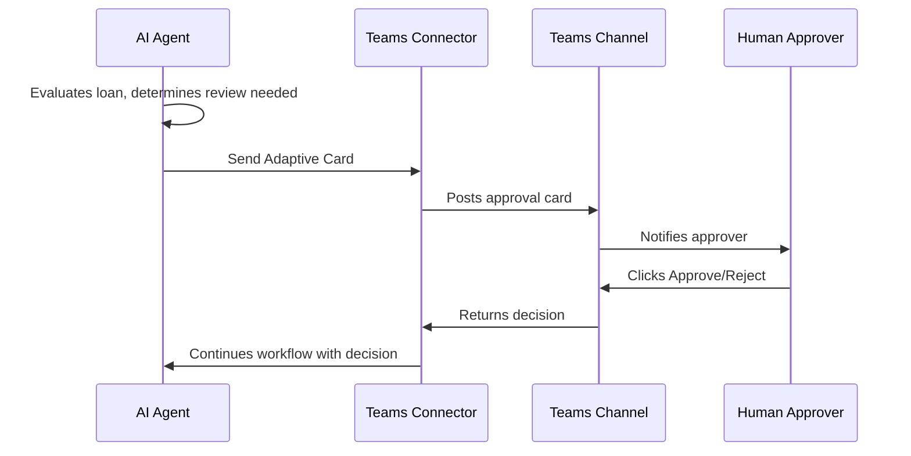

# Replace Mock Human Approval with Microsoft Teams Adaptive Cards

This guide walks you through replacing the mock "Wait for Human Review" tool with a Microsoft Teams Adaptive Card integration. When the AI agent determines a loan requires human approval, it will post an interactive card to a Teams channel where approvers can make decisions directly.

**Time to complete:** 20-30 minutes

---

## Overview

**What you'll build:**



---

## Prerequisites

- ✅ AI Loan Agent sample deployed to Azure ([deployment guide](README.md#deploy-sample))
- ✅ Microsoft Teams account with access to a team and channel for approvals
- ✅ Contributor access to Logic App resource in Azure Portal

---

## Step 1: Prepare Microsoft Teams

Ensure you have a Team and Channel where approval cards will be posted. You'll select these from a dropdown list when configuring the Teams action.

---

## Step 2: Update the Workflow

### 2.1 Open Workflow Designer

1. Navigate to [Azure Portal](https://portal.azure.com) → Your resource group → Your Logic App
2. Go to **Workflows** → **LoanApprovalAgent** → **Designer**
3. Find the **Loan Agent** action → Expand it → Locate **Wait for Human Review** tool

### 2.2 Replace Mock Action with Teams Action

1. Inside "Wait for Human Review" tool, right-click on **Simulate_Human_Review** action
2. Select **Delete** → Confirm deletion
3. Click the **+** button where the action was
4. Select **Add an action**
5. Search for: `post adaptive card`
6. Select **Microsoft Teams** → **Post adaptive card and wait for a response**

### 2.3 Create Teams Connection

When prompted to create a new connection:

1. Ensure **Per-user connection** toggle is **disabled** (deselected)
2. Click **Sign in**
3. Authenticate with your Microsoft account

### 2.4 Configure the Teams Action

First, rename the action to help the AI agent understand its purpose:

1. Click the action title at the top (next to the Teams icon)
2. Change it to: `WaitForHumanReview_TeamsChannel`
3. **Note:** This name follows Logic Apps naming conventions (verb-first, task-focused) and helps the AI agent understand when to call this tool during workflow execution

Next, configure where and how the approval card will be posted:

- **Post as:** Flow bot
- **Post in:** Channel
- **Message:** Paste the Adaptive Card JSON from the [card template section](#adaptive-card-template) below
- **Team:** Select your target team from the dropdown list
- **Channel:** Select your target channel from the dropdown list

**Important:** The Teams action will return an output with a `data` object containing the `decision` field. When the user clicks a button, the value will be either `"APPROVED"` or `"REJECTED"`. You can access this in subsequent actions using `@{outputs('WaitForHumanReview_TeamsChannel')?['body']?['data']?['decision']}`

### 2.5 Save Workflow

Click **Save** at the top of the designer.

---

## Step 3: Test the Integration

### Run Test Case 4

Test Case 4 triggers the human review workflow because it includes a luxury vehicle (Ferrari):

1. In your Logic App: **Workflows** → **LoanApprovalAgent** → **Overview**
2. Click **Run** → **Run with payload**
3. Paste this test payload (Test Case 4):

```json
{
  "applicationId": "APP-LUXURY-REVIEW-004",
  "name": "Sarah Johnson",
  "email": "sarah.johnson@example.com",
  "loanAmount": 85000,
  "vehicleMake": "Ferrari",
  "vehicleModel": "F8 Tributo",
  "salary": 125000,
  "employmentYears": 6
}
```

4. Click **Run**

**What happens:** The AI agent will detect the Ferrari (luxury vehicle), call the `Get_special_vehicles` tool which identifies it as requiring human review, and then invoke the `Wait_for_Human_Review` tool which posts the card to Teams.

### Verify the Integration

1. **Check Teams:** Open your Teams channel—you should see the approval card posted by the Flow bot with:
   - AI review summary
   - Loan amount
   - Risk profile
2. **Make Decision:** Click either ✅ **Approve Loan** or ❌ **Reject Loan** button
3. **Card Updates:** The card should update showing your response was received
4. **Check Workflow:** Return to Azure Portal → View run history → The Teams action should show "Succeeded" with your decision in the outputs

---

## Adaptive Card Template

Copy and paste this JSON into the **Message** field when configuring the Teams action.

**Important:** This card uses `agentParameters()` to access the data the AI agent passes to the tool. The parameters match the `agentParameterSchema` defined in the "Wait for Human Review" tool.

```json
{
  "type": "AdaptiveCard",
  "$schema": "http://adaptivecards.io/schemas/adaptive-card.json",
  "version": "1.4",
  "body": [
    {
      "type": "Container",
      "style": "emphasis",
      "items": [
        {
          "type": "ColumnSet",
          "columns": [
            {
              "type": "Column",
              "width": "auto",
              "items": [
                {
                  "type": "Image",
                  "url": "https://adaptivecards.io/content/cars/1.png",
                  "size": "Small"
                }
              ]
            },
            {
              "type": "Column",
              "width": "stretch",
              "items": [
                {
                  "type": "TextBlock",
                  "text": "🚗 Loan Application Review Required",
                  "weight": "Bolder",
                  "size": "Large",
                  "wrap": true
                },
                {
                  "type": "TextBlock",
                  "text": "AI Agent has escalated this application for human decision",
                  "isSubtle": true,
                  "wrap": true
                }
              ]
            }
          ]
        }
      ]
    },
    {
      "type": "Container",
      "spacing": "Medium",
      "items": [
        {
          "type": "TextBlock",
          "text": "**AI Review Summary:**",
          "weight": "Bolder",
          "wrap": true
        },
        {
          "type": "TextBlock",
          "text": "@{agentParameters('aireview')}",
          "wrap": true,
          "spacing": "Small"
        }
      ]
    },
    {
      "type": "Container",
      "spacing": "Medium",
      "items": [
        {
          "type": "FactSet",
          "facts": [
            {
              "title": "Loan Amount:",
              "value": "@{agentParameters('loanamount')}"
            },
            {
              "title": "Risk Profile:",
              "value": "@{agentParameters('riskprofile')}"
            }
          ]
        }
      ]
    },
    {
      "type": "Container",
      "spacing": "Medium",
      "items": [
        {
          "type": "TextBlock",
          "text": "Please review the AI assessment and make your decision:",
          "wrap": true,
          "weight": "Bolder"
        }
      ]
    }
  ],
  "actions": [
    {
      "type": "Action.Submit",
      "title": "✅ Approve Loan",
      "style": "positive",
      "data": {
        "decision": "APPROVED"
      }
    },
    {
      "type": "Action.Submit",
      "title": "❌ Reject Loan",
      "style": "destructive",
      "data": {
        "decision": "REJECTED"
      }
    }
  ]
}
```

---

## Troubleshooting

<details>
<summary><b>Card doesn't appear in Teams</b></summary>

- Verify Teams connection is authorized in API connections
- Check Team and Channel are selected correctly in the action configuration
- Review workflow run history for error messages
- Ensure Teams channel hasn't been archived or deleted
- Verify the Logic App has permissions to post to the channel

</details>

<details>
<summary><b>Workflow doesn't continue after button click</b></summary>

- Verify "Should update card" is enabled in the Teams action
- Check that button data values match exactly: `"APPROVED"` or `"REJECTED"` (case-sensitive)
- Review run history to see what data was returned from the Teams action
- Ensure the tool is returning the decision in the expected format

</details>

<details>
<summary><b>Card displays but fields are empty</b></summary>

- Check that you're using `agentParameters()` not `triggerBody()` in the Adaptive Card
- Verify the AI agent is passing the correct parameters: `aireview`, `loanamount`, `riskprofile`
- Test with the exact payload provided in Step 3
- Review the agent's tool call in the run history to see what parameters it sent

</details>

---

## Next Steps

### Customize Your Card

- **Design visually:** Use [Adaptive Cards Designer](https://adaptivecards.io/designer/) to customize layout, colors, and fields
- **Add more buttons:** Include "Request More Info" or "Escalate to Manager" options
- **Add images:** Include company logo or records

### Add Notifications

- **@mention approvers:** Configure mentions in the card to notify specific users
- **Send chat message:** Add a "Send chat message" action before posting the card

### Track Approvals

- **Log to database:** Add action to store decisions in SQL or Cosmos DB
- **Email summary:** Use Office 365 connector to notify applicant of decision
- **Create audit trail:** Log approval details to SharePoint list

---

## Learn More

- [Microsoft Teams connector for Logic Apps](https://learn.microsoft.com/connectors/teams/)
- [Adaptive Cards documentation](https://learn.microsoft.com/adaptive-cards/)
- [Post adaptive cards in Teams](https://learn.microsoft.com/azure/connectors/connectors-create-api-teams#post-an-adaptive-card-to-a-teams-channel-and-wait-for-a-response)
- [Configure on-behalf-of authentication for agent connections](https://learn.microsoft.com/azure/logic-apps/enable-stateful-affinity-built-in-connectors#configure-on-behalf-of-authentication-for-agent-connections)

