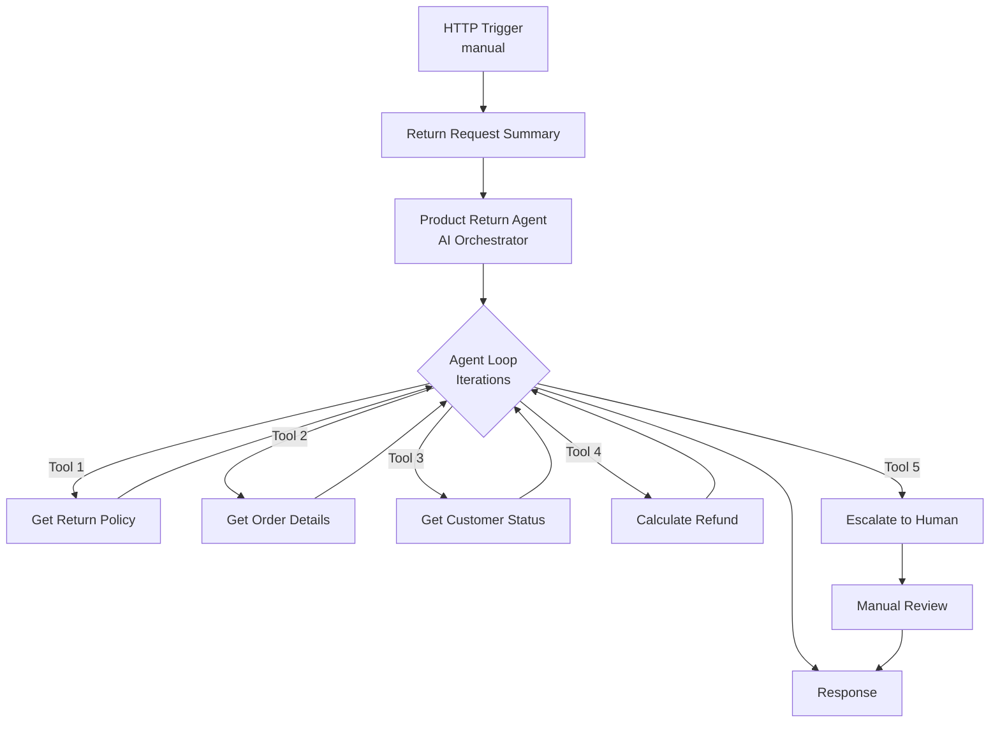

# AI Product Return Agent

An AI-powered product return system that automates the evaluation of return requests using Azure Logic Apps Standard and Azure OpenAI. The agent autonomously analyzes return requests, validates policies, checks order details, evaluates customer status, calculates refunds, and makes approval decisions or escalates complex cases to human reviewers.

---

## Deploy

**Prerequisites:**
- Azure subscription with contributor access
- Region supporting Azure OpenAI (GPT-4o-mini) and Logic Apps Standard - see [region selection](#region-selection)

**Deploy to your Azure subscription:**

[](https://portal.azure.com/#create/Microsoft.Template/uri/https%3A%2F%2Fraw.githubusercontent.com%2Fmodularity%2Flogicapps-labs%2Fproduct-return-sample%2Fsamples%2Fproduct-return-agent-sample%2F1ClickDeploy%2Fsample-arm.json)

<details>
<summary><b>What happens when you deploy</b></summary>

1. Opens Azure Portal and prompts for subscription, [resource group](https://learn.microsoft.com/azure/azure-resource-manager/management/manage-resource-groups-portal) (create new recommended: `rg-productreturn`)
2. Provisions Azure resources (Logic App, OpenAI, Storage, App Service Plan, Managed Identity)
3. Configures [RBAC (Role-Based Access Control)](https://learn.microsoft.com/azure/role-based-access-control/overview) permissions for passwordless authentication
4. Deploys AI agent workflows with built-in test scenarios

</details>

<details>
<summary><b>What gets deployed</b></summary>

| Resource | Purpose |
|----------|----------|
| Logic App Standard | Hosts AI agent workflows |
| Azure OpenAI | GPT-4o-mini model for agent reasoning |
| Storage Account | Workflow state and run history |
| App Service Plan | Compute resources |
| Managed Identity | Passwordless authentication |

See [Deployment automation](#deployment-automation) and [Sample data approach](#sample-data-approach) for technical details.

</details>

<details id="region-selection">
<summary><b>Region selection</b></summary>

Recommended regions: East US 2, West Europe, Sweden Central, North Central US

See regional availability:
- [Azure OpenAI models](https://learn.microsoft.com/azure/ai-services/openai/concepts/models#model-summary-table-and-region-availability)
- [Logic Apps Standard](https://azure.microsoft.com/explore/global-infrastructure/products-by-region/)

</details>

<details>
<summary><b>Resource naming</b></summary>

Resources use `{projectName}` for subscription-scoped resources and `{projectName}{uniqueId}` for globally-unique resources:

| Resource | Example (projectName = "productreturn") |
|----------|----------------------------------|
| Resource Group | `rg-productreturn` |
| Logic App | `productreturnxyz123-logicapp` |
| Azure OpenAI | `productreturn-openai` |
| Storage Account | `productreturnxyz123` |

</details>

---

## Explore

After deployment, test the agent with different return scenarios to see how it autonomously makes decisions.

### Run a test

1. Open [Azure Portal](https://portal.azure.com) > your resource group > Logic App > **Workflows** > **ProductReturnAgent** > [**Run history**](https://learn.microsoft.com/azure/logic-apps/monitor-logic-apps#review-runs-history)
2. Click **Run** > [**Run with payload**](https://learn.microsoft.com/azure/logic-apps/test-logic-apps-track-results#run-with-payload)
3. Paste one of the test payloads below > **Run** (returns success)
4. Click **Refresh** > click the **Identifier** to open monitoring view
5. In **Agent log** tab, review which tools the agent called
6. In workflow, click **Product Return Agent** action > **Outputs** tab > verify decision

**Test these scenarios to see different decision paths:**

<details>
<summary><b>Test scenario 1: Defective item - Auto-approval</b></summary>

Coffee maker reported as defective, within return window:

```json
{"orderId":"ORD001","customerId":"CUST001","reason":"defective","description":"Coffee maker stopped working after 10 days","imageData":"https://example.com/images/ORD001-product.jpg"}
```

**Expected result:** `decision` = `"APPROVED"` with `refundAmount` = `150` in Product Return Agent action outputs, full refund for defective item

</details>

<details>
<summary><b>Test scenario 2: Opened perishable - Auto-rejection</b></summary>

Opened coffee beans, perishable item:

```json
{"orderId":"ORD002","customerId":"CUST002","reason":"changed_mind","description":"Don't like the flavor","imageData":"https://example.com/images/ORD002-product.jpg"}
```

**Expected result:** `decision` = `"REJECTED"` with `refundAmount` = `0` in Product Return Agent action outputs, perishable items cannot be returned once opened

</details>

<details>
<summary><b>Test scenario 3: Order not found - Auto-rejection</b></summary>

Order doesn't exist in system:

```json
{"orderId":"ORD005","customerId":"CUST004","reason":"changed_mind","description":"Want to return this item","imageData":"https://example.com/images/ORD005-product.jpg"}
```

**Expected result:** `decision` = `"REJECTED"` with `refundAmount` = `0` in Product Return Agent action outputs, order not found

</details>

<details>
<summary><b>Test scenario 4: High-value fraud risk - Escalation</b></summary>

Premium customer with excessive return history, expensive item:

```json
{"orderId":"ORD003","customerId":"CUST003","reason":"changed_mind","description":"Decided to get a different model","imageData":"https://example.com/images/ORD003-product.jpg"}
```

**Expected result:** `decision` = `"ESCALATED"` with `refundAmount` = `0` in Product Return Agent action outputs. Agent log shows "Escalate_to_human" tool call for manual review.

</details>

<details>
<summary><b>Test scenario 5: Opened electronics - Approved with fee</b></summary>

Opened electronics with restocking fee:

```json
{"orderId":"ORD004","customerId":"CUST001","reason":"changed_mind","description":"Found a better price elsewhere","imageData":"https://example.com/images/ORD004-opened.jpg"}
```

**Expected result:** `decision` = `"APPROVED"` with `refundAmount` = `96` in Product Return Agent action outputs (20% restocking fee applied to $120 order)

</details>

**Tips:**
- Review **Agent log** tab to see which tools the agent called
- Check **Metadata** tab (under Product Return Agent action) for token usage statistics
- Runs complete in 5-15 seconds
- [Learn more about reviewing agent execution](https://learn.microsoft.com/azure/logic-apps/create-autonomous-agent-workflows#review-tool-execution-data)

---

## Workflows

Three workflows process product return requests using autonomous AI decision-making:

<details>
<summary><b>Workflow details</b></summary>

### ProductReturnAgent

Orchestrates return approval using an AI agent. The agent evaluates requests against business rules, autonomously selecting and sequencing tools.

**Agent Tools:**
- Get return policy - Retrieves return policy rules and conditions
- Get order details - Fetches order information including product, price, purchase date
- Analyze product image - Analyzes product photos to detect damage and assess condition
- Get return history - Checks customer return patterns and fraud flags
- Get customer status - Checks if customer is VIP (60-day window) or Standard (30-day window)
- Calculate refund - Computes refund amount based on reason, category, and condition
- Notify customer - Sends email notification with return decision and refund details
- Escalate to human - Routes complex cases to human review

**Process Flow:**



### GetOrderHistory

Retrieves mock order data including product details, purchase date, and age. Includes three pre-configured orders for testing.

**Mock Orders:**
- **ORD001**: Coffee Maker Pro ($150, 15 days old, electronics, unopened, CUST001)
- **ORD002**: Premium Coffee Beans ($89, 10 days old, perishable, opened, CUST002)
- **ORD003**: Espresso Machine Deluxe ($450, 35 days old, electronics, unopened, CUST003 Premium)
- **ORD004**: Coffee Grinder ($120, 20 days old, electronics, opened, CUST001)
- **ORD005**: Coffee Grinder ($120, 20 days old, electronics, unopened, CUST004)

### CalculateRefund

Computes refund amounts based on return reason, product category, and condition:
- **Defective items**: Full refund, no fees
- **Opened electronics**: 80% refund (20% restocking fee)
- **Changed mind**: Refund minus $10 shipping fee
- **Other reasons**: Full refund

</details>

<details>
<summary><b>Required Connections</b></summary>

This sample uses Azure OpenAI with Managed Identity authentication for passwordless access.

| Connection Name | Connector Name | Connector Type | Purpose |
|-----------------|----------------|----------------|---------|
| Azure OpenAI Connection | Azure OpenAI | Agent | Powers the AI agent decision-making in ProductReturnAgent workflow |

**Authentication:** System-Assigned Managed Identity with `Cognitive Services OpenAI User` role assigned to Azure OpenAI resource during deployment.

</details>

---

## Extend

This sample uses built-in test data to eliminate external dependencies. Here's how to extend it for production use:

### Replace demo services

| Component | Demo Implementation | Production Options |
|-----------|----------------------|-------------------|
| Order Database | Static mock data (3 orders) | SQL Database, Cosmos DB, E-commerce API, ERP systems |
| Customer Management | Hardcoded VIP status | CRM systems (Dynamics 365, Salesforce), Customer database |
| Refund Processing | Calculation only | Payment gateways (Stripe, PayPal), ERP systems |
| Human Escalation | Compose action response | Microsoft Teams, ServiceNow, Jira Service Management |
| Notifications | Template responses | Email (Office 365, SendGrid), SMS (Twilio, Azure Communication Services) |
| Policy Management | Hardcoded rules | SharePoint, Blob Storage, API Management |

### Customize workflows

**Option 1: Edit in Azure Portal**
- Navigate to your Logic App > Workflows > select workflow > **Edit**
- Use the visual designer to modify workflow logic
- [Learn more about editing workflows in Azure Portal](https://learn.microsoft.com/azure/logic-apps/create-single-tenant-workflows-azure-portal)

**Option 2: Edit in VS Code**
- Install Azure Logic Apps (Standard) VS Code extension
- Edit workflow JSON files locally in LogicApps/ folder
- Deploy changes using the extension

---

## How Tools Work

The agent uses 8 specialized tools to autonomously evaluate return requests:

### Core Analysis Tools

| Tool | Implementation | Production Alternative |
|------|----------------|------------------------|
| **Analyze_product_image** | Mock image analysis simulating Azure AI Vision. Returns damage level, confidence score, and findings based on order ID pattern matching in the image URL. | [Azure AI Vision](https://learn.microsoft.com/azure/ai-services/computer-vision/) connector to analyze actual product photos using Computer Vision API for damage detection, object recognition, and quality assessment. |
| **Get_return_history** | Hardcoded customer return patterns (CUST003 flagged for excessive returns). | SQL Database or Cosmos DB connector to query actual customer transaction history, combined with Azure Machine Learning for fraud detection patterns. |
| **Notify_customer** | Generates mock notification response with email channel, timestamp, and message ID. | [Office 365 Outlook](https://learn.microsoft.com/connectors/office365/) connector for email notifications, [Azure Communication Services](https://learn.microsoft.com/azure/communication-services/) for SMS, or [Microsoft Teams](https://learn.microsoft.com/connectors/teams/) for in-app notifications. |

### Supporting Tools

- **Get_return_policy** - Static policy rules (replace with SharePoint or Blob Storage connector)
- **Get_order_details** - Mock order database (replace with SQL Database, Cosmos DB, or ERP API)
- **Get_customer_status** - Hardcoded Premium tier detection (replace with CRM connector like Dynamics 365 or Salesforce)
- **Calculate_refund** - Formula-based logic (can remain as is or integrate with payment gateway APIs)
- **Escalate_to_human** - Returns escalation message (replace with ServiceNow, Jira, or Teams for actual case creation)

**Why mock data?** This sample prioritizes ease of deployment and exploration by eliminating external dependencies. All tools use `Compose` actions with conditional logic, allowing you to test the full agent workflow immediately after deployment without configuring databases, APIs, or third-party services.

---

## Demo Alignment

This sample balances demonstration value with production readiness:

| Component | Demo Implementation | Production Readiness | Notes |
|-----------|---------------------|---------------------|-------|
| **Agent orchestration** | ✅ Production-ready | Full Azure OpenAI agent with tool selection, reasoning, and autonomous decision-making | Core agent pattern is production-ready |
| **Tool structure** | ✅ Production-ready | 8 specialized tools with proper schemas, descriptions, and parameter validation | Tool architecture matches production best practices |
| **HTTP trigger** | ⚠️ Acceptable simplification | Manual HTTP trigger for testing | Replace with Event Grid, Service Bus, or API Management for production |
| **Mock data sources** | ⚠️ Demo only | Hardcoded orders, customers, and analysis results | See [Extension Points](#extension-points) for production integrations |
| **Error handling** | ⚠️ Basic implementation | Limited retry logic and error responses | Add comprehensive error handling, logging, and monitoring |
| **Authentication** | ✅ Production-ready | Managed Identity with passwordless Azure OpenAI access | Enterprise-ready security pattern |
| **Workflow definitions** | ✅ Production-ready | Standard Logic Apps workflow format with proper action composition | Can be version-controlled and CI/CD deployed |

**Key Takeaway:** The agent reasoning, tool orchestration, and workflow structure are production-ready. The mock data and HTTP trigger are intentional simplifications for demo purposes and can be swapped with production connectors without changing the core agent logic.

---

## Extension Points

Replace demo components with production-ready Azure services:

### 1. Image Analysis (Analyze_product_image tool)

**Current:** Mock analysis with pattern matching
**Production options:**
- **Azure AI Vision:** Add Computer Vision connector, call Analyze Image API with product photo URL
- **Custom Vision:** Train custom model for product-specific damage detection
- **Implementation:** Replace `Compose` action with HTTP action calling Vision API, parse JSON response for damage assessment

```json
// Replace mock Compose action with:
{
  "type": "Http",
  "inputs": {
    "method": "POST",
    "uri": "https://YOUR-VISION-ENDPOINT/vision/v3.2/analyze",
    "headers": {
      "Ocp-Apim-Subscription-Key": "@parameters('visionApiKey')"
    },
    "body": {
      "url": "@agentParameters('imageData')"
    }
  }
}
```

### 2. Return History (Get_return_history tool)

**Current:** Hardcoded customer patterns
**Production options:**
- **Azure SQL Database:** Query customer transaction history with SQL connector
- **Cosmos DB:** NoSQL document store for customer profiles and return records
- **Implementation:** Replace `Compose` action with SQL query or Cosmos DB lookup

```sql
-- Example SQL query:
SELECT 
  CustomerId,
  COUNT(*) as ReturnCount,
  CASE WHEN COUNT(*) > 5 THEN 1 ELSE 0 END as Flagged
FROM Returns
WHERE CustomerId = @customerId 
  AND ReturnDate > DATEADD(month, -6, GETDATE())
GROUP BY CustomerId
```

### 3. Customer Notifications (Notify_customer tool)

**Current:** Mock notification response
**Production options:**
- **Office 365 Outlook:** Send personalized emails with refund details and return instructions
- **Azure Communication Services:** Multi-channel notifications (email, SMS, WhatsApp)
- **Microsoft Teams:** Send adaptive cards to customer service team channel
- **Implementation:** Replace `Compose` action with Outlook connector or HTTP action calling Communication Services API

```json
// Replace mock Compose action with Outlook connector:
{
  "type": "ApiConnection",
  "inputs": {
    "host": {
      "connection": {
        "referenceName": "office365"
      }
    },
    "method": "post",
    "path": "/v2/Mail",
    "body": {
      "To": "@variables('customerEmail')",
      "Subject": "Return Request Update - Order @{agentParameters('orderId')}",
      "Body": "@agentParameters('message')"
    }
  }
}
```

### 4. Order Database (GetOrderHistory workflow)

**Current:** Static order records
**Production options:**
- **SQL Database:** Enterprise order management system
- **SAP/Dynamics 365:** ERP system connectors
- **Custom API:** REST API to existing order database
- **Implementation:** Replace workflow with SQL query or HTTP connector to API

### 5. Human Escalation (Escalate_to_human tool)

**Current:** Returns escalation message
**Production options:**
- **ServiceNow:** Create incident ticket with return details
- **Microsoft Teams:** Post adaptive card to support team channel with approve/reject actions
- **Jira Service Management:** Create service request with customer context
- **Implementation:** Replace `Compose` action with ServiceNow connector or Teams webhook

### Quick Start: Add Real Email Notifications

1. Add Office 365 Outlook connection to Logic App
2. Edit `Notify_customer` tool in ProductReturnAgent workflow
3. Replace `Notification_Result` Compose action with Outlook Send Email action
4. Map agent parameters to email fields (To, Subject, Body)
5. Test with your email address to verify delivery

**No code changes needed** - the agent will automatically call the updated tool with the same parameters.

---

## Learn more

<details>
<summary><b>Troubleshooting</b></summary>

| Issue | Solution |
|-------|----------|
| **CustomDomainInUse** | Use different project name. [Purge deleted resources](https://learn.microsoft.com/azure/ai-services/recover-purge-resources) if needed. |
| **InsufficientQuota** | Try different [region](#region-selection) or [request quota increase](https://learn.microsoft.com/azure/ai-services/openai/how-to/quota). |
| **Deployment timeout** | Allow 15 min. [View Activity Log](https://learn.microsoft.com/azure/azure-monitor/essentials/activity-log). Redeploy: resource group > Deployments > select > Redeploy. |
| **Unauthorized** | Wait 2-3 min for RBAC propagation. [Verify role assignments](https://learn.microsoft.com/azure/logic-apps/authenticate-with-managed-identity?tabs=standard). |
| **ajaxExtended call failed** | Designer: rename trigger "manual" → "manual2" > save > rename back > save. [Details](https://learn.microsoft.com/answers/questions/2046895). |
| **Run stuck** | Wait 1-2 min, refresh. Check run history for errors. Verify model is active. |

</details>

<details>
<summary><b>Deployment automation</b></summary>

The Deploy to Azure button uses a two-stage process:

**Build** (manual via [`BundleAssets.ps1`](1ClickDeploy/BundleAssets.ps1)):
- Compiles [Bicep modules](Deployment/infrastructure/) → [`sample-arm.json`](1ClickDeploy/sample-arm.json)
- Bundles [workflow definitions](LogicApps/) → [`workflows.zip`](1ClickDeploy/workflows.zip)

**Deploy** (automated):
- [ARM (Azure Resource Manager)](https://learn.microsoft.com/azure/azure-resource-manager/templates/overview) template provisions Azure resources
- Embedded deployment script configures RBAC and deploys workflows

[Learn about ARM deployment scripts](https://learn.microsoft.com/azure/azure-resource-manager/bicep/deployment-script-bicep)

</details>

<details>
<summary><b>Sample data approach</b></summary>

This sample uses built-in test data to simplify exploration:
- **Order database:** `Compose` actions with 3 mock orders
- **Customer status:** Hardcoded VIP detection
- **Refund calculation:** Formula-based logic
- **Human escalation:** Conditional logic (no Teams integration)

For production integration options, see [Extend](#extend).

</details>

<details>
<summary><b>Resources</b></summary>

**Agent workflows:** [Create autonomous agents](https://learn.microsoft.com/azure/logic-apps/create-autonomous-agent-workflows) | [Best practices](https://learn.microsoft.com/azure/logic-apps/create-autonomous-agent-workflows#best-practices-for-agents-and-tools)

**Azure OpenAI:** [System messages](https://learn.microsoft.com/azure/ai-services/openai/concepts/system-message) | [Managed Identity](https://learn.microsoft.com/azure/logic-apps/authenticate-with-managed-identity)

</details>
